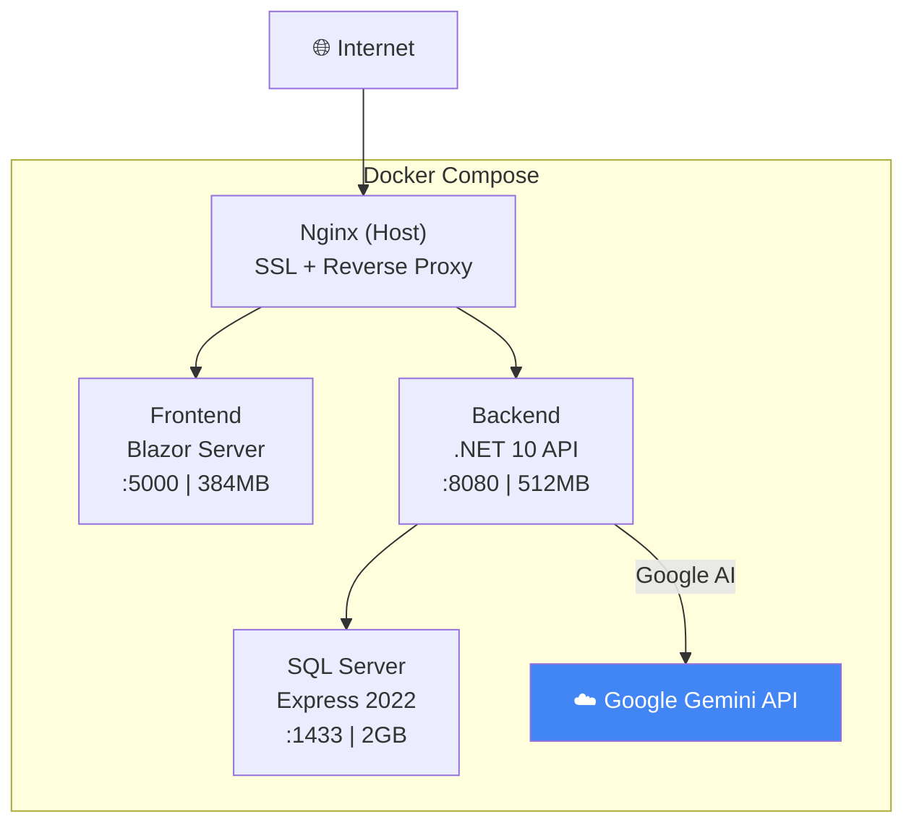

# 🚀 GTAS VPP – Hướng dẫn Deploy VPS Live Demo

**Domain**: `gtas_vpp.annam.id.vn`  
**Server**: DigitalOcean 8GB RAM

---

## Kiến trúc



### Cách hệ thống chọn DB

| URL chứa | `selected_server` | Connection String | DB |
|-----------|-------------------|-------------------|----|
| `localhost`, `dev.` | `Test` → `TestEnv` | Local dev DB | `GTAS_VPP_TEST` |
| `annam.id.vn`, IP | `Live` → `LiveEnv` | VPS Docker DB | `GTAS_VPP_LIVE` |

> Trên VPS, cả `TestEnv` lẫn `LiveEnv` đều trỏ `GTAS_VPP_LIVE` (vì EF Migration hardcode `TestEnv`).

---

## Step 1: Tạo Droplet

```
- Image: Ubuntu 24.04 LTS
- Size: 8GB RAM / 4 vCPUs
- Region: Singapore (SGP1)
- SSH Key: Thêm public key
```

## Step 2: Cài đặt server

```bash
ssh root@YOUR_DROPLET_IP

apt update && apt upgrade -y
curl -fsSL https://get.docker.com | sh
apt install -y nginx certbot python3-certbot-nginx
mkdir -p /opt/gtas-vpp
```

## Step 3: Upload code

```bash
# Option A: Git clone (khuyến nghị)
cd /opt/gtas-vpp && git clone YOUR_REPO_URL .

# Option B: SCP từ local
scp -r ./* root@YOUR_DROPLET_IP:/opt/gtas-vpp/
```

## Step 4: Cấu hình .env

```bash
cd /opt/gtas-vpp
cp .env.example .env
nano .env
```

```env
DB_SA_PASSWORD=ThayDoiMatKhauManh!2026
MSSQL_MEMORY_LIMIT_MB=1536
JWT_KEY=$(openssl rand -base64 48)

AI_PROVIDER=Google
GOOGLE_AI_API_KEY=AIzaSy...KEY-MỚI...
AI_CHAT_MODEL=gemini-2.5-flash
AI_EMBEDDING_MODEL=text-embedding-004
AI_TIMEOUT_SECONDS=60
```

> [!CAUTION]
> **Tạo Google AI key MỚI** tại https://aistudio.google.com/apikey. Key cũ đã lộ trong git → revoke ngay!

## Step 5: Import Database từ Local

### 5.1 Dọn rác trên Local (tùy chọn)

```bash
# Mở SSMS, chạy scripts/cleanup_test_data.sql trên DB GTAS_VPP_TEST
# Bỏ comment các block DELETE phù hợp, sửa điều kiện WHERE
```

### 5.2 Backup từ Local

**SSMS**: Right-click `GTAS_VPP_TEST` → Tasks → Back Up → chọn Full → OK → file `.bak`

**Hoặc dùng sqlcmd**:
```cmd
sqlcmd -S . -Q "BACKUP DATABASE [GTAS_VPP_TEST] TO DISK='C:\Backup\GTAS_VPP_TEST.bak' WITH COMPRESSION"
```

### 5.3 Upload & Restore trên VPS

```bash
# Upload file .bak lên VPS
scp C:\Backup\GTAS_VPP_TEST.bak root@YOUR_DROPLET_IP:/opt/gtas-vpp/

# Khởi động DB container trước
cd /opt/gtas-vpp
docker compose up -d db
sleep 30   # Đợi SQL Server sẵn sàng

# Copy .bak vào container
docker cp GTAS_VPP_TEST.bak gtas-vpp-db:/var/opt/mssql/

# Restore với tên mới GTAS_VPP_LIVE
docker exec gtas-vpp-db /opt/mssql-tools18/bin/sqlcmd \
  -S localhost -U sa -P 'YOUR_DB_SA_PASSWORD' -C -Q "
RESTORE DATABASE [GTAS_VPP_LIVE]
FROM DISK = '/var/opt/mssql/GTAS_VPP_TEST.bak'
WITH MOVE 'GTAS_VPP_TEST' TO '/var/opt/mssql/data/GTAS_VPP_LIVE.mdf',
     MOVE 'GTAS_VPP_TEST_log' TO '/var/opt/mssql/data/GTAS_VPP_LIVE_log.ldf',
     REPLACE;"
```

> [!TIP]
> Nếu tên logical file khác, chạy lệnh này để kiểm tra:
> ```bash
> docker exec gtas-vpp-db /opt/mssql-tools18/bin/sqlcmd \
>   -S localhost -U sa -P 'YOUR_PASSWORD' -C -Q \
>   "RESTORE FILELISTONLY FROM DISK = '/var/opt/mssql/GTAS_VPP_TEST.bak'"
> ```

## Step 6: Nginx + SSL

```bash
cp /opt/gtas-vpp/nginx/gtas-vpp.conf /etc/nginx/sites-available/gtas-vpp
ln -sf /etc/nginx/sites-available/gtas-vpp /etc/nginx/sites-enabled/
rm -f /etc/nginx/sites-enabled/default
nginx -t && systemctl reload nginx

# SSL
certbot --nginx -d gtas_vpp.annam.id.vn
```

## Step 7: Khởi chạy Docker

```bash
cd /opt/gtas-vpp
docker compose up -d --build
```

## Step 8: Kiểm tra

```bash
docker compose ps                     # Tất cả container running
docker compose logs backend           # Không lỗi
curl http://localhost:8080/api/health  # 200 OK
curl https://gtas_vpp.annam.id.vn     # Test từ bên ngoài
```

---

## Lệnh thường dùng

```bash
docker compose restart                                # Restart all
docker compose up -d --build                          # Rebuild
docker stats --no-stream                              # RAM check
docker compose logs -f backend                        # Xem log
docker image prune -f                                 # Dọn images cũ

# Backup DB trên VPS
docker exec gtas-vpp-db /opt/mssql-tools18/bin/sqlcmd \
  -S localhost -U sa -P 'YOUR_PASSWORD' -C -Q \
  "BACKUP DATABASE [GTAS_VPP_LIVE] TO DISK='/var/opt/mssql/backup_live.bak' WITH COMPRESSION"
```

---

## File đã tạo/cập nhật

| File | Mô tả |
|------|--------|
| [docker-compose.yml](file:///c:/ANNAM/TT/SRS/gtas_vpp/docker-compose.yml) | TestEnv + LiveEnv → `GTAS_VPP_LIVE`, CORS `gtas_vpp.annam.id.vn` |
| [.env.example](file:///c:/ANNAM/TT/SRS/gtas_vpp/.env.example) | Template env vars |
| [nginx/gtas-vpp.conf](file:///c:/ANNAM/TT/SRS/gtas_vpp/nginx/gtas-vpp.conf) | Domain `gtas_vpp.annam.id.vn` |
| [scripts/cleanup_test_data.sql](file:///c:/ANNAM/TT/SRS/gtas_vpp/scripts/cleanup_test_data.sql) | Script dọn rác data test |

> [!WARNING]
> File `.env` chứa mật khẩu và API key. KHÔNG commit lên Git!
