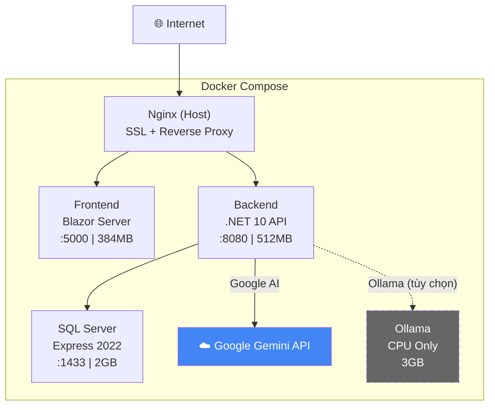

# 🚀 GTAS VPP – Hướng dẫn Deploy lên DigitalOcean

## Kiến trúc tổng quan



## Phân bổ RAM (8GB Droplet)

### Mode 1: Google AI (Khuyến nghị ✅)

| Component | RAM | Ghi chú |
|-----------|-----|---------|
| OS + Docker | ~1.0 GB | Ubuntu overhead |
| SQL Server Express | 1.5 GB | `MSSQL_MEMORY_LIMIT_MB=1536` |
| Backend (.NET 10) | 0.5 GB | Workstation GC |
| Frontend (Blazor Server) | 0.4 GB | Workstation GC |
| **Tổng sử dụng** | **~3.4 GB** | |
| **Còn trống** | **~4.6 GB** | Rất thoải mái! |

### Mode 2: Ollama Self-hosted (Tùy chọn)

| Component | RAM | Ghi chú |
|-----------|-----|---------|
| OS + Docker | ~1.0 GB | |
| SQL Server Express | 1.5 GB | |
| Ollama + models | ~1.5 GB | gemma:2b + nomic-embed-text |
| Backend (.NET 10) | 0.5 GB | |
| Frontend (Blazor Server) | 0.4 GB | |
| **Tổng sử dụng** | **~4.9 GB** | |
| **Còn trống** | **~3.1 GB** | Đủ dùng |

> [!IMPORTANT]
> **Google AI được khuyến nghị cho DigitalOcean** vì tiết kiệm ~3GB RAM, phản hồi nhanh hơn nhiều so với CPU-only Ollama, và dùng `gemini-2.5-flash` (free tier) rất nhanh, nhẹ.

---

## Step-by-step Deploy

### Bước 1: Tạo Droplet trên DigitalOcean

```
- Image: Ubuntu 24.04 LTS
- Size: 8GB RAM / 4 vCPUs ($48/tháng) hoặc tương đương
- Region: Singapore (SGP1)
- SSH Key: Thêm public key của bạn
```

### Bước 2: SSH vào server & cài đặt

```bash
ssh root@YOUR_DROPLET_IP
```

```bash
# Update hệ thống
apt update && apt upgrade -y

# Cài Docker
curl -fsSL https://get.docker.com | sh

# Cài Nginx (host-level reverse proxy)
apt install -y nginx certbot python3-certbot-nginx

# Tạo thư mục project
mkdir -p /opt/gtas-vpp
```

### Bước 3: Upload code lên server

Chạy từ máy Windows (PowerShell):

```powershell
# Từ thư mục gốc project (c:\ANNAM\TT\SRS\backup)
scp -r ./* root@YOUR_DROPLET_IP:/opt/gtas-vpp/
```

> [!TIP]
> Nếu dùng Git, push code lên repo rồi clone trên server sẽ nhanh và sạch hơn:
> ```bash
> cd /opt/gtas-vpp && git clone YOUR_REPO_URL .
> ```

### Bước 4: Cấu hình .env

```bash
cd /opt/gtas-vpp

# Copy template
cp .env.example .env

# Chỉnh sửa
nano .env
```

**Nội dung `.env` cho Google AI (mặc định):**

```env
DB_SA_PASSWORD=ThayDoiMatKhauManh!2026
MSSQL_MEMORY_LIMIT_MB=1536
JWT_KEY=GTAS_VPP_PRODUCTION_KEY_DO_2026_CHANGE_ME_MIN32

AI_PROVIDER=Google
GOOGLE_AI_API_KEY=AIzaSy...your-key-here...
AI_CHAT_MODEL=gemini-2.5-flash
AI_EMBEDDING_MODEL=text-embedding-004
AI_TIMEOUT_SECONDS=60
```

**Hoặc cho Ollama (self-hosted):**

```env
DB_SA_PASSWORD=ThayDoiMatKhauManh!2026
MSSQL_MEMORY_LIMIT_MB=1536
JWT_KEY=GTAS_VPP_PRODUCTION_KEY_DO_2026_CHANGE_ME_MIN32

AI_PROVIDER=Ollama
AI_CHAT_MODEL=gemma:2b
AI_EMBEDDING_MODEL=nomic-embed-text
OLLAMA_BASE_URL=http://ollama:11434
AI_TIMEOUT_SECONDS=120
```

### Bước 5: Cấu hình Nginx (Host-level)

```bash
# Copy config
cp /opt/gtas-vpp/nginx/gtas-vpp.conf /etc/nginx/sites-available/gtas-vpp

# Enable site
ln -sf /etc/nginx/sites-available/gtas-vpp /etc/nginx/sites-enabled/
rm -f /etc/nginx/sites-enabled/default

# Test & reload
nginx -t && systemctl reload nginx
```

### Bước 6: SSL Certificate (Let's Encrypt)

```bash
certbot --nginx -d annam.id.vn
```

### Bước 7: Khởi chạy Docker

````carousel
**Mode 1: Google AI (Khuyến nghị)**
```bash
cd /opt/gtas-vpp
docker compose up -d --build
```
Xong! Không cần thêm bước nào.
<!-- slide -->
**Mode 2: Ollama Self-hosted**
```bash
cd /opt/gtas-vpp

# Khởi chạy với Ollama profile
docker compose --profile ollama up -d --build

# Đợi Ollama container sẵn sàng (~30s)
docker compose --profile ollama logs -f ollama
# Ctrl+C khi thấy "Listening on..."

# Pull 2 model nhẹ
docker exec gtas-vpp-ollama ollama pull gemma:2b
docker exec gtas-vpp-ollama ollama pull nomic-embed-text
```
````

### Bước 8: Kiểm tra

```bash
# Xem tất cả container
docker compose ps

# Xem logs
docker compose logs -f

# Test API
curl http://localhost:8080/api/health

# Test từ bên ngoài
curl https://annam.id.vn/api/health
```

---

## Các file đã tạo/cập nhật

| File | Mô tả |
|------|--------|
| [docker-compose.yml](file:///c:/ANNAM/TT/SRS/backup/docker-compose.yml) | Orchestration chính – 4 services, Ollama là optional profile |
| [.env.example](file:///c:/ANNAM/TT/SRS/backup/.env.example) | Template biến môi trường với 2 AI modes |
| [gtas_vpp_be/Dockerfile](file:///c:/ANNAM/TT/SRS/backup/gtas_vpp_be/Dockerfile) | Backend multi-stage (giữ nguyên, đã tốt) |
| [gtas_vpp_fe/Dockerfile](file:///c:/ANNAM/TT/SRS/backup/gtas_vpp_fe/Dockerfile) | Frontend multi-stage (giữ nguyên, đã tốt) |
| [nginx/gtas-vpp.conf](file:///c:/ANNAM/TT/SRS/backup/nginx/gtas-vpp.conf) | Host Nginx reverse proxy (giữ nguyên) |
| [.dockerignore](file:///c:/ANNAM/TT/SRS/backup/.dockerignore) | Fix bug loại trừ Migrations |
| [DefaultAIOrchestrator.cs](file:///c:/ANNAM/TT/SRS/backup/gtas_vpp_be/gtas_vpp_be.AI/Services/DefaultAIOrchestrator.cs) | Fix health check cho Docker hostname |

---

## Lệnh thường dùng

```bash
# Restart tất cả
docker compose restart

# Rebuild sau khi thay đổi code
docker compose up -d --build

# Xem RAM usage
docker stats --no-stream

# Dọn dẹp images cũ
docker image prune -f

# Backup database
docker exec gtas-vpp-db /opt/mssql-tools18/bin/sqlcmd -S localhost -U sa -P 'YOUR_PASSWORD' -Q "BACKUP DATABASE GTAS_VPP TO DISK='/var/opt/mssql/backup.bak'" -C

# Xem log của 1 service
docker compose logs -f backend
```

> [!WARNING]
> **Bảo mật**: File `.env` chứa mật khẩu và API key. KHÔNG commit lên Git!  
> File `.dockerignore` đã có `**/.env` để ngăn Docker copy file này vào image.
