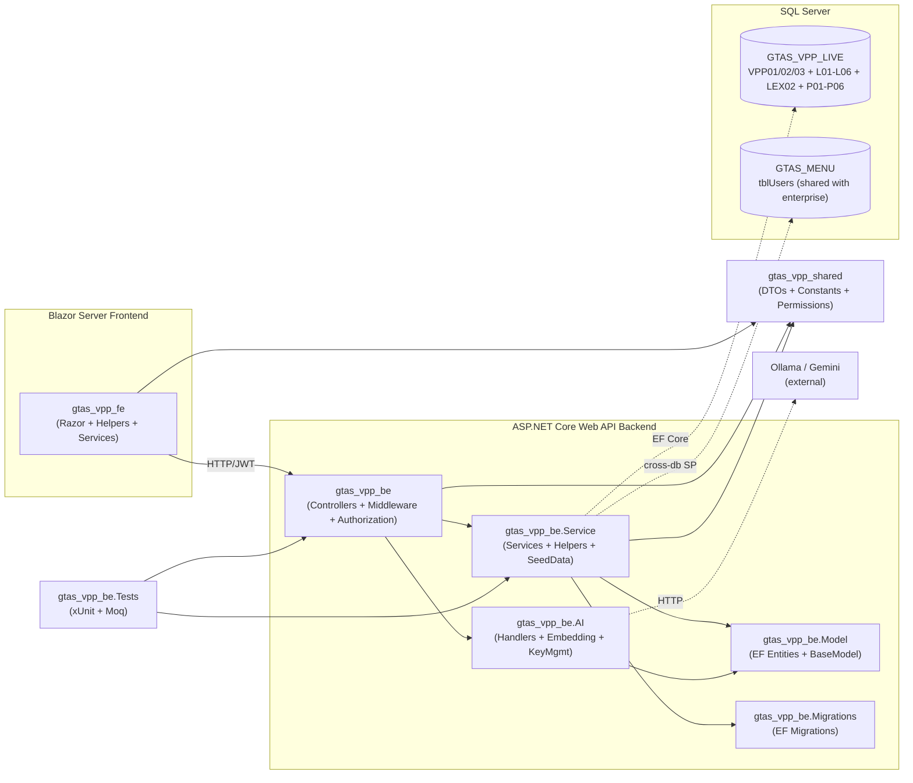
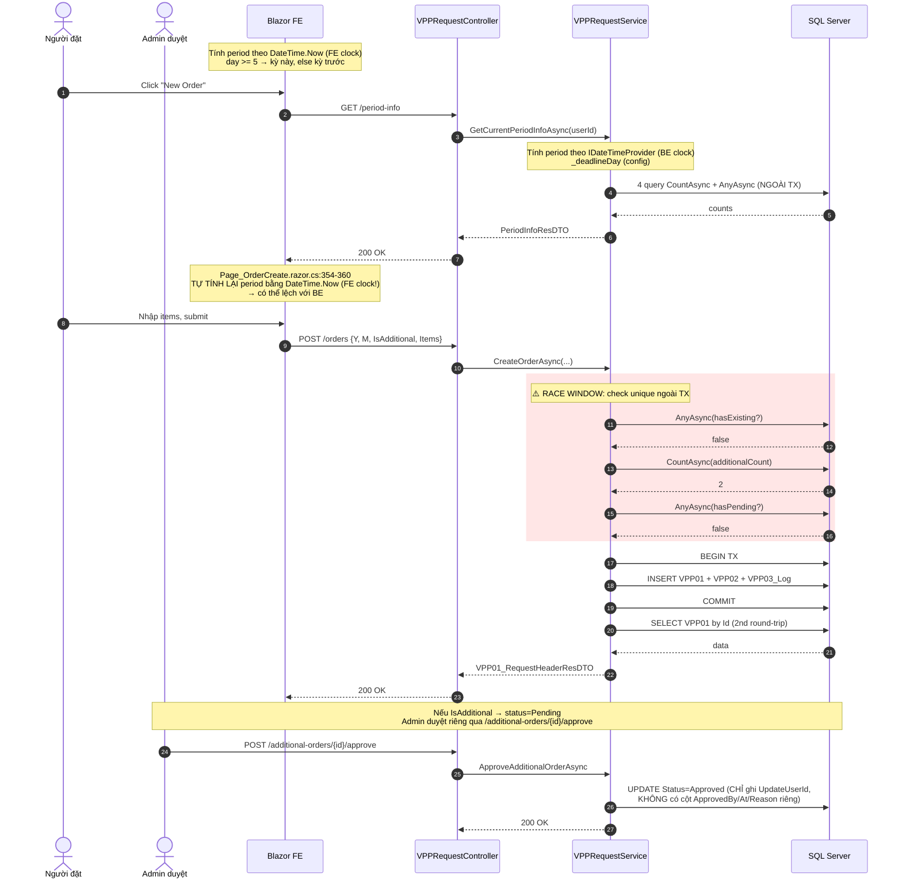
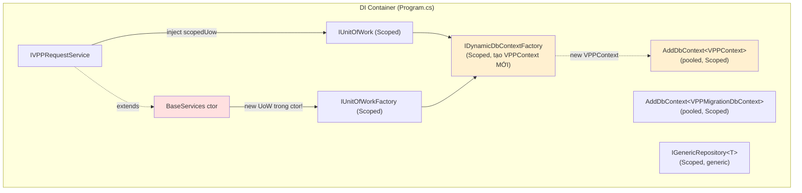
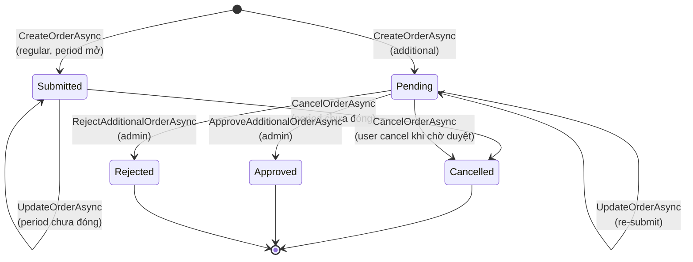
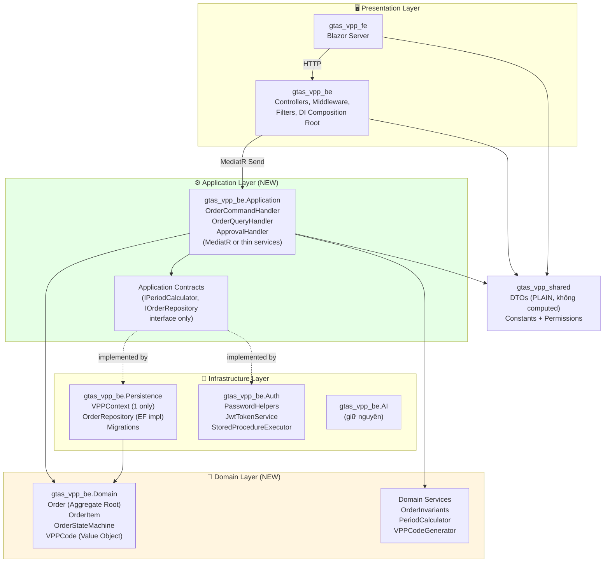
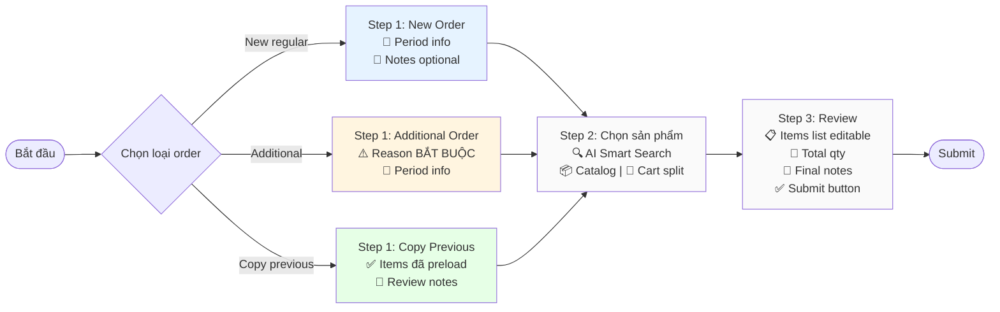
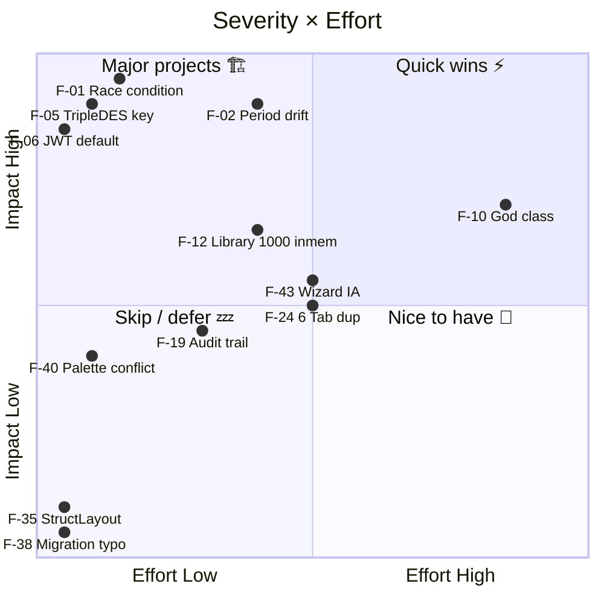

# GTAS VPP — Báo cáo Audit Toàn diện

> **Vị trí file:** ban đầu plan đề xuất `/opt/gtas_vpp/docs/AUDIT_REPORT.md`, nhưng `.gitignore` line 5 đang block folder `docs/`. Tôi đặt file ở `/opt/gtas_vpp/audit-report/AUDIT_REPORT.md` để có thể được commit cùng repo nếu bạn muốn.
>
> **Ngày phát hành:** May 2026 · **Phạm vi:** Toàn bộ codebase (Backend + Frontend + AI + Tests + Infra + UX/UI) · **Trạng thái:** Read-only audit, không sửa code.

---

## Mục lục

1. [Executive Summary](#1-executive-summary)
2. [Bản đồ kiến trúc hiện tại](#2-bản-đồ-kiến-trúc-hiện-tại)
3. [Findings theo mức độ nghiêm trọng](#3-findings-theo-mức-độ-nghiêm-trọng)
   - 3.1 [🔴 Critical](#31--critical-mất-an-toàn--mất-dữ-liệu--không-đăng-nhập-được)
   - 3.2 [🟠 High](#32--high-nợ-kỹ-thuật-cao--cản-trở-scale)
   - 3.3 [🟡 Medium](#33--medium-code-smell--duplicated-logic)
   - 3.4 [🔵 Low](#34--low-convention--minor-cleanup)
   - 3.5 [🎨 UX/UI](#35--uxui--design-system)
4. [Phân tích chuyên sâu theo 5 trục](#4-phân-tích-chuyên-sâu-theo-5-trục)
5. [Target Architecture](#5-target-architecture)
6. [Target UX/UI](#6-target-uxui)
7. [Refactoring Action Plan — 7 Phase](#7-refactoring-action-plan--7-phase)
8. [Phụ lục](#8-phụ-lục)

---

## 1. Executive Summary

GTAS VPP là hệ thống đặt mua **văn phòng phẩm theo kỳ tháng** cho công ty Việt Nam, trong đó kỳ tháng N chạy từ `00:00:00` ngày `05/N` đến `23:59:59` ngày `04/(N+1)` (kiến trúc .NET 10 Web API + Blazor Server, EF Core, SQL Server, tích hợp AI gợi ý sản phẩm qua Ollama/Gemini). Codebase đã đạt **mức MVP có chất lượng UI khá tốt** (design tokens style Linear/Vercel, dark mode mặc định, sidebar có theme switcher, AI suggestion card), nhưng **lớp domain logic và data access có 7 lỗ hổng critical** cần xử lý trước khi đưa ra production thật.

### 1.1 Kết luận chính

| # | Vấn đề | Tác động | Ưu tiên |
|---|---|---|---|
| 1 | Logic kỳ tháng (`00:00` ngày 5 → `23:59:59` ngày 4 tháng sau) bị **lặp ở 3 nơi** với 3 đồng hồ khác nhau (BE config, FE hardcode, DTO `DateTime.Now` client) → user có thể submit sai kỳ khi đồng hồ FE/BE lệch | Sai dữ liệu, không thể audit | 🔴 P0/P1 |
| 2 | `CreateOrderAsync` check unique **ngoài transaction** → 2 request đồng thời cùng pass, tạo trùng order trong cùng kỳ | Mất tính toàn vẹn dữ liệu | 🔴 P0 |
| 3 | `GenericRepository.AddAsync/UpdateAsync/DeleteAsync` mỗi method tự `BeginTransactionAsync` → khi service gọi qua repo trong cùng tx sẽ throw `InvalidOperationException("Transaction already started")` | Crash runtime | 🔴 P0 |
| 4 | 2 `DbContext` (`VPPContext` + `VPPMigrationDbContext`) trùng `OnModelCreating` nhưng **chỉ migration context được track** → schema drift âm thầm | Production khác dev | 🔴 P2 |
| 5 | TripleDES key `"ttpsolutions"` hardcoded; **constraint**: phải giữ cùng key với DB user shared của hệ thống GTAS doanh nghiệp (`abc*123@` ↔ `wiSEc6nf/dK/Vu0E738j8Q==`) — chỉ move sang `IConfiguration` với default fallback, **không đổi thuật toán** | Lộ secret qua git | 🔴 P0 |
| 6 | `LibraryController.GetTableDataWithFilteringAsync` load `take:1000` rồi filter/sort/paginate **in-memory** → TotalCount sai khi >1000 dòng, không scale | Performance | 🟠 P3 |
| 7 | `VPPRequestService` là **god class 770 dòng**, 17 method, 4 method trùng lặp gần như y chang (`GetAllOrdersAsync` ≡ `GetDepartmentOrdersAsync`, `GetMyOrdersAsync` ≡ `GetMyOrdersSummaryAsync`) | Khó maintain | 🟠 P2 |

### 1.2 Tóm tắt findings

| Mức độ | Số lượng | Ví dụ tiêu biểu |
|---|---|---|
| 🔴 **Critical** | **9** | Race condition tạo order, period drift 3 chỗ, dual UoW trong cùng scope, hardcoded TripleDES key, JWT default fallback yếu, dead code BCrypt, dual DbContext drift, `VPPCode` không unique index, `Y/M` từ client không validate upper bound |
| 🟠 **High** | **14** | God class `VPPRequestService`, method trùng lặp 4×, generic repo nested tx, `LibraryController` load 1000 row in-memory, service locator pattern, status code magic numbers 7 vị trí, `Mapster ProjectToType` không tối ưu SQL, `GetDashboardCharts` load toàn bộ vào memory, FE tab boilerplate, `Config` static class, soft-delete trộn với status, `CurrentSinglePrice = 0` không lookup, `ApplyRequesterNamesAsync` N+round-trip, `Page_OrderCreate` tính period FE |
| 🟡 **Medium** | **10** | FE 6 tab lặp UI, i18n hardcode rải rác, `mmss` trong `GenerateVPPCode` có thể trùng, FE empty state thiếu CTA, accessibility chưa pass WCAG AA, loading state không nhất quán, date format inconsistent, audit trail không có `ApprovedBy/At` riêng, `vpp-a11y.css` mới 3KB, test mỏng và dùng reflection |
| 🔵 **Low** | **6** | Comment lẫn ngôn ngữ, `[StructLayout(LayoutKind.Auto)]` trên entity class, `IBaseServices` interface rỗng, naming `Services.Services.Services` lặp, migration `intialFirs` typo, `EnvironmentResolver` fallback luôn về TestEnv |
| 🎨 **UX/UI** | **12** | Xung đột palette navy/tím vs sky blue, 3 lớp styling chồng nhau, wizard Step1 merge vào Step2 quá tải, mobile responsive 2 breakpoint sơ sài, status badge 2 cặp cùng màu (Submitted≡Approved, Cancelled≡Rejected), KPI gradient distract, font Inter chưa self-host, |

### 1.3 Đề xuất Action Plan 7 Phase

```
P0 (Khẩn cấp, S)      → bịt rò secret, fix race condition, xoá dead code, golden-vector login test
P1 (Stability, M)      → PeriodCalculator domain service, FE chỉ consume API period-info
P2 (Architect, L)      → tách Clean Architecture, xoá generic repo nested tx
P3 (Performance, M)    → hợp nhất 2 DbContext, bỏ in-memory filter, explicit Select
P4 (FE logic, M)       → BaseOrderTab cho 6 tab, bỏ DTO computed period
P5 (UX/UI, L)          → unified design system, IA mới cho wizard, mobile-first, a11y WCAG AA
P6 (Audit trail, M)    → ApprovedBy/At, state-machine pattern (mở đường luận văn extend)
P7 (Test & CI, M)      → golden vectors, integration test, Playwright smoke
```

> Chi tiết ROI/Effort/Risk: xem [§7](#7-refactoring-action-plan--7-phase).

---

## 2. Bản đồ kiến trúc hiện tại

### 2.1 Project dependency map



**Quan sát chính:**

- **Tight coupling**: `gtas_vpp_be` (Controllers) gọi thẳng `gtas_vpp_be.Model` (entity) qua `BaseGenericController` + `IGenericRepository<T>` → không có lớp domain/application trung gian → vi phạm Clean Architecture (`Dependency Rule`: lớp ngoài phụ thuộc lớp trong, không ngược lại).
- **Cross-database query**: SP `sp_Authen_Login` đọc từ `GTAS_MENU.dbo.tblUsers` (DB user shared với hệ thống doanh nghiệp khác). Đây là **constraint cứng**: password TripleDES không thể đổi thuật toán.
- **2 DbContext song song**: `VPPContext` (runtime) + `VPPMigrationDbContext` (chỉ migration) → schema drift risk. Xem [F-04](#f-04--dual-dbcontext-schema-drift).
- **Tests project quá mỏng** (~6 unit test + 4 controller test) so với 770 dòng service logic.

### 2.2 Sơ đồ workflow Create/Approve order (hiện tại)



**3 vấn đề nhìn thấy ngay từ flow:**

1. **Period drift** giữa step 7 (BE) và step 9 (FE) — xem [F-02](#f-02--logic-kỳ-tháng-bị-lặp-3-chỗ).
2. **Race window** ở bước 13-18 — xem [F-01](#f-01--race-condition-trong-createorderasync).
3. **Audit trail nghèo** ở bước 27 — xem [F-19](#f-19--không-có-cột-approvedbyat-riêng).

### 2.3 Bản đồ DI hiện tại



**Anti-patterns:**

- **Dual VPPContext path**: `AddDbContext<VPPContext>` đăng ký pool sẵn, nhưng `DynamicDbContextFactory.CreateVPPContext` lại `new VPPContext(options)` mới mỗi UoW. **Cùng 1 request có thể đụng cả 2 context**, gây entity tracking conflict nếu inject thẳng `VPPContext` ở `AuthController` (`@/opt/gtas_vpp/gtas_vpp_be/gtas_vpp_be/Controllers/AuthController.cs:28`) cùng lúc với UoW.
- **Dual UoW trong cùng request scope**: `VPPRequestService` constructor inject `IUnitOfWork _scopedUow` (UoW #1, dùng cho data ops), nhưng đồng thời extend `BaseServices` mà ctor `BaseServices` tạo UoW #2 từ `_unitOfWorkFactory.Create(...)` (`@/opt/gtas_vpp/gtas_vpp_be/gtas_vpp_be.Service/Services/BaseServices.cs:33`). 2 UoW → 2 DbContext → 2 connection trong cùng 1 request.

---

## 3. Findings theo mức độ nghiêm trọng

> **Format chuẩn mỗi finding**: ID · Tiêu đề · Severity · File:line · Triệu chứng → Gốc rễ → Tác động → Hướng refactor (high-level, không code) · Effort (S/M/L).

### 3.1 🔴 Critical (mất an toàn / mất dữ liệu / không đăng nhập được)

#### F-01 · Race condition trong `CreateOrderAsync`

- **File**: `@/opt/gtas_vpp/gtas_vpp_be/gtas_vpp_be.Service/Services/VPPRequestService.cs:159-258`
- **Triệu chứng**: Service kiểm tra 3 ràng buộc uniqueness (`hasExisting`, `additionalCount`, `hasPending`) ở các dòng 171-187 và 196-202 — tất cả **ngoài transaction**. Tx chỉ bắt đầu ở dòng 205 `await _scopedUow.BeginTransactionAsync()`.

```csharp
// Dòng 196-202 (regular order check, NGOÀI tx)
var hasExisting = await _scopedUow.VPPContext.Set<VPP01_RequestHeader>()
    .AsNoTracking()
    .AnyAsync(x => x.CreateUserId == createUserId && x.Y == req.Y && x.M == req.M && !x.IsAdditionalOrder && !x.IsDeleted);
if (hasExisting) throw new InvalidOperationException("You already have an order for this period.");

await _scopedUow.BeginTransactionAsync();  // ← tx mới bắt đầu sau khi check
```

- **Gốc rễ**: TOCTOU (Time-Of-Check-Time-Of-Use). Giữa lúc `AnyAsync` trả `false` và lúc `INSERT`, một request khác cũng kiểm tra → cả 2 cùng pass → cả 2 cùng INSERT.
- **Tác động**: Một user có thể tạo **2 order cùng kỳ** nếu spam click hoặc gửi request đồng thời. DB không có ràng buộc unique nào trên `(CreateUserId, Y, M, IsAdditionalOrder, IsDeleted)` để chặn.
- **Hướng refactor**:
  - **Cách A (đúng nhất)**: Thêm **unique filtered index** `IX_VPP01_OnePerUserPeriod` trên `(CreateUserId, Y, M, IsAdditionalOrder)` `WHERE IsDeleted = 0`; bắt exception `DbUpdateException` của SQL Server 2601/2627 và map về `409 Conflict`.
  - **Cách B (kém hơn)**: Đưa check vào trong tx + dùng `SERIALIZABLE` isolation level → giảm throughput.
- **Effort**: S (1 migration + 1 catch block + golden test).

#### F-02 · Logic kỳ tháng bị lặp 3 chỗ

- **File 1 (BE truth)**: `@/opt/gtas_vpp/gtas_vpp_be/gtas_vpp_be.Service/Services/VPPRequestService.cs:688-698` — dùng `_dateTimeProvider.Now` và `_deadlineDay` (config).
- **File 2 (FE drift A)**: `@/opt/gtas_vpp/gtas_vpp_fe/gtas_vpp_fe/gtas_vpp_fe/Components/Pages/VPPRequest/Tabs/Tab_Orders.razor.cs:51-62` — **hardcode `day >= 5`**, dùng `DateTime.Now` (FE process clock).
- **File 3 (FE drift B)**: `@/opt/gtas_vpp/gtas_vpp_fe/gtas_vpp_fe/gtas_vpp_fe/Components/Pages/VPPRequest/Page_OrderCreate.razor.cs:354-360` — submit dùng:
  ```csharp
  var now = DateTime.Now;
  var period = now.Day >= 5 ? currentMonth : currentMonth.AddMonths(-1);
  ```
- **File 4 (DTO drift)**: `@/opt/gtas_vpp/gtas_vpp_be/gtas_vpp_shared/DTOs/Res/VPP/VPP01_RequestHeaderResDTO.cs:30` — DTO computed property:
  ```csharp
  public bool IsDeadlinePassed => DateTime.Now >= new DateTime(Y, M, 5);
  ```
  → mỗi lần FE truy cập DTO sẽ tính lại với clock của **process đang serialize** (BE khi serialize, FE khi deserialize) → kết quả khác nhau.
- **Triệu chứng**: 3 đồng hồ + 2 hardcode + 1 config = **kỳ tháng có thể khác nhau** giữa: API `/period-info`, UI Tab Orders, button "Submit" trong wizard, và DTO trả về sau khi tạo. Đặc biệt nguy hiểm vào lúc giao kỳ (23:59 ngày 4 → 00:01 ngày 5).
- **Tác động**: User có thể submit order với `Y/M` lệch ý định, hoặc thấy "deadline đã qua" trong khi BE chưa qua, hoặc ngược lại.
- **Hướng refactor**:
  - Tạo `PeriodCalculator` domain service trong BE (1 nguồn sự thật).
  - FE **chỉ** consume `GET /period-info` ở mount + cache 60s, không tự tính lại.
  - Xoá `IsDeadlinePassed`/`CanEdit`/`CanCancel` ra khỏi DTO; BE trả về sẵn dưới dạng property thường (đã materialize, không phải computed).
- **Effort**: M.
- **🟢 Deadline definition (user-confirmed)**: `now.Day >= 5` (`>= 00:00:00 ngày 5`) ≡ `> 23:59:59 ngày 4` — tức kỳ tháng N luôn là `00:00:00` ngày `05/N` → `23:59:59` ngày `04/(N+1)`. Ví dụ: kỳ `05/2026` chạy từ `00:00:00 05/05/2026` đến `23:59:59 04/06/2026`; kỳ `06/2026` chạy từ `00:00:00 05/06/2026` đến `23:59:59 04/07/2026`.

#### F-03 · `GenericRepository` mở transaction nested → throw runtime

- **File**: `@/opt/gtas_vpp/gtas_vpp_be/gtas_vpp_be.Service/Services/GenericRepository.cs:15-126`
- **Triệu chứng**: Mọi method (`AddAsync`/`UpdateAsync`/`UpdateRangeAsync`/`DeleteAsync`) đều có pattern:
  ```csharp
  await _unitOfWork.BeginTransactionAsync();
  // ... do something ...
  await _unitOfWork.CommitAsync();
  ```
  Trong khi `UnitOfWork.BeginTransactionAsync` (`@/opt/gtas_vpp/gtas_vpp_be/gtas_vpp_be.Service/Services/UnitOfWork.cs:79-85`) throw nếu đã có tx:
  ```csharp
  if (_transaction != null)
      throw new InvalidOperationException("Transaction already started.");
  ```
- **Gốc rễ**: Anti-pattern "Repository tự quản lý transaction" — repo nghĩ mình là toplevel mỗi lần dùng. Khi service đã `BeginTransactionAsync` rồi gọi `repo.AddAsync(...)` trong cùng UoW → **runtime exception**.
- **Tác động**: Hiện tại "tránh" được vì service không gọi qua repo cho VPP01/02/03 (insert trực tiếp qua `Set<T>().Add()`). Nhưng bất kỳ ai sửa code dùng `_userGroupRepository.AddAsync()` (`PermissionController.CreateUserGroup` hiện đang an toàn vì controller không mở tx) trong cùng tx sẽ crash.
- **Hướng refactor**:
  - **Tách 2 trách nhiệm**: Repo chỉ `Add`/`Update`/`Delete` vào DbContext (không commit); UoW lo `BeginTransactionAsync`/`CommitAsync` toàn cục.
  - Hoặc bỏ luôn `IGenericRepository<T>` cho các use case phức tạp, chỉ giữ cho CRUD admin pages.
- **Effort**: M (refactor 13 method + update ~10 caller).

#### F-04 · Dual DbContext, schema drift

- **File 1**: `@/opt/gtas_vpp/gtas_vpp_be/gtas_vpp_be.Service/Helpers/Context/VPPContext.cs` (runtime context, 113 dòng)
- **File 2**: `@/opt/gtas_vpp/gtas_vpp_be/gtas_vpp_be.Model/VPPMigrationDbContext.cs` (migration context)
- **Triệu chứng**: 2 `DbContext` cùng map các bảng `VPP01/02/03`, `L01-L06`, `P01-P06`. Cả 2 có `OnModelCreating` configure relationship/index. **Chỉ Migration context được generate migration**; nếu dev sửa `OnModelCreating` của `VPPContext` (vì runtime đọc context này) mà quên đồng bộ `VPPMigrationDbContext`, schema deploy ra production **sẽ khác** với expectations runtime.
- **Gốc rễ**: Lịch sử có lẽ là pattern legacy "tách read-context vs migration-context". Trong EF Core 6+ pattern này không cần thiết — `dotnet ef` đủ thông minh để tách CLI work.
- **Tác động**: Đã thấy ở `VPPContext.cs:90-96` có 2 index (`IX_VPP01_RequestHeader_User_Period_Status`, `IX_VPP01_RequestHeader_Period_Status`) chỉ có trong runtime context. Migration cuối (`20260504084326_AddVPPRequestHeaderIndexes`) đã add 2 index này vào DB. Nhưng nếu add index thứ 3 trong runtime context mà không tạo migration → drift.
- **Hướng refactor**:
  - **Hợp nhất**: chỉ giữ `VPPContext`, dùng nó cho cả migration (`AddDbContext<VPPContext>` + chỉ định `MigrationsAssembly`).
  - Migration project (`gtas_vpp_be.Migrations`) vẫn tồn tại như assembly chứa migration files, nhưng `DbContext` chỉ 1.
- **Effort**: M (1 lần refactor + chạy lại migration test).

#### F-05 · Hardcoded TripleDES key (CONSTRAINT: phải giữ thuật toán)

- **File**: `@/opt/gtas_vpp/gtas_vpp_be/gtas_vpp_be.Service/Helpers/PasswordHelpers.cs:10`
  ```csharp
  private static readonly string _securitykey = "ttpsolutions";
  ```
- **Constraint cứng (user xác nhận)**: DB user shared với hệ thống GTAS doanh nghiệp (`GTAS_MENU.dbo.tblUsers`). Password trong DB là Base64 của TripleDES(ECB, MD5-key, PKCS7). Ví dụ: `abc*123@` ⇒ `wiSEc6nf/dK/Vu0E738j8Q==`. SP `sp_Authen_Login` (`@/opt/gtas_vpp/gtas_vpp_be/gtas_vpp_be.Service/Helpers/SQL/02_StoredProcedures.sql:373-465`) so sánh `us.PasswordChar = @PasswordChar` — **ciphertext = ciphertext, không decrypt**.
- **Triệu chứng**: Key bị leak qua git history. Ai cloned repo có thể decrypt mọi password trong DB user shared (bao gồm cả các hệ thống GTAS khác đang dùng cùng DB).
- **Gốc rễ**: Convention legacy của hệ thống GTAS Vietnam (`"ttpsolutions"` là tên công ty/team). Hardcoded để dễ deploy.
- **Hướng refactor** (constrained):
  - **KHÔNG** đổi thuật toán (sẽ break login với DB user thật).
  - **CHỈ** move key sang `IConfiguration["PasswordEncryption:Key"]`, **default fallback vẫn = `"ttpsolutions"`** để không phá test hiện tại.
  - Khi deploy production thật → set env var `PasswordEncryption__Key` = key thực của server (nếu server dùng key khác).
  - **Bắt buộc** thêm golden-vector test:
    ```csharp
    [Fact]
    public void Encrypt_KnownPlaintext_MatchesProductionCiphertext()
    {
        var ciphertext = PasswordHelpers.Encrypt("abc*123@", useHashing: true);
        Assert.Equal("wiSEc6nf/dK/Vu0E738j8Q==", ciphertext);
    }
    ```
  - Migration sang BCrypt là **long-term plan** (cần phối hợp team GTAS_MENU). Xem [§8 Future Roadmap](#8-phụ-lục).
- **Effort**: S (1 file edit + 1 test).

#### F-06 · JWT default key yếu trong `docker-compose.yml`

- **File**: `@/opt/gtas_vpp/docker-compose.yml:65`
  ```yaml
  JwtSettings__Key: "${JWT_KEY:-CHANGE_THIS_TO_A_STRONG_PRODUCTION_KEY_MIN_32_CHARS}"
  ```
- **Triệu chứng**: Nếu env `JWT_KEY` không được set khi `docker compose up`, JWT sẽ ký bằng string default — chuỗi này nằm trong git, bất kỳ ai cũng có thể tự ký token hợp lệ.
- **Gốc rễ**: "Safe-by-default for dev" nhưng thực tế là "unsafe-by-default for prod".
- **Hướng refactor**:
  - Bỏ default value: `JwtSettings__Key: "${JWT_KEY:?JWT_KEY env var is required}"` (bash-style fail nếu thiếu).
  - `Config.JwtSettings.Key` (`@/opt/gtas_vpp/gtas_vpp_be/gtas_vpp_be.Service/Helpers/Config.cs:19`) **đã** throw `InvalidOperationException` nếu missing → backend fail-fast tốt rồi. Chỉ cần compose fail-fast trước khi container start.
- **Effort**: S (1 dòng compose).

#### F-07 · Dead code BCrypt + comment misleading

- **File 1**: `@/opt/gtas_vpp/gtas_vpp_be/gtas_vpp_be.Service/Helpers/PasswordHelpers.cs:14-36` — `HashPassword/VerifyPassword/IsBcryptHash` được khai báo nhưng **không nơi nào trong code dùng**.
- **File 2**: `@/opt/gtas_vpp/gtas_vpp_be/gtas_vpp_be/Controllers/AuthController.cs:89-111`
  ```csharp
  private async Task<sp_ResDTO> TryLoginWithPassword(string username, string password)
  {
      // 1) Try bcrypt hash
      var encrypted = PasswordHelpers.Encrypt(password, true);  // ← KHÔNG PHẢI bcrypt, là TripleDES
      var result = await _storedProcedureExecutor.ExecuteSPAsync(...);
      if (result.IsSuccess) return result;

      // 2) Fallback: legacy TripleDES password
      // ... đoạn comment dài giải thích nhưng KHÔNG có code thực thi gì khác
      return result;
  }
  ```
  Comment nói "Try bcrypt first, fallback TripleDES" nhưng thực tế **chỉ có 1 nhánh TripleDES**.
- **Triệu chứng**: Tương lai có người tin comment, sửa code dựa trên giả định sai → bug.
- **Hướng refactor**:
  - Xoá `HashPassword/VerifyPassword/IsBcryptHash`.
  - Sửa method thành `TryLoginAsync` + sửa comment thành "TripleDES ciphertext compare against DB column" (mô tả đúng).
- **Effort**: S.

#### F-08 · `VPPCode` không có unique index, sinh từ `mmss`

- **File 1**: `@/opt/gtas_vpp/gtas_vpp_be/gtas_vpp_be.Service/Services/VPPRequestService.cs:685-686`
  ```csharp
  private string GenerateVPPCode(int year, int month, int userId)
      => $"VPP-{year}{month:D2}-{userId}-{_dateTimeProvider.Now:mmss}";
  ```
- **File 2**: `@/opt/gtas_vpp/gtas_vpp_be/gtas_vpp_be.Model/VPP/VPP01_RequestHeader.cs:15` — column `VPPCode` không có `[Index(IsUnique = true)]` và migration không tạo unique index.
- **Triệu chứng**:
  - Format `mmss` = minute + second (4 ký tự). Nếu user tạo 2 order trong cùng giây/phút (regular + additional cùng lúc, hoặc user A và user B khác id nhưng cùng giây) → **trùng `VPPCode`**.
  - User confirm trong câu hỏi clarification: "không có spec rõ, để bạn flag".
- **Tác động**: Trùng code không gây fatal vì PK là `Id` GUID, nhưng UI hiển thị code này → confusing. Khi join với Excel/ERP khác cần code unique → fail.
- **Hướng refactor**:
  - **Option 1 (recommended)**: Đổi format → `VPP-{Y}{M:D2}-{userId}-{Guid:N[0..8]}` (8 ký tự đầu GUID) → collision xác suất ~1/2³² gần như không xảy ra.
  - **Option 2**: Giữ format nhưng thêm unique index + retry-with-counter khi duplicate.
- **Effort**: S.

#### F-09 · `Y/M` từ client không validate upper bound

- **File**: `@/opt/gtas_vpp/gtas_vpp_be/gtas_vpp_be.Service/Services/VPPRequestService.cs:159-203`
- **Triệu chứng**: Khi tạo regular order, service chỉ check `IsDeadlinePassed(req.Y, req.M)` (deadline đã qua). **Không check** `req.Y/req.M` có hợp lệ không. User có thể submit:
  - `Y=2099, M=12` (tương lai 70 năm)
  - `Y=1990, M=1` (quá khứ — chỉ bị chặn nếu deadline đã qua, mà với 1990 thì... đã qua rất lâu, trở thành mismatch logic)
- **Tác động**: Pollution dữ liệu, báo cáo theo period sai. Combine với F-08 (`VPPCode` từ `Y/M`) → code dị kỳ trong DB.
- **Hướng refactor**: BE phải lấy period từ `GetCurrentAndPreviousPeriod()` rồi so sánh với `req.Y/req.M` — chỉ accept current period (regular) hoặc previous period (additional). FE không cần truyền Y/M nữa (truyền `IsAdditional` đủ rồi, BE tự suy ra period).
- **Effort**: S.

### 3.2 🟠 High (nợ kỹ thuật cao / cản trở scale)

#### F-10 · God class `VPPRequestService` 770 dòng

- **File**: `@/opt/gtas_vpp/gtas_vpp_be/gtas_vpp_be.Service/Services/VPPRequestService.cs`
- **Triệu chứng**: 1 class, 17 public method, gánh 5 nhóm trách nhiệm khác nhau:
  1. Query orders (cá nhân, phòng ban, toàn công ty, pending) — 8 method
  2. Create/Update/Cancel order — 3 method
  3. Approve/Reject additional order — 2 method
  4. Period info & previous items — 2 method
  5. Helpers (ValidateItems, GenerateVPPCode, IsDeadlinePassed, BuildLogPayload, ApplyRequesterNamesAsync) — 5 method
- **Tác động**: Khi cần test 1 method, phải mock 8 dependency. Mọi PR sửa file này risk regression cho 16 method còn lại. Code review dễ miss.
- **Hướng refactor**: Tách theo bounded context:
  - `OrderQueryService` (read-only, projection thuần)
  - `OrderCommandService` (Create/Update/Cancel)
  - `OrderApprovalService` (Approve/Reject + state machine)
  - `PeriodCalculator` (pure domain)
  - `OrderInvariants` (pure validation, static)
- **Effort**: L.

#### F-11 · Method trùng lặp gần như nhân bản

- **File**: `@/opt/gtas_vpp/gtas_vpp_be/gtas_vpp_be.Service/Services/VPPRequestService.cs`
- **Cặp 1**: `GetMyOrdersAsync` (`:53-56`) ≡ `GetMyOrdersSummaryAsync` (`:58-61`) — **cùng** gọi `GetFilteredOrdersAsync`. Khác nhau **chỉ là tên alias**.
- **Cặp 2**: `GetAllOrdersAsync` (`:403-418`) ≡ `GetDepartmentOrdersAsync` (`:463-478`) — code y hệt từng dòng, chỉ khác signature.
- **Cặp 3**: `GetAllOrdersPagedAsync` (`:420-461`) ≡ `GetDepartmentOrdersPagedAsync` (`:480-522`) — y hệt.
- **Cặp 4**: 4 method có pattern `query + stats aggregate + paging + ProjectToType + ApplyRequesterNames` lặp lại 4 lần với 90% code identical.
- **Tác động**: Sửa filter logic phải sửa 4 chỗ; rủi ro drift.
- **Hướng refactor**: 1 method generic `GetFilteredOrdersAsync(Expression<Func<...>> filter, int? skip, int? top)` + caller chỉ build expression.
- **Effort**: M.

#### F-12 · 🔴 `LibraryController` load 1000 row in-memory rồi filter

> **Promoted lên Critical** (user-confirmed scale 1000 concurrent user). 1000 user × 1000 row materialize/request = 1M object/phút trên heap → OOM trong vài giờ.

- **File**: `@/opt/gtas_vpp/gtas_vpp_be/gtas_vpp_be/Controllers/LibraryController.cs:85-194`
- **Triệu chứng**: Method `GetTableDataWithFilteringAsync<TModel, TDto>` dòng 96:
  ```csharp
  var allData = await ReadEntitiesAsync<TModel>(true, take: 1000);
  // ...
  var query = allData.AsQueryable();  // ← LINQ-to-Objects, không phải SQL
  query = query.Where(filter);         // ← filter chạy trên 1000 row trong RAM
  var totalCount = query.Count();      // ← TotalCount sai khi DB có >1000 row
  ```
- **Tác động**:
  - Khi `L02_ClassDetail` có 2000 row, user filter "code starts with A" → TotalCount trả về số count trong 1000 đầu tiên, **không phải toàn bộ**. Phân trang sai.
  - Memory mỗi request +1000 entity instances → GC pressure ở môi trường nhiều người dùng.
- **Hướng refactor**:
  - Bỏ `take: 1000`, dùng `IQueryable<TModel>` từ EF Core; `System.Linq.Dynamic.Core.Where(filter)` có thể translate sang SQL **nếu** source là `IQueryable` (đang là `IEnumerable.AsQueryable()`).
  - Apply `Where → Count → OrderBy → Skip → Take → Adapt` trên IQueryable.
- **Effort**: M.

#### F-13 · 🔴 `GetDashboardCharts` load toàn bộ order vào memory

> **Promoted lên Critical** (user-confirmed scale 1000 concurrent user). Dashboard là endpoint **được gọi nhiều nhất** (mỗi user load mỗi lần vào trang); với user có 200 order/năm × 1000 user × n requests = vài chục triệu object materialize/ngày.

- **File**: `@/opt/gtas_vpp/gtas_vpp_be/gtas_vpp_be/Controllers/VPPRequestController.cs:264-318`
- **Triệu chứng**: Endpoint load **tất cả** order của user vào memory rồi GroupBy in-memory:
  ```csharp
  var orders = await _unitOfWork.VPPContext.Set<VPP01_RequestHeader>()
      .AsNoTracking()
      .Where(x => !x.IsDeleted && x.CreateUserId == CurrentUserId.Value)
      .Select(...)
      .ToListAsync();  // ← materialize ALL orders
  
  var monthlyData = orders.Where(...).GroupBy(...);  // ← in-memory
  ```
- **Tác động**: User có 200+ order/năm → 200 object materialize mỗi request charts. Charts được gọi mỗi lần load Dashboard.
- **Hướng refactor**: GroupBy ở DB:
  ```csharp
  var monthly = await query
      .Where(x => x.SubmittedDate.HasValue)
      .GroupBy(x => new { x.SubmittedDate!.Value.Year, x.SubmittedDate.Value.Month })
      .Select(g => new { ... })
      .ToListAsync();
  ```
- **Effort**: S.

#### F-14 · Dual UoW trong cùng request scope

- **File**: `@/opt/gtas_vpp/gtas_vpp_be/gtas_vpp_be.Service/Services/BaseServices.cs:33` + `VPPRequestService.cs:48`
- **Triệu chứng**:
  - `BaseServices` ctor tạo UoW #1 từ factory: `_unitOfWork = _unitOfWorkFactory.Create(environment);`
  - `VPPRequestService` constructor inject UoW #2 từ DI: `_scopedUow = scopedUow;`
  - Service **chỉ dùng** `_scopedUow` cho mọi data ops → UoW #1 từ `BaseServices` mở connection nhưng không bao giờ dùng → connection leak nhẹ + waste.
- **Tác động**: 2 connection mở per request, 1 không dùng. Connection pool exhaust nhanh hơn 2× trong load test.
- **Hướng refactor**:
  - Bỏ luôn `BaseServices` (interface rỗng + ctor side-effect nặng).
  - Service trực tiếp inject thứ cần: `IUnitOfWork`, `ILogger<T>`, `IJiraSettings`.
- **Effort**: M (~10 service kế thừa BaseServices cần update).

#### F-15 · `BaseGenericController` xài service locator

- **File**: `@/opt/gtas_vpp/gtas_vpp_be/gtas_vpp_be/Controllers/BaseGenericController.cs` (nếu có) + `LibraryController.cs:295`:
  ```csharp
  var created = await GetRepository<TModel>().AddAsync(obj);
  ```
- **Triệu chứng**: `GetRepository<T>()` chắc chắn resolve qua `IServiceProvider.GetRequiredService<IGenericRepository<T>>()` → service locator anti-pattern. Dependency bị ẩn, test phải mock toàn bộ DI container.
- **Hướng refactor**: Khi xoá `IGenericRepository<T>` (F-03), tự nhiên loại bỏ luôn pattern này. Controller chỉ inject `IUnitOfWork`/`DbContext` thẳng.
- **Effort**: M (cùng pass với F-03).

#### F-16 · Status code magic number rải rác 7 vị trí

- **VPPStatus enum** đã tồn tại: `@/opt/gtas_vpp/gtas_vpp_be/gtas_vpp_be.Model/VPP/VPPStatus.cs:1-12` (Submitted=1, Cancelled=4, Pending=6, Approved=7, Rejected=8).
- **Nhưng code hardcode số**:
  1. `VPPRequestController.cs:299-307` — switch số trong `GetDashboardCharts`
  2. `VPP01_RequestHeaderResDTO.cs:20-28` — switch số trong `StatusText`
  3. `Tab_Orders.razor.cs:215-233` — `GetStatusText` + `GetStatusBadgeStyle`
  4. `Tab_History.razor.cs:216-234`
  5. `Tab_AdminApproval.razor.cs` — duplicate
  6. `Tab_AllOrdersSummary.razor.cs:202-220`
  7. `Tab_DepartmentSummary.razor.cs:209-227`
- **Tác động**: Đổi thêm status mới (vd. `WaitingForVendor=9`) → cần sửa 7 chỗ. Forgetting 1 chỗ → UI hiển thị "-" hoặc badge sai màu.
- **Hướng refactor**:
  - Đưa enum vào `gtas_vpp_shared` (cả FE/BE đều ref).
  - 1 helper `StatusDisplay.GetText(int status)` + `StatusDisplay.GetBadgeStyle(int status)` ở `gtas_vpp_shared`.
- **Effort**: S.

#### F-17 · `Mapster ProjectToType` cho header sinh SQL không tối ưu

- **File**: `@/opt/gtas_vpp/gtas_vpp_be/gtas_vpp_be/Mappings/MapsterConfig.cs:63-66`:
  ```csharp
  config.NewConfig<VPP01_RequestHeader, VPP01_RequestHeaderResDTO>()
      .Map(dest => dest.TotalLines, src => src.VPP02_RequestDetails.Count(d => !d.IsDeleted))
      .Map(dest => dest.TotalQty, src => src.VPP02_RequestDetails.Where(d => !d.IsDeleted).Sum(d => (int?)d.Qty) ?? 0)
      .Map(dest => dest.Items, src => src.VPP02_RequestDetails.Where(d => !d.IsDeleted));
  ```
- **Triệu chứng**: Mỗi list call (`GetMyOrdersSummaryPagedAsync`, `GetAllOrdersPagedAsync`,...) đều JOIN với `VPP02_RequestDetails` để tính `TotalLines/TotalQty` **và** trả luôn `Items` (collection). Mapster + `AsSplitQuery()` sinh ra **2 query**: 1 cho header + 1 cho details collection.
- **Tác động**: Page list 20 order → 1 query header + 1 query 20 IN-clause details → load **toàn bộ items của 20 order** chỉ để hiển thị danh sách summary (không cần items detail).
- **Hướng refactor**:
  - Explicit `.Select(...)` cho list endpoint, chỉ chọn `TotalLines`/`TotalQty` (computed in-SQL), **bỏ `Items`**.
  - Endpoint detail (`GET /orders/{id}`) mới load đầy đủ items.
  - Hoặc denormalize: thêm column `VPP01.TotalLines/TotalQty` + update khi Insert/Update detail.
- **Effort**: M.

#### F-18 · `ApplyRequesterNamesAsync` thêm round-trip không cần thiết

- **File**: `@/opt/gtas_vpp/gtas_vpp_be/gtas_vpp_be.Service/Services/VPPRequestService.cs:700-725`
- **Triệu chứng**: Mỗi list call sau khi `ProjectToType` xong sẽ gọi `ApplyRequesterNamesAsync` → 1 query thêm vào `v_Users` view chỉ để lấy `FullName`.
- **Tác động**: 2× round-trip cho mọi list endpoint. Không scale với high concurrency.
- **Hướng refactor**: JOIN với `v_Users` trong cùng query `ProjectToType`/`Select`. EF Core 8+ support `IQueryable<v_Users>` cross-database hoặc dùng `LEFT JOIN` explicit qua `SelectMany`.
- **Effort**: M.

#### F-19 · Không có cột `ApprovedBy/At` riêng

- **File**: `@/opt/gtas_vpp/gtas_vpp_be/gtas_vpp_be.Model/VPP/VPP01_RequestHeader.cs:1-35`
- **Triệu chứng**: Khi admin approve, code chỉ làm:
  ```csharp
  header.Status = (int)VPPStatus.Approved;
  header.UpdateUserId = adminId;
  header.UpdateDate = now;
  ```
  → mất thông tin "ai là người tạo gốc" (vì `UpdateUserId` bị override).
- **Tác động**: Audit trail nghèo. Báo cáo "Order X được duyệt khi nào?" phải parse `VPP03_Log.LogJS` JSON → khó query.
- **Hướng refactor**: Thêm 5 cột vào `VPP01`:
  - `ApprovedById int?` 
  - `ApprovedAt DateTime?`
  - `RejectedById int?`
  - `RejectedAt DateTime?`
  - `RejectReason nvarchar(500)?`
- **Effort**: S (1 migration + 2 service method update).

#### F-20 · `Config` static class với side-effect `Initialize`

- **File**: `@/opt/gtas_vpp/gtas_vpp_be/gtas_vpp_be.Service/Helpers/Config.cs:10-15`
  ```csharp
  private static IConfiguration? _configuration;
  public static void Initialize(IConfiguration configuration)
  {
      _configuration = configuration;
  }
  ```
  Được gọi 1 lần ở `Program.cs:31`: `Config.Initialize(Configuration);`
- **Triệu chứng**: Anti-pattern Service Locator dạng static. `JwtSettings.Key` truy cập `_configuration` qua biến static → untestable (unit test không thể đặt config khác nhau cho từng test mà không lock module).
- **Hướng refactor**:
  - Bỏ `Config.Initialize`.
  - `JwtSettings` chuyển thành `IOptions<JwtSettings>` inject qua DI.
  - Code hiện đã có pattern này cho `JiraSettings` (`Program.cs:72`) → áp dụng tương tự.
- **Effort**: S (~4 call site).

#### F-21 · Soft-delete trộn với status `Cancelled`

- **File**: `@/opt/gtas_vpp/gtas_vpp_be/gtas_vpp_be.Service/Services/VPPRequestService.cs:350-351`:
  ```csharp
  header.IsDeleted = true;
  header.Status = (int)VPPStatus.Cancelled;
  ```
- **Triệu chứng**: Khi cancel order, **vừa** set `IsDeleted=true` **vừa** set `Status=Cancelled`. Sau đó mọi query đều filter `!x.IsDeleted` (`VPPRequestService:76, 102, 145,...`) → user **không thấy** order đã cancel trong UI, dù DTO có sẵn `StatusText="Cancelled"`.
- **Tác động**:
  - Confusing semantics: `IsDeleted=true` có nghĩa gì khi `Status=Cancelled` đã đủ?
  - Báo cáo "Tỷ lệ huỷ" phải bỏ filter `!IsDeleted` → trộn lẫn 2 khái niệm.
- **Hướng refactor**:
  - **Không** set `IsDeleted=true` khi cancel — chỉ đổi status.
  - Soft-delete dành riêng cho ai thật sự xoá (admin only).
  - Filter UI: `WHERE Status NOT IN (Cancelled, Rejected)` thay vì `WHERE !IsDeleted`.
- **Effort**: S (1 service method + cập nhật filter).

#### F-22 · `CurrentSinglePrice` luôn = 0

- **File**: `@/opt/gtas_vpp/gtas_vpp_be/gtas_vpp_be.Service/Services/VPPRequestService.cs:232, 299`
  ```csharp
  CurrentSinglePrice = 0,  // ← hardcode 0
  ```
- **Có data nguồn**: `L06_VPPSupplierMapping.Price` (`@/opt/gtas_vpp/gtas_vpp_be/gtas_vpp_be.Model/Library/L06_VPPSupplierMapping.cs`) — bảng giá theo nhà cung cấp.
- **Triệu chứng**: Schema có cột `CurrentSinglePrice` (suggest có ý định tracking giá lịch sử) nhưng luôn = 0. Không có lookup từ `L06`.
- **Tác động**: Báo cáo "Chi phí VPP theo tháng" không tính được. Khi product đổi nhà cung cấp/giá → mất thông tin giá tại thời điểm đặt.
- **Hướng refactor**:
  - Khi `CreateOrderAsync`, lookup `L06_VPPSupplierMapping.Price` (lấy default supplier hoặc supplier mới nhất).
  - Snapshot giá vào `CurrentSinglePrice` → giá thay đổi sau không ảnh hưởng order cũ.
- **Effort**: M.

#### F-23 · `Page_OrderCreate` tính period FE thay vì consume API

- **File**: `@/opt/gtas_vpp/gtas_vpp_fe/gtas_vpp_fe/gtas_vpp_fe/Components/Pages/VPPRequest/Page_OrderCreate.razor.cs:353-360`:
  ```csharp
  var now = DateTime.Now;
  var currentMonth = new DateTime(now.Year, now.Month, 1);
  var period = now.Day >= 5 ? currentMonth : currentMonth.AddMonths(-1);
  if (IsAdditional)
  {
      period = period.AddMonths(-1);
  }
  ```
- **Triệu chứng**: Trong khi `Tab_Orders.razor.cs` đã có call `GET /period-info` cache `PeriodInfo`, `Page_OrderCreate` **không inject** PeriodInfo mà tự tính lại bằng clock FE.
- **Tác động**: Submit order với `Y/M` lệch với BE → vào danh sách "current period" nhưng BE xếp vào "previous period" (hoặc ngược lại).
- **Hướng refactor**: Bỏ logic FE; thay bằng GET `/period-info` ở `OnInitializedAsync` rồi dùng `PeriodInfo.CurrentPeriodYear/Month` khi submit.
- **Effort**: S.

### 3.3 🟡 Medium (code smell / duplicated logic)

#### F-24 · 6 Tab_*.razor.cs lặp pattern UI

- **Files**: `Tab_Orders.razor.cs`, `Tab_History.razor.cs`, `Tab_AdminApproval.razor.cs`, `Tab_AllOrdersSummary.razor.cs`, `Tab_DepartmentSummary.razor.cs`, `Tab_ProductCatalog.razor.cs` — đều ở `@/opt/gtas_vpp/gtas_vpp_fe/gtas_vpp_fe/gtas_vpp_fe/Components/Pages/VPPRequest/Tabs/`.
- **Triệu chứng**: 5/6 file có pattern y hệt:
  - State `IsLoading/IsGridLoading/_isFirstLoad/PageSize/CurrentSkip`
  - `OptionItem` class trùng lặp 5 lần
  - `InitFilters()` với `YearOptions/MonthOptions/StatusOptions` xây dropdown giống nhau
  - `OnFilterChanged` với debounce 300ms y hệt
  - `OnLoadData(LoadDataArgs args)` chuyển skip/top y hệt
  - `GetStatusText` + `GetStatusBadgeStyle` (đã liệt kê ở F-16)
- **Tác động**: Thêm tab thứ 7 phải copy 200 dòng. Sửa pattern (vd debounce thành 500ms) phải sửa 5 chỗ.
- **Hướng refactor**:
  - Tạo `BaseOrderTab<TFilter>` (abstract Razor component) đảm nhiệm filter + paging + loading state.
  - Tab cụ thể chỉ override `BuildEndpoint()` + columns.
- **Effort**: M.

#### F-25 · `i18n` hardcode rải rác trong UI

- **Examples**:
  - `Tab_Orders.razor:80-82`: `"No orders found"`, `"No orders for the current period."`
  - `Tab_Orders.razor:148`: `"Order Code:"`, `"Submitted:"`
  - `Tab_Orders.razor:98`: `"Previous Order Period"`, `"Additional Orders"`
  - `OrderCreateStep1.razor:13,17,24,28-30`: `"Editing Order"`, `"Copy from Previous Order"`, `"Additional Order"`, `"Attention: The order period..."`
- **Triệu chứng**: Một số chuỗi dùng `Loc["NewOrder"]` (i18n key) nhưng nhiều chuỗi hardcode tiếng Anh → bản dịch tiếng Việt **không bao quát** được.
- **Hướng refactor**:
  - Audit hết hardcoded English strings (grep `"[A-Z][a-z]+ [a-z]+"` trong `.razor`).
  - Migrate vào `Loc[]` resource (`.resx`).
- **Effort**: M.

#### F-26 · Empty state thiếu CTA

- **File**: `@/opt/gtas_vpp/gtas_vpp_fe/gtas_vpp_fe/gtas_vpp_fe/Components/Pages/VPPRequest/Tabs/Tab_Orders.razor:78-82`
  ```html
  <div class="vpp-empty-state">
      <span class="vpp-empty-state-icon rzi rzi-inbox"></span>
      <div class="vpp-empty-state-title">No orders found</div>
      <div class="vpp-empty-state-desc">No orders for the current period.</div>
  </div>
  ```
- **Triệu chứng**: User mới đăng nhập lần đầu, thấy "No orders found" — không có chỉ dẫn bước tiếp theo. Trong khi đó button "New Order" nằm ở header, có thể bị disabled (do `PeriodInfo == null` lúc đầu).
- **Hướng refactor**: Empty state cần CTA chính:
  - Title: "Bạn chưa có đơn nào cho kỳ này"
  - Desc: "Bắt đầu tạo đơn đầu tiên trong 30 giây"
  - Primary button: "+ Tạo đơn mới" → navigate `/order-create`
  - Secondary link: "Copy từ kỳ trước" (nếu có previous order)
- **Effort**: S.

#### F-27 · Loading state không nhất quán

- **Files**:
  - `Tab_Orders.razor:69-73`: dùng `<SkeletonStatCards>` + `<SkeletonGrid>`
  - `Tab_History.razor:104-106`: dùng `IsGridLoading` (chính DataGrid render skeleton)
  - Submit form: `glb.isBusyPage = true` (block toàn page) + `IsSaving = true` (disable button)
  - `OrderCreateStep2.razor:60`: `RadzenProgressBar` cho AI search
- **Triệu chứng**: 4 cách hiển thị loading khác nhau → user thấy lúc thì page mờ, lúc thì skeleton, lúc thì progress bar.
- **Hướng refactor**: 1 hệ thống thống nhất:
  - **Page-level skeleton** khi load đầu (block UI hiển thị placeholder)
  - **In-place skeleton** trong DataGrid khi paginate
  - **Inline progress** cho async action ngắn (AI search, save)
  - **Disabled button + spinner** cho submit
- **Effort**: M.

#### F-28 · Accessibility chưa đạt WCAG AA

- **File**: `@/opt/gtas_vpp/gtas_vpp_fe/gtas_vpp_fe/gtas_vpp_fe/wwwroot/css/vpp-a11y.css` (mới 3KB)
- **Issues nhìn nhanh**:
  - Icon button thiếu `aria-label` (vd `Tab_Orders.razor:165-166` button edit/delete chỉ có Icon, không có label):
    ```html
    <RadzenButton Icon="edit" Size="ButtonSize.Small" ButtonStyle="ButtonStyle.Primary" Variant="Variant.Text" Click="..." />
    ```
    → Screen reader đọc "button" mà không biết action.
  - Gradient text trong `OrderCreateStep2.razor:44` (`linear-gradient(135deg, #667eea 0%, #764ba2 100%)` + `color: white`) có contrast ratio ~3:1, không đạt WCAG AA 4.5:1.
  - Focus indicator: chưa thấy custom `:focus-visible` cho keyboard navigation.
  - KPI card decorative icon thiếu `aria-hidden="true"`.
- **Hướng refactor**:
  - Pass 1 vòng tất cả `RadzenButton Icon=""` → thêm `title` + `Aria-label` props.
  - Pass `vpp-a11y.css` thêm `:focus-visible` global style với outline 2px solid primary.
  - Audit contrast bằng tool (Pa11y, axe DevTools).
- **Effort**: M.

#### F-29 · Date format không nhất quán

- **Examples**:
  - `Tab_Orders.razor:157`: `HH:mm dd/MM/yyyy`
  - `Tab_Orders.razor.cs:69`: `dd/MM/yyyy`
  - `Tab_Orders.razor.cs:71`: `MM/yyyy`
  - `Page_OrderCreate.razor.cs:255`: `DateTime.Now` không format
- **Hướng refactor**: 1 `DateFormatter` helper với 3 constant `ShortDate = "dd/MM/yyyy"`, `LongDate = "HH:mm dd/MM/yyyy"`, `MonthYear = "MM/yyyy"`. Tất cả `.ToString()` đi qua helper.
- **Effort**: S.

#### F-30 · KPI gradient/shine effect distract

- **File**: `@/opt/gtas_vpp/gtas_vpp_fe/gtas_vpp_fe/gtas_vpp_fe/Components/Pages/VPPRequest/Tabs/Tab_Orders.razor:22-66` (4 KPI card có `kpi-card-shine` + class `kpi-blue/purple/emerald/amber`)
- **Triệu chứng**: Mỗi card 1 màu khác nhau + shine animation → "playful" nhưng cản trở scan thông tin chính. Linear/Vercel (reference được declare trong `vpp-tokens.css:4`) **không** dùng card màu sặc sỡ.
- **Hướng refactor**: Flat minimal:
  - Background = `--vpp-bg-elevated`
  - Border 1px = `--vpp-border-default`
  - Value text-2xl bold = `--vpp-text-primary`
  - Label text-xs = `--vpp-text-secondary`
  - Icon nhỏ ở góc, opacity 0.4
- **Effort**: S (chỉ CSS).

#### F-31 · Font Inter chưa self-host hoặc Google Fonts link

- **File**: `@/opt/gtas_vpp/gtas_vpp_fe/gtas_vpp_fe/gtas_vpp_fe/wwwroot/css/vpp-tokens.css:9-11` khai báo:
  ```css
  --vpp-font-display: 'Inter', system-ui, -apple-system, sans-serif;
  --vpp-font-body: 'Inter', system-ui, -apple-system, sans-serif;
  --vpp-font-mono: 'JetBrains Mono', 'SF Mono', 'Fira Code', monospace;
  ```
- **Triệu chứng**: Không thấy `@font-face` self-host trong `wwwroot/fonts/` hoặc `<link rel="stylesheet" href="https://fonts.googleapis.com/...">` trong layout chính. → Browser fallback sang `system-ui` (San Francisco trên macOS, Segoe UI trên Windows) → **mỗi OS hiển thị khác nhau**, không đảm bảo design fidelity.
- **Hướng refactor**: 2 option:
  - **Self-host** (recommended): tải Inter + JetBrains Mono vào `wwwroot/fonts/`, khai báo `@font-face`.
  - **Google Fonts CDN**: thêm 1 link vào `App.razor` head.
- **Effort**: S.

#### F-32 · Test mỏng, dùng reflection gọi private method

- **File**: `@/opt/gtas_vpp/gtas_vpp_be.Tests/VPPRequestTests/VPPRequestServiceTests.cs:162-184`:
  ```csharp
  private static void InvokeValidateItems(List<VPP02_ItemReqDTO>? items)
  {
      try {
          typeof(VPPRequestService)
              .GetMethod("ValidateItems", BindingFlags.NonPublic | BindingFlags.Static)!
              .Invoke(null, new object?[] { items });
      } ...
  }
  ```
- **Triệu chứng**: Test gọi private method bằng reflection — fragile (rename method → test fail compile-time pass nhưng runtime fail).
- **Tác động**: Coverage thấp (~6 test cho 770 dòng service), test brittle.
- **Hướng refactor**:
  - Extract `ValidateItems` → static class `OrderInvariants` (public) → test trực tiếp.
  - Tương tự: `IsDeadlinePassed` → `PeriodCalculator.IsDeadlinePassed(now, year, month)`.
  - `GenerateVPPCode` → `VPPCodeGenerator.Generate(now, year, month, userId)`.
- **Effort**: M.

#### F-33 · Khoá tài nguyên trong DTO

- **File**: `@/opt/gtas_vpp/gtas_vpp_be/gtas_vpp_shared/DTOs/Res/VPP/VPP01_RequestHeaderResDTO.cs:30-34`
  ```csharp
  public bool IsDeadlinePassed => DateTime.Now >= new DateTime(Y, M, 5);
  public bool CanEdit => IsAdditionalOrder ? Status == 6 : (Status == 1 && !IsDeadlinePassed);
  public bool CanCancel => CanEdit;
  ```
- **Triệu chứng**: DTO có 3 computed property với side-effect (`DateTime.Now`). Khi:
  - Serialize JSON ở BE: tính bằng BE clock
  - Deserialize ở FE: tính lại bằng FE clock
  - Re-serialize trong test: tính lại lần nữa
  Tất cả 3 lần đều có thể khác giá trị → **không deterministic**.
- **Hướng refactor**:
  - Chuyển thành `public bool IsDeadlinePassed { get; set; }` (plain property, materialize ở BE 1 lần).
  - BE set giá trị này trong projection.
- **Effort**: S.

### 3.4 🔵 Low (convention / minor cleanup)

#### F-34 · Comment lẫn 2 ngôn ngữ Việt-Anh

- **Examples**: `VPPRequestService.cs:692-694` comment tiếng Việt:
  ```csharp
  // Kỳ tháng N: ngày 5/N → ngày 4/(N+1)
  // Ngày >= deadline → kỳ hiện tại = tháng hiện tại
  ```
  Cùng file `:165` comment tiếng Anh:
  ```csharp
  // Additional orders: only for the previous (just closed) period
  ```
- **Hướng refactor**: Quyết định 1 ngôn ngữ cho code comment (recommend English vì cộng đồng .NET). Sửa bằng 1 pass + linter rule.
- **Effort**: S.

#### F-35 · `[StructLayout(LayoutKind.Auto)]` trên entity class

- **Files**: `@/opt/gtas_vpp/gtas_vpp_be/gtas_vpp_be.Model/Library/L04_VPP.cs:10`, `VPP01_RequestHeader.cs:11`, `PasswordHelpers.cs:7`, `UnitOfWorkFactory.cs:15`...
- **Triệu chứng**: Attribute `StructLayout` chỉ có ý nghĩa cho `struct` (value type), **không tác dụng gì** cho `class` (reference type). Gây nhầm cho người mới — tưởng là value type, sẽ optimize sai.
- **Hướng refactor**: Xoá hết.
- **Effort**: S.

#### F-36 · `IBaseServices` interface rỗng

- **File**: `@/opt/gtas_vpp/gtas_vpp_be/gtas_vpp_be.Service/Services/BaseServices.cs:9-11`
  ```csharp
  public interface IBaseServices
  {
  }
  ```
- **Triệu chứng**: Interface không có method nào, không deliverable contract. `BaseServices` "implement" nó cũng vô nghĩa. Đăng ký DI ở `Program.cs:81`:
  ```csharp
  builder.Services.AddScoped<IBaseServices, BaseServices>();
  ```
  Không có nơi nào inject `IBaseServices` cả.
- **Hướng refactor**: Xoá luôn.
- **Effort**: S.

#### F-37 · Naming `gtas_vpp_be.Service.Services` (folder lặp)

- **File**: `@/opt/gtas_vpp/gtas_vpp_be/gtas_vpp_be.Service/Services/` (folder)
- **Triệu chứng**: Project name `gtas_vpp_be.Service`, namespace `gtas_vpp_be.Service.Services`, folder `Services/` → `IUnitOfWork` full path là `gtas_vpp_be.Service.Services.IUnitOfWork`.
- **Hướng refactor**: Đổi project name thành `gtas_vpp_be.Application` hoặc đổi folder thành `BusinessLogic/` (tuỳ taste). Trong refactor Clean Arch (P2) sẽ tự nhiên giải quyết.
- **Effort**: M (rename namespace toàn project).

#### F-38 · Migration name typo `intialFirs`

- **File**: `@/opt/gtas_vpp/gtas_vpp_be/gtas_vpp_be.Migrations/Migrations/20260402021841_intialFirs.cs`
- **Triệu chứng**: `intialFirs` thay vì `InitialFirst` hoặc `InitialMigration`. Đã apply rồi nên rename không bắt buộc, nhưng tài liệu/log sẽ thấy lạ.
- **Hướng refactor**: Không bắt buộc fix. Có thể note "legacy name" trong migration history doc.
- **Effort**: 0 (cosmetic).

#### F-39 · `EnvironmentResolver` luôn fallback về `TestEnv`

- **File**: `@/opt/gtas_vpp/gtas_vpp_be/gtas_vpp_be.Service/Helpers/EnvironmentResolver.cs:11-21`
- **Triệu chứng**: Nếu user không có claim `Server` (vd. anonymous endpoint như `/api/Auth/login`), resolver trả `"TestEnv"` mặc định. Production mới hiểu `TestEnv` cũng map sang DB production (`docker-compose.yml:63-64`).
- **Hướng refactor**: Khi user-confirmed "để nguyên, mốt sửa sau" → note **"kế hoạch dài hạn"**, không action ngay. Nhưng cảnh báo: khi tách `TestEnv` thật ra khỏi `LiveEnv` (mốt), logic này sẽ break.
- **Effort**: 0 (deferred per user request).

### 3.5 🎨 UX/UI & Design System

> Codebase đã có nền design system khá tốt: `vpp-tokens.css` (305 dòng, lấy cảm hứng Linear/Vercel) + 17 file CSS phân lớp (KPI, datagrid, sidebar, wizard, ai, login, polish, a11y, responsive, tabs, toast, charts, layout, radzen-theme). Inter font + JetBrains Mono mono. Dark mode default. Nhưng các lớp này **không nhất quán với nhau**.

#### F-40 · 🟠 Xung đột palette: navy/tím vs sky blue

- **File 1**: `@/opt/gtas_vpp/gtas_vpp_fe/gtas_vpp_fe/gtas_vpp_fe/Components/Layout/MainLayout.razor.css:12`:
  ```css
  .sidebar {
      background-image: linear-gradient(180deg, rgb(5, 39, 103) 0%, #3a0647 70%);
  }
  ```
- **File 2**: `@/opt/gtas_vpp/gtas_vpp_fe/gtas_vpp_fe/gtas_vpp_fe/wwwroot/css/vpp-tokens.css:42-51`:
  ```css
  --vpp-primary-500: #0EA5E9;  /* sky blue */
  --vpp-accent-500: #14B8A6;   /* teal */
  ```
- **Triệu chứng**: Sidebar dùng gradient navy→tím (`rgb(5,39,103)→#3a0647`), nhưng button/badge primary dùng sky blue (`#0EA5E9`). 2 hệ màu cùng tồn tại → screen tổng thể không cảm thấy đồng nhất.
- **Hướng refactor**:
  - Bỏ gradient hardcode ở `MainLayout.razor.css`.
  - Sidebar nền dùng `--vpp-bg-elevated` (đen 14×14×14 dark mode, trắng dark mode).
  - Active menu item: `background: var(--vpp-primary-500/15)`.
- **Effort**: S.

#### F-41 · 🟠 3 lớp styling chồng nhau

- **File**: `@/opt/gtas_vpp/gtas_vpp_fe/gtas_vpp_fe/gtas_vpp_fe/Components/Pages/VPPRequest/Tabs/Tab_Orders.razor:179`:
  ```html
  <RadzenDataGrid ... 
                  class="vpp-order-grid"
                  Style="border: none !important; box-shadow: none !important; padding: 0;">
  ```
- **Triệu chứng**: Cùng 1 grid có:
  1. Radzen built-in style (default Material 3 theme)
  2. Custom class `vpp-order-grid` (vpp-datagrid.css)
  3. Inline style `border: none !important`
  Vì class cấp 2 không override được class cấp 1 (specificity thấp hơn), buộc dùng `!important` cấp 3.
- **Hướng refactor**:
  - Tăng specificity của custom class (đặt sau radzen-theme.css).
  - Sửa Radzen theme overrides ở `vpp-radzen-theme.css` thay vì inline.
  - Mục tiêu: **bỏ hết `!important`** trong Razor.
- **Effort**: M.

#### F-42 · 🟠 6 Tab UI lặp pattern (đã đề F-24, repeat từ UX góc nhìn)

- Đã xử lý ở [F-24](#f-24--6-tab_razorcs-lặp-pattern-ui).

#### F-43 · 🟠 IA Wizard không rõ: Step1 merge vào Step2

- **Files**:
  - `OrderCreateStep1.razor:1-50` — chỉ có **1 RadzenFormField** cho Description/Reason. Step 1 quá nhẹ.
  - `OrderCreateStep2.razor:7-39` — chứa luôn "Order Context" (đáng lẽ ở Step 1) + "AI Smart Search" + "Product Catalog" (split layout 60/40) + "Selected Items" → **4 zones trong 1 screen**.
  - `OrderCreateStep3.razor:1-79` — Review summary.
- **Triệu chứng**: Wizard 3 bước nhưng phân bổ công việc **mất cân**: Step 1 quá ít (1 field), Step 2 quá nhiều (4 zone, scroll dài, mobile khó), Step 3 vừa.
- **Hướng refactor đề xuất**:
  - **Step 1: Loại order** — chọn type (new / additional / copy), nếu `additional` → bắt buộc nhập "Reason" tại đây. Show period info.
  - **Step 2: Chọn sản phẩm** — split layout catalog | cart, có AI search bar.
  - **Step 3: Review & submit** — items + total + notes + nút submit.
- **Effort**: M (re-layout 3 razor file).

#### F-44 · 🟡 Mobile responsive sơ sài

- **File**: `@/opt/gtas_vpp/gtas_vpp_fe/gtas_vpp_fe/gtas_vpp_fe/wwwroot/css/vpp-responsive.css:1-86`
- **Triệu chứng**:
  - Chỉ 2 breakpoint thực sự dùng: 768px (tablet), 1200px (desktop).
  - `.vpp-hide-tablet`, `.vpp-show-tablet` khai báo rỗng (line 8, 11) → không có style.
  - `RadzenDataGrid` không có chiến lược mobile (card stack hay horizontal scroll?).
  - KPI 4 cột không rõ phản ứng ra sao trên 360px (iPhone SE).
- **Hướng refactor**: Áp dụng mobile-first với 4 breakpoint:
  - 0-640px (mobile): KPI 1 cột, tab dạng dropdown, DataGrid → card list
  - 641-1024px (tablet): KPI 2 cột, tab horizontal, DataGrid scroll-x
  - 1025-1440px (laptop): KPI 4 cột, full layout
  - 1441+ (wide): tăng max-width container
- **Effort**: M.

#### F-45 · 🟡 Status badge: Submitted ≡ Approved cùng màu

- **File**: `@/opt/gtas_vpp/gtas_vpp_fe/gtas_vpp_fe/gtas_vpp_fe/Components/Pages/VPPRequest/Tabs/Tab_Orders.razor.cs:225-232`:
  ```csharp
  protected BadgeStyle GetStatusBadgeStyle(int status) => status switch
  {
      1 => BadgeStyle.Success,    // Submitted
      4 => BadgeStyle.Danger,     // Cancelled
      6 => BadgeStyle.Warning,    // Pending
      7 => BadgeStyle.Success,    // Approved
      8 => BadgeStyle.Danger,     // Rejected
      _ => BadgeStyle.Light
  };
  ```
- **Triệu chứng**: 2 cặp status khác nghĩa cùng màu:
  - Submitted (1) = chờ Admin nhìn = Success xanh
  - Approved (7) = đã được duyệt = Success xanh
  - → User không phân biệt được trong list.
  - Cancelled (4) = user huỷ = Danger đỏ
  - Rejected (8) = admin từ chối = Danger đỏ
  - → Cùng đỏ nhưng nguyên nhân khác.
- **Hướng refactor đề xuất palette**:
  - `Submitted` (1) → **Info** (xanh nhạt, "chờ xử lý")
  - `Pending` (6) → **Warning** (cam, "cần action")
  - `Approved` (7) → **Success** (xanh đậm, "hoàn tất")
  - `Cancelled` (4) → **Light** (xám, "không hoạt động")
  - `Rejected` (8) → **Danger** (đỏ, "bị từ chối")
- **Effort**: S.

#### F-46 · 🟡 Empty state thiếu CTA (đã đề F-26)

- Đã xử lý ở [F-26](#f-26--empty-state-thiếu-cta).

#### F-47 · 🟡 Loading state không nhất quán (đã đề F-27)

- Đã xử lý ở [F-27](#f-27--loading-state-không-nhất-quán).

#### F-48 · 🟡 i18n hardcode (đã đề F-25)

- Đã xử lý ở [F-25](#f-25--i18n-hardcode-rải-rác-trong-ui).

#### F-49 · 🟡 Accessibility (đã đề F-28)

- Đã xử lý ở [F-28](#f-28--accessibility-chưa-đạt-wcag-aa).

#### F-50 · 🔵 Date format (đã đề F-29)

- Đã xử lý ở [F-29](#f-29--date-format-không-nhất-quán).

#### F-51 · 🔵 KPI gradient distract (đã đề F-30)

- Đã xử lý ở [F-30](#f-30--kpi-gradientshine-effect-distract).

---

## 4. Phân tích chuyên sâu theo 5 trục

### 4.1 Architectural Flaws (Kiến trúc)

#### Vấn đề 1: Thiếu lớp Domain rõ rệt

Codebase hiện tại có 5 layer nhưng **trộn lẫn trách nhiệm**:

| Layer thực tế | Trách nhiệm thực tế | Vấn đề |
|---|---|---|
| `gtas_vpp_be` (Web) | Controllers + DI + Middleware + **truy vấn EF trực tiếp** (`VPPRequestController.GetProducts:145-209`) | Vi phạm SRP — controller làm việc của service |
| `gtas_vpp_be.Service` | Services + Helpers + **SeedData** + **SQL infrastructure** + Context | "Service" thực ra là 4 layer trộn lẫn |
| `gtas_vpp_be.Model` | Entities + `BaseModel` + **VPPMigrationDbContext** | Model lẫn lộn với context |
| `gtas_vpp_shared` | DTOs + Constants + **DTO có business logic** (`IsDeadlinePassed`) | DTO không nên có logic |
| `gtas_vpp_be.AI` | AI orchestration | OK, riêng biệt |

**Hệ quả Clean Arch:**
- Controller phụ thuộc EF Core (qua `IUnitOfWork.VPPContext.Set<>()`) → không thể swap qua mock database mà không boot toàn bộ app.
- Business rule (period, status transition) rải rác Controller + Service + DTO → khó audit.
- Không có **Domain Entity** riêng — code dùng thẳng EF entity (anemic domain model). Logic ở service tầng → mỗi service file có thể bypass invariant.

#### Vấn đề 2: Generic Repository nested transaction

Như đã phân tích ở [F-03](#f-03--genericrepository-mở-transaction-nested--throw-runtime). Pattern này được nhiều bài blog `.NET` cũ recommend, nhưng **lỗi thời** — EF Core đã có DbContext có thể đóng vai trò Repository + UoW sẵn. Generic repository chỉ thêm 1 lớp wrapper mà không thêm giá trị.

#### Vấn đề 3: Service Locator anti-pattern

`BaseGenericController` (`@/opt/gtas_vpp/gtas_vpp_be/gtas_vpp_be/Controllers/BaseGenericController.cs`) inject `IServiceProvider` rồi resolve runtime → hidden dependency, untestable. Như F-15.

#### Vấn đề 4: 2 DbContext + 2 UoW path

Như F-04 + F-14. Cấu trúc DI ở `Program.cs:55-78` tạo ra **4 cách lấy DbContext**:
1. `AddDbContext<VPPContext>` (pooled scoped)
2. `AddDbContext<VPPMigrationDbContext>` (pooled scoped, chỉ dùng startup)
3. `IDynamicDbContextFactory.CreateVPPContext()` (new mỗi UoW)
4. `IUnitOfWork.VPPContext` (qua factory)

Hiện tại path #3 dùng cho mọi `IUnitOfWork`, path #1 chỉ dùng cho `AuthController` (`VPPContext _authDb` inject thẳng). **2 path khác nhau → 2 entity tracker → có thể conflict** nếu controller dùng cả `_authDb` lẫn `_unitOfWork.VPPContext` (chưa thấy nhưng risk tiềm năng).

### 4.2 Business Logic & State Issues

#### Period management — thiếu Single Source of Truth

**Vấn đề trung tâm của hệ thống** (đã chi tiết ở F-02). Tóm lược:

| Nơi tính | Input | Hardcode | Kết quả |
|---|---|---|---|
| `VPPRequestService.GetCurrentAndPreviousPeriod` | `IDateTimeProvider.Now` (BE) | `_deadlineDay` (config, default 5) | ✅ Authoritative |
| `Tab_Orders.razor.cs:55-60` | `DateTime.Now` (FE process) | `day >= 5` | ⚠️ Drift |
| `Page_OrderCreate.razor.cs:354-356` | `DateTime.Now` (FE process) | `day >= 5` | ⚠️ Drift |
| `VPP01_RequestHeaderResDTO.IsDeadlinePassed` | `DateTime.Now` (caller process) | `new DateTime(Y, M, 5)` | ⚠️ Drift |

**Edge cases** chưa được handle:
1. Tháng 1 → tháng 12 năm trước: `currentMonth.AddMonths(-1)` của tháng 1/2026 cho ra `12/2025` — OK trong cả BE và FE, nhưng test chưa cover.
2. Đúng `00:00:00` ngày 5: `now.Day >= 5` true ngay từ giây đầu tiên → user vừa qua midnight phải vào kỳ mới. Đây là intent đã được user confirm vì kỳ mới bắt đầu ngay sau `23:59:59` ngày 4.
3. Năm nhuận / tháng 28-31 ngày — không liên quan vì luôn check `day 5`.

#### Order lifecycle — workflow đơn giản nhưng audit nghèo



**Gaps**:
- Không có cột `ApprovedBy/At` (F-19) → admin nào duyệt, lúc nào → chỉ tra `VPP03_Log.LogJS` JSON.
- Không có `RejectReason` riêng — hiện đang nhét vào `VPP03_Log.LogJS` (`VPPRequestService.cs:627`) → khó query "lý do từ chối top 5".
- Không có transition guard tập trung — mỗi method kiểm tra rời rạc:
  - `UpdateOrderAsync:274-275`: chặn `Cancelled/Approved/Rejected`
  - `CancelOrderAsync:341-342`: chỉ cho `Submitted/Pending`
  - `ApproveAdditionalOrderAsync:579`: chỉ cho `Pending`
  → nếu thêm status mới, phải đi check 3 nơi.

**Hướng tương lai (cho luận văn extend)**: tách `OrderStateMachine` thuần domain, define `IReadOnlyDictionary<(int from, OrderAction action), int to>` → 1 nguồn sự thật. Bổ sung quota model khi cần.

#### Cart logic — autosave + restore

`Page_OrderCreate.razor.cs:245-321` có hệ thống `OrderDraft` lưu vào `localStorage` mỗi 8s nếu dirty:

- ✅ Tốt: key per user + order type + edit/new
- ⚠️ Risk: không expire — draft từ 6 tháng trước vẫn còn. User sẽ thấy "restored" nhưng items đã bị xoá khỏi catalog.
- ⚠️ Không sanitize: items có thể chứa `VPPId` đã bị soft-delete; khi submit sẽ failed validation ở BE.

### 4.3 Performance Bottlenecks

| Bottleneck | File | Tác động ước lượng | Fix |
|---|---|---|---|
| `LibraryController` load 1000 in-memory | `LibraryController.cs:96` | 10× latency cho L02/L05 nếu >1000 row | F-12 |
| `GetDashboardCharts` load all orders | `VPPRequestController.cs:269` | Linear với số order user | F-13 |
| `Mapster ProjectToType` JOIN items mỗi list | `MapsterConfig.cs:63-66` | 2× round-trip + 20× data | F-17 |
| `ApplyRequesterNamesAsync` round-trip riêng | `VPPRequestService.cs:700-725` | +1 query per list endpoint | F-18 |
| `GetPreviousOrderItemsAsync` load all VPP IDs | `VPPRequestService.cs:392-396` | Tải toàn bảng L04_VPP | F-X (medium) |
| Stats query GroupBy(1) trick | `VPPRequestService.cs:113-118` | OK ngay nhưng SQL không tự nhiên | Re-write Sum/Count thuần |
| Dual UoW per request | `BaseServices.cs:33` | 2× connection | F-14 |

**Index hiện tại** (`VPPContext.cs:90-96`):
- `IX_VPP01_RequestHeader_User_Period_Status` trên `(CreateUserId, Y, M, IsDeleted, IsAdditionalOrder, Status)` — phục vụ query "đơn của tôi".
- `IX_VPP01_RequestHeader_Period_Status` trên `(Y, M, IsDeleted, Status, IsAdditionalOrder)` — phục vụ admin filter.

**Index thiếu**:
- Trên `DepartmentCode` (filter trong `GetDepartmentOrdersPagedAsync`).
- Unique filtered index trên `(CreateUserId, Y, M, IsAdditionalOrder)` `WHERE IsDeleted = 0 AND IsAdditionalOrder = 0` (xem F-01).
- Trên `VPPCode` (xem F-08).

### 4.4 Maintainability (DI, naming, interfaces)

#### Naming chaos
- `gtas_vpp_be.Service.Services.IUnitOfWork` (lặp `Service.Services`)
- `VPPContext` vs `VPPMigrationDbContext` (đặt tên không chỉ ra context nào dùng khi nào)
- `BaseGenericController`, `BaseServices`, `IBaseServices` — quá nhiều "base"

#### DI registration không nhất quán
- `IDateTimeProvider` đăng ký **Singleton** (`Program.cs:73`) — OK vì stateless
- `IEnvironmentResolver` đăng ký **Singleton** — OK
- `IUnitOfWork` đăng ký **Scoped** — đúng
- Nhưng `IUnitOfWorkFactory.Create()` lại `new UnitOfWork(...)` bằng tay (`UnitOfWorkFactory.cs:33`) → không qua DI → không dispose theo lifecycle scope!

#### Constants & Permissions duplicated
- Backend: `gtas_vpp_shared.Constants.Permissions.RequestOrder = "REQUEST_ORDER"` (`Permissions.cs:13`)
- Frontend: `Config.Page_ComponentCode.ComponentCode.RequestOrder = "REQUEST_ORDER"` (`Helpers/Config.cs:96`)
- 2 string constant cùng giá trị, 2 namespace khác → đổi 1 quên 1 → bug.

### 4.5 UX/UI & Design System

Đã chi tiết ở [§3.5](#35--uxui--design-system). Bổ sung phân tích kiến trúc UI:

**17 file CSS hiện tại**:
```
vpp-tokens.css     — Foundation (color/typography/spacing/radius)
vpp-layout.css     — Main grid + container
vpp-sidebar.css    — Left nav
vpp-tabs.css       — Tab component
vpp-datagrid.css   — DataGrid theme
vpp-kpi.css        — KPI card variants
vpp-wizard.css     — Order wizard steps
vpp-ai.css         — AI search card
vpp-charts.css     — Chart theme
vpp-login.css      — Login page
vpp-toast.css      — Notification toast
vpp-polish.css     — Misc polish
vpp-a11y.css       — Accessibility
vpp-responsive.css — Mobile breakpoints
vpp-radzen-theme.css — Radzen Material 3 overrides
material3-base.css   — Radzen base (696KB)
material3-dark-base.css — Radzen dark base
```

**Đánh giá:** Phân lớp logic, có tokenization. Vấn đề chính:
1. **Specificity war** — F-41 đã nói.
2. **`MainLayout.razor.css` đứng ngoài system** — palette riêng, không dùng token. F-40 đã nói.
3. **`vpp-responsive.css` chưa hoàn thành** — chỉ 2 breakpoint thực sự, các utility class rỗng. F-44.
4. **Component CSS scoped vs global trộn lẫn** — `MainLayout.razor.css` dùng `::deep` scoped, nhưng `vpp-*.css` global → ranh giới mờ.

---

## 5. Target Architecture

### 5.1 Clean Architecture layered (đề xuất)



**Nguyên tắc**:
- **Inward dependency** chỉ. Web phụ thuộc Application; Application phụ thuộc Domain; Infrastructure implements Application contract (Inversion of Control).
- **Domain layer KHÔNG** phụ thuộc EF/HTTP/anything I/O → testable thuần in-memory.
- **DTO ở `gtas_vpp_shared`** là **plain data** (không computed property), được map từ Domain Entity ở Application layer.

### 5.2 Mapping finding → target layer

| Finding hiện tại | Layer đích | Loại |
|---|---|---|
| Period logic (F-02) | Domain (`PeriodCalculator`) | Pure function |
| Order invariants (ValidateItems, IsDeadlinePassed) | Domain (`OrderInvariants`) | Pure function |
| `VPPCode` generation (F-08) | Domain (`VPPCodeGenerator`) | Value Object |
| Order state machine (F-19) | Domain (`OrderStateMachine`) | Pure function |
| `CreateOrderAsync` (F-01) | Application (`CreateOrderHandler`) | Use case |
| `GetMyOrdersAsync` (F-11) | Application (`OrderQueryHandler`) | Use case |
| `ApproveAdditionalOrder` | Application (`ApprovalHandler`) | Use case |
| EF context + migrations (F-04) | Infrastructure | I/O |
| Password encryption (F-05) | Infrastructure (`Auth`) | I/O |
| TripleDES key from config | Infrastructure (`IConfiguration`) | Config |

### 5.3 Sample target code shape

> Chỉ mô tả shape — chi tiết implement nằm trong Action Plan §7.

```csharp
// Domain — pure, no I/O
namespace GtasVpp.Domain.Orders;

public sealed class PeriodCalculator
{
    private readonly int _deadlineDay;
    public PeriodCalculator(int deadlineDay) => _deadlineDay = deadlineDay;
    
    public Period Current(DateTime now)
    {
        var monthStart = new DateTime(now.Year, now.Month, 1);
        return now.Day >= _deadlineDay
            ? new Period(monthStart.Year, monthStart.Month)
            : new Period(monthStart.AddMonths(-1).Year, monthStart.AddMonths(-1).Month);
    }
    
    public bool IsDeadlinePassed(DateTime now, Period period)
        => now >= new DateTime(period.Year, period.Month, _deadlineDay);
}

public readonly record struct Period(int Year, int Month);
```

```csharp
// Application — orchestrates domain + infrastructure
namespace GtasVpp.Application.Orders.Commands;

public sealed record CreateOrderCommand(bool IsAdditional, string? Description, IReadOnlyList<OrderItemReq> Items, int UserId, string DeptCode, string CompanyCode);

public sealed class CreateOrderHandler
{
    private readonly IOrderRepository _orders;
    private readonly IPeriodCalculator _period;
    private readonly IDateTimeProvider _clock;

    public async Task<OrderDto> HandleAsync(CreateOrderCommand cmd, CancellationToken ct)
    {
        OrderInvariants.ValidateItems(cmd.Items);  // pure
        var period = cmd.IsAdditional ? _period.Previous(_clock.Now) : _period.Current(_clock.Now);
        var order = Order.Create(period, cmd, _clock.Now);  // domain factory
        
        try
        {
            await _orders.AddAsync(order, ct);
            await _orders.UnitOfWork.SaveChangesAsync(ct);
        }
        catch (DbUpdateException ex) when (IsUniqueViolation(ex))  // F-01 catch
        {
            throw new ConflictException("You already have an order for this period.");
        }
        
        return order.ToDto();
    }
}
```

```csharp
// Infrastructure — EF + crypto
namespace GtasVpp.Infrastructure.Auth;

public sealed class TripleDesPasswordEncoder : IPasswordEncoder
{
    private readonly string _key;  // injected from IConfiguration, fallback "ttpsolutions"
    
    public TripleDesPasswordEncoder(IOptions<PasswordEncoderOptions> opt)
        => _key = opt.Value.Key ?? "ttpsolutions";

    public string Encode(string plaintext) { /* TripleDES(ECB) + MD5(key) + PKCS7 + Base64 */ }
}
```

### 5.4 DI registration target

```csharp
// Program.cs sau khi refactor
builder.Services
    .AddSingleton<IDateTimeProvider, SystemClock>()
    .AddSingleton<IPeriodCalculator>(sp =>
        new PeriodCalculator(sp.GetRequiredService<IConfiguration>().GetValue("VPPDeadlineDay", 5)))
    .Configure<PasswordEncoderOptions>(builder.Configuration.GetSection("PasswordEncryption"))
    .AddSingleton<IPasswordEncoder, TripleDesPasswordEncoder>()
    .AddDbContext<VPPContext>(o => o.UseSqlServer(connStr))
    .AddScoped<IOrderRepository, EfOrderRepository>()
    .AddScoped<CreateOrderHandler>()
    .AddScoped<OrderQueryHandler>()
    .AddScoped<ApprovalHandler>();
// (NO MORE: BaseServices, IGenericRepository<T>, IUnitOfWorkFactory, DynamicDbContextFactory)
```

---

## 6. Target UX/UI

### 6.1 Design system unified map

```mermaid
graph LR
    subgraph Tokens["Foundation (vpp-tokens.css)"]
        Color["Color palette<br/>primary/accent/semantic"]
        Type["Typography<br/>Inter + JetBrains Mono"]
        Space["Spacing 4px scale"]
        Radius["Border radius"]
    end

    subgraph Primitives["Primitives (override Radzen)"]
        Button["Button variants"]
        Input["Input/TextField"]
        Badge["Status Badge<br/>(5 màu phân biệt)"]
        Card["Card surface"]
    end

    subgraph Patterns["Patterns (vpp-*.css)"]
        Layout["Layout (sidebar + topbar)"]
        DataGrid["DataGrid + Mobile card stack"]
        KPI["KPI Card minimal flat"]
        Tab["Tab component"]
        Empty["Empty state with CTA"]
        Loading["Skeleton loaders"]
    end

    subgraph Pages["Pages"]
        Dashboard["Dashboard tabs (6)"]
        Wizard["Order Wizard 3 steps re-balanced"]
        Library["Library admin"]
        Login["Login"]
    end

    Tokens --> Primitives
    Primitives --> Patterns
    Patterns --> Pages

    style Tokens fill:#fff5e0
    style Primitives fill:#e6f3ff
    style Patterns fill:#e6ffe6
```



**Đề xuất cải thiện theo lớp:**

#### Foundation
- ✅ Giữ palette `vpp-tokens.css` (Linear/Vercel reference)
- 🔧 Self-host Inter font (F-31)
- 🔧 Bổ sung token cho `--vpp-status-submitted`, `--vpp-status-pending`, etc. (F-45)

#### Primitives
- 🔧 Đổi status badge palette (F-45):
  ```css
  /* status-badge.css */
  .vpp-badge-submitted { background: var(--vpp-info-muted); color: var(--vpp-info); }
  .vpp-badge-pending   { background: var(--vpp-warning-muted); color: var(--vpp-warning); }
  .vpp-badge-approved  { background: var(--vpp-success-muted); color: var(--vpp-success); }
  .vpp-badge-cancelled { background: var(--vpp-bg-surface); color: var(--vpp-text-tertiary); }
  .vpp-badge-rejected  { background: var(--vpp-danger-muted); color: var(--vpp-danger); }
  ```

#### Patterns
- 🔧 Sidebar dùng `--vpp-bg-elevated` thay gradient navy/tím (F-40)
- 🔧 DataGrid mobile: 1 card per row trên <640px, scroll-x trên 641-1024px
- 🔧 KPI minimal flat (F-30)
- 🔧 Empty state với CTA (F-26)
- 🔧 Loading state thống nhất 4 mode (F-27)

### 6.2 Re-balanced Wizard IA



**Khác hiện tại:**
- Step 1 **không còn chỉ là textbox notes** — thêm bối cảnh period info, type-aware (additional cần reason).
- Step 2 **bỏ Order Context block** (đã ở Step 1) — chỉ còn Catalog + Cart.
- Step 3 giữ nguyên (đã ổn).

### 6.3 Mobile responsive strategy

```
0-640px (mobile)
├─ Sidebar: hidden by default, hamburger menu
├─ KPI: 1 cột, full-width
├─ DataGrid → card list (1 card = 1 row)
├─ Tabs → dropdown
├─ Wizard: full-screen modal, 1 step visible
└─ Touch targets ≥44px

641-1024px (tablet)
├─ Sidebar: collapsible (icon-only)
├─ KPI: 2 cột
├─ DataGrid: scroll-x với sticky first column
├─ Tabs: horizontal scroll
├─ Wizard: split layout (catalog 50% | cart 50%)
└─ Touch targets ≥40px

1025-1440px (laptop)
├─ Sidebar: full text
├─ KPI: 4 cột
├─ DataGrid: full
├─ Tabs: full
├─ Wizard: split 60/40 catalog/cart
└─ Hover state enabled

1441+ (wide)
├─ Container max-width: 1400px
├─ KPI: 4 cột với gap rộng hơn
└─ DataGrid: stretch
```

### 6.4 Accessibility checklist target

| Item | Hiện tại | Target |
|---|---|---|
| Color contrast ratio | Một số gradient < 4.5:1 | WCAG AA 4.5:1 mọi text |
| Icon-only button label | Thiếu `aria-label` | 100% có `aria-label` + `title` |
| Keyboard navigation | Tab order ok | + Visible `:focus-visible` 2px outline |
| Screen reader landmark | Có nhưng chưa pass test | Pass với NVDA + VoiceOver |
| Touch target | ~32px (small button) | ≥44px theo Apple HIG |
| Reduced motion | Có vài animation | `@media (prefers-reduced-motion)` disable shine + transition |

### 6.5 i18n target

- 100% chuỗi UI nằm trong `.resx` file
- Default culture: `vi-VN`, fallback `en-US`
- Date/number format theo `CultureInfo.CurrentCulture`
- Locale switcher trong header (đã có ở `LeftSidebar.razor.cs:164-171`)

---

## 7. Refactoring Action Plan — 7 Phase

### 7.1 Tóm tắt 7 Phase

| Phase | Tên | Effort | ROI | Risk | Findings xử lý |
|---|---|---|---|---|---|
| **P0** | Khẩn cấp: bịt rò secret + race | S (3-5 ngày) | ★★★★★ | Thấp | F-01, F-05, F-06, F-07, F-08 |
| **P1** | Ổn định period logic | M (1 tuần) | ★★★★★ | Thấp | F-02, F-09, F-23, F-33 |
| **P2** | Tách Clean Architecture | L (3-4 tuần) | ★★★★ | Trung | F-03, F-10, F-11, F-14, F-15, F-20, F-21 |
| **P3** | Hợp nhất DbContext + Query tuning | M (1.5 tuần) | ★★★★ | Trung | F-04, F-12, F-13, F-17, F-18 |
| **P4** | FE Refactor — BaseOrderTab + bỏ period FE | M (1 tuần) | ★★★ | Thấp | F-16, F-24, F-33 |
| **P5** | UX/UI Redesign | L (2-3 tuần) | ★★★★ | Thấp | F-25 đến F-31, F-40 đến F-51 |
| **P6** | Audit trail + Approval state machine | M (1 tuần) | ★★★ | Thấp | F-19, F-22 |
| **P7** | Test & CI | M (1 tuần) | ★★★ | Thấp | F-32 + cover các phase trên |

> **Tổng effort**: ~10-12 tuần dev (1 người full-time).
> **Khuyến nghị order**: P0 → P1 → P3 (quick wins performance) → P2 (heavy refactor) → P4 → P5 → P6 → P7 song song.

> **🔴 UPDATE (user-confirmed)**: Hệ thống target ~**1000 concurrent user** (doanh nghiệp lớn). Với scale này:
> - **F-12 (`LibraryController` 1000 in-memory)** + **F-13 (`GetDashboardCharts` load all)** **promote lên Critical** vì 1000 user × 1000 row = 1M entity/phút → OOM + GC crash trong vài giờ.
> - **Khuyến nghị order điều chỉnh**: P0 → P1 → **P3 (high priority do scale)** → P2 → P4 → P5 → P6 → P7.
>
> **Timeline 3 tháng cho luận văn** (user đang thực tập):
> - **Tháng 1**: P0 + P1 + P3 → demo ổn định, không crash dưới load test.
> - **Tháng 2**: P2 + P5 → Clean Arch + UX/UI đẹp cho luận văn defense.
> - **Tháng 3**: P6 + P7 + viết luận văn. P7 (test + CI) nên làm sớm hơn nếu có thời gian.

### 7.2 P0 — Khẩn cấp (3-5 ngày)

**Mục tiêu**: Bịt 3 lỗ hổng có thể gây mất an toàn/dữ liệu **không phá login với DB user shared**.

#### P0.1 · Move TripleDES key sang `IConfiguration` (F-05)
**Constraint**: KHÔNG đổi thuật toán; default vẫn `"ttpsolutions"`.

> **🟢 User-confirmed**: Key production công ty thực tế **chưa biết**. Plan:
> 1. Setup `appsettings.Development.json` với `"PasswordEncryption:Key": "ttpsolutions"` (giống test hiện tại) → đảm bảo dev/test không gãy login.
> 2. Khi deploy production: bạn chỉ cần set env var `PasswordEncryption__Key=<key-thật>` (ASP.NET pattern `__` thay `:` trên Linux). Không phải code lại.
> 3. **Golden vector test** verify dev key vẫn ra `wiSEc6nf/dK/Vu0E738j8Q==` (gate merge).
> 4. **Smoke test production**: khi đổi key production, thử login 1 tài khoản → nếu fail, env var sai.

Steps:
1. Tạo `PasswordEncoderOptions { string? Key; }`.
2. Đăng ký `builder.Services.Configure<PasswordEncoderOptions>(builder.Configuration.GetSection("PasswordEncryption"))` ở `Program.cs`.
3. Sửa `PasswordHelpers` thành non-static class `TripleDesPasswordEncoder : IPasswordEncoder` (hoặc giữ static nhưng inject key qua method param).
4. Trong constructor: `_key = options.Value.Key ?? "ttpsolutions";`.
5. Đăng ký `AddSingleton<IPasswordEncoder, TripleDesPasswordEncoder>()`.
6. Cập nhật `AuthController.TryLoginWithPassword` inject `IPasswordEncoder`.

**Acceptance test (golden vector)**:
```csharp
[Fact]
public void Encrypt_KnownPlaintext_MatchesProductionCiphertext()
{
    var options = Options.Create(new PasswordEncoderOptions { Key = "ttpsolutions" });
    var encoder = new TripleDesPasswordEncoder(options);
    var ciphertext = encoder.Encode("abc*123@");
    Assert.Equal("wiSEc6nf/dK/Vu0E738j8Q==", ciphertext);
}
```

#### P0.2 · Race condition fix (F-01)
1. Tạo migration `AddUniqueIndex_VPP01_OneRegularPerUserPeriod`:
   ```sql
   CREATE UNIQUE INDEX UX_VPP01_OneRegularPerUserPeriod
   ON VPP01_RequestHeader (CreateUserId, Y, M)
   WHERE IsDeleted = 0 AND IsAdditionalOrder = 0;
   ```
2. Catch `DbUpdateException` trong `CreateOrderAsync`, check inner exception cho SQL error 2601/2627 → throw `ConflictException("...")`.
3. Map `ConflictException` → 409 trong `ExceptionHandlingMiddleware`.

#### P0.3 · JWT default key fail-fast (F-06)
- Sửa `docker-compose.yml:65` → `${JWT_KEY:?JWT_KEY env var is required}`
- Update `.env.example` để dev biết.

#### P0.4 · Xoá dead code BCrypt + sửa comment (F-07)
- Xoá `HashPassword/VerifyPassword/IsBcryptHash` trong `PasswordHelpers.cs`.
- Đổi method name `TryLoginWithPassword` → `LoginWithTripleDesAsync`.
- Sửa comment thành mô tả đúng.

#### P0.5 · `VPPCode` unique + format mới (F-08)
- Đổi format thành `VPP-{Y}{M:D2}-{userId}-{Guid:N[0..8]}`.
- Migration add unique index trên `VPPCode` (nullable column, filtered `WHERE VPPCode IS NOT NULL`).

#### P0 — Test coverage tối thiểu
```csharp
[Fact] public async Task CreateOrder_DuplicateInSamePeriod_Returns409()
[Fact] public void TripleDes_GoldenVector_StaysStable()
[Fact] public void GenerateVPPCode_TwoOrdersSameMillisecond_DifferentCode()
```

### 7.3 P1 — Ổn định period logic (1 tuần)

**Mục tiêu**: 1 nguồn sự thật cho period; FE không tính period.

#### P1.1 · Tạo `PeriodCalculator` domain service
- Tạo class trong namespace mới `gtas_vpp_be.Domain` (nếu chưa có project Domain, tạm để trong `gtas_vpp_be.Service.Domain`).
- Pure function, không phụ thuộc DI.
- Inject vào `VPPRequestService` thay vì tính trong-line.

#### P1.2 · Validate `Y/M` không vượt period hợp lệ (F-09)
- Trong `CreateOrderAsync`:
  ```csharp
  var (curY, curM, prevY, prevM) = _periodCalculator.GetCurrentAndPrevious(_clock.Now);
  if (req.IsAdditional)
  {
      if (req.Y != prevY || req.M != prevM)
          throw new InvalidOperationException("Additional order chỉ cho kỳ vừa đóng.");
  }
  else
  {
      if (req.Y != curY || req.M != curM)
          throw new InvalidOperationException("Order chỉ cho kỳ hiện tại.");
  }
  ```

#### P1.3 · Bỏ computed property period trong DTO (F-33)
- Đổi `IsDeadlinePassed`/`CanEdit`/`CanCancel` thành plain `{ get; set; }`.
- BE set trong `ApplyRequesterNamesAsync` (hoặc projection).

#### P1.4 · FE consume `/period-info` thay vì tự tính (F-02 F-23)
- `Page_OrderCreate.razor.cs`: thêm `[Inject] IAPIServices`, load `PeriodInfo` ở `OnInitializedAsync`, dùng `PeriodInfo.CurrentPeriodYear/Month` khi submit.
- `Tab_Orders.razor.cs`: xoá `CurrentOrderPeriodDate` getter tự tính, dùng `PeriodInfo` (đã có).

#### P1 — Test coverage
```csharp
[Theory]
[InlineData("2026-04-04 23:59:59", 2026, 3, 2026, 2)]  // chưa qua deadline, vẫn là kỳ tháng 3
[InlineData("2026-04-05 00:00:00", 2026, 4, 2026, 3)]  // đúng deadline
[InlineData("2026-05-04 23:59:59", 2026, 4, 2026, 3)]  // cuối kỳ
[InlineData("2026-01-04 12:00:00", 2025, 12, 2025, 11)] // năm rollover
public void PeriodCalculator_VariousTimes_ReturnsCorrectPeriod(...)
```

### 7.4 P2 — Tách Clean Architecture (3-4 tuần)

**Mục tiêu**: Domain + Application layer + bỏ generic repo nested tx.

#### P2.1 · Tạo project mới `gtas_vpp_be.Domain` + `gtas_vpp_be.Application`
- Reference: Application → Domain → (nothing).
- Move các pure class: `PeriodCalculator`, `OrderInvariants`, `OrderStateMachine`, `VPPCodeGenerator` vào Domain.

#### P2.2 · Tách `VPPRequestService` thành 3 handler (F-10, F-11)
- `OrderQueryHandler` (read-only)
- `OrderCommandHandler` (Create/Update/Cancel)
- `OrderApprovalHandler` (Approve/Reject)
- Generic method `GetFilteredOrdersAsync(Expression<...>, paging)` dùng chung cho 4 endpoint trước đây duplicate.

#### P2.3 · Bỏ `IGenericRepository<T>` nested tx (F-03)
- Tạo `IOrderRepository`, `IUserGroupRepository` etc. cụ thể.
- Repo chỉ Add/Update/Remove vào DbContext, **không commit**.
- UoW chịu trách nhiệm `SaveChangesAsync`.
- Migrate caller: `PermissionController`, `LibraryController`.

#### P2.4 · Bỏ `BaseServices` + `IBaseServices` (F-14, F-36)
- Service inject thẳng `IUnitOfWork`, `ILogger<T>`, `IOptions<JiraSettings>`.

#### P2.5 · Bỏ `BaseGenericController` + service locator (F-15)
- Controller inject thẳng handler (`CreateOrderHandler`, etc.).

#### P2.6 · `Config` static → `IOptions<JwtSettings>` (F-20)
- Đăng ký `builder.Services.Configure<JwtSettings>(Configuration.GetSection("JwtSettings"))`.
- Inject `IOptions<JwtSettings>` ở `AuthController`.
- Xoá `Config.Initialize`.

#### P2.7 · `Soft-delete` decouple `Cancelled` (F-21)
- `CancelOrderAsync`: **không** set `IsDeleted=true`, chỉ `Status=Cancelled`.
- Cập nhật mọi filter `!IsDeleted` thành `Status NOT IN (4, 8)` nếu cần ẩn cancelled.

### 7.5 P3 — Hợp nhất DbContext + Query tuning (1.5 tuần)

> **🔴 PRIORITY UP**: Với scale 1000 user, P3 **cần làm trước P2** (sau P0+P1). 4 task con (P3.2/P3.3/P3.4/P3.5) đều giải quyết bottleneck thực sự sẽ gặp dưới load.


#### P3.1 · Hợp nhất `VPPContext` + `VPPMigrationDbContext` (F-04)
- Xoá `VPPMigrationDbContext`, giữ `VPPContext`.
- `Program.cs`: chỉ 1 `AddDbContext<VPPContext>(o => o.UseSqlServer(...).MigrationsAssembly(...))`.
- Migration project (`gtas_vpp_be.Migrations`) vẫn tồn tại như assembly chứa migration files.

#### P3.2 · Bỏ `take:1000` in-memory filter (F-12)
- `LibraryController.GetTableDataWithFilteringAsync`: bỏ `await ReadEntitiesAsync<TModel>(true, take:1000)`, dùng `IQueryable<TModel>` từ EF Core trực tiếp.
- Apply filter/sort/paging trên `IQueryable` → translate sang SQL.

#### P3.3 · `GetDashboardCharts` GroupBy ở DB (F-13)
- Move `GroupBy` vào EF Core query.

#### P3.4 · Explicit `Select` cho list endpoint (F-17)
- Thay `Mapster.ProjectToType<VPP01_RequestHeaderResDTO>()` bằng:
  ```csharp
  .Select(x => new VPP01_RequestHeaderResDTO {
      Id = x.Id, VPPCode = x.VPPCode, ...
      TotalLines = x.VPP02_RequestDetails.Count(d => !d.IsDeleted),
      TotalQty = x.VPP02_RequestDetails.Where(d => !d.IsDeleted).Sum(d => (int?)d.Qty) ?? 0,
      // KHÔNG load Items
  })
  ```
- Endpoint detail `GET /orders/{id}` mới load `Items`.

#### P3.5 · JOIN `v_Users` để bỏ `ApplyRequesterNamesAsync` (F-18)
- `Select` trong projection:
  ```csharp
  RequesterName = _ctx.Set<v_Users>().Where(u => u.UserID == x.CreateUserId).Select(u => u.FullName).FirstOrDefault()
  ```

### 7.6 P4 — FE Refactor (1 tuần)

#### P4.1 · `BaseOrderTab<TFilter>` Razor component (F-24)
- Abstract Razor component với:
  - `[Parameter] Filter { get; set; }`
  - `LoadDataAsync()` virtual
  - `BuildEndpoint()` abstract
  - Generic OptionItem state cho year/month/status dropdown
- 6 Tab cụ thể chỉ override `BuildEndpoint()` + columns.

#### P4.2 · `StatusDisplay` shared helper (F-16)
- Tạo `gtas_vpp_shared/UI/StatusDisplay.cs`:
  ```csharp
  public static class StatusDisplay
  {
      public static string GetText(int status) => status switch { ... };
      public static string GetCssClass(int status) => status switch {
          (int)VPPStatus.Submitted => "vpp-badge-submitted",
          ...
      };
  }
  ```
- FE Tab + DTO + Controller chỉ gọi qua helper.

#### P4.3 · Permission constants dedup (Maintainability)
- Bỏ `Config.Page_ComponentCode.ComponentCode.RequestOrder` trong FE.
- Dùng `Permissions.RequestOrder` từ `gtas_vpp_shared`.

### 7.7 P5 — UX/UI Redesign (2-3 tuần)

#### P5.1 · Sidebar dùng token system (F-40)
- Xoá gradient hardcode trong `MainLayout.razor.css:12`.
- Apply `--vpp-bg-elevated`.

#### P5.2 · Bỏ inline `!important`, sửa `vpp-radzen-theme.css` (F-41)
- Pass 1 vòng các file `.razor`, di chuyển inline style vào `.css` file tương ứng.
- Tăng specificity bằng cách load `vpp-radzen-theme.css` sau Radzen.

#### P5.3 · Status badge palette mới (F-45)
- Cập nhật `vpp-tokens.css` thêm 5 token semantic.
- Cập nhật `StatusDisplay.GetCssClass()` (đã làm ở P4.2).
- Apply trong Razor: `<RadzenBadge class="@StatusDisplay.GetCssClass(order.Status)">`.

#### P5.4 · Mobile responsive 4 breakpoint (F-44)
- Sửa `vpp-responsive.css` với 4 breakpoint.
- DataGrid → card list ở mobile (custom Razor template).

#### P5.5 · KPI minimal flat (F-30)
- Cập nhật `vpp-kpi.css`: bỏ `kpi-blue/purple/emerald/amber`, dùng 1 class `vpp-kpi-card` duy nhất + accent icon.

#### P5.6 · Empty state có CTA (F-26)
- Tạo Razor component `<VppEmptyState Title="..." Description="..." CTA="..." />`.
- Apply ở 6 Tab.

#### P5.7 · Loading state thống nhất (F-27)
- 4 chiến lược: page-skeleton, in-grid-skeleton, inline-progress, button-spinner.
- Document trong `wwwroot/css/vpp-loading.css`.

#### P5.8 · Wizard re-balance IA (F-43)
- Re-layout Step 1: từ "chỉ textbox" → "type info + period + reason (if additional)".
- Step 2: bỏ "Order Context block", chỉ Catalog + Cart.
- Step 3 giữ nguyên.

#### P5.9 · i18n cleanup (F-25)
- Audit grep tất cả hardcoded English strings.
- Migrate vào `.resx`.

#### P5.10 · A11y pass (F-28)
- Pass `RadzenButton Icon=""` thêm `aria-label`.
- `:focus-visible` outline 2px.
- Test contrast bằng Pa11y/axe.

#### P5.11 · Self-host font (F-31)
- Download Inter + JetBrains Mono → `wwwroot/fonts/`.
- Add `@font-face` trong `vpp-tokens.css`.

#### P5.12 · Date format helper (F-29)
- Tạo `DateFormatter.cs` ở `gtas_vpp_fe.Helpers`.
- Replace mọi `.ToString("dd/MM/yyyy")` qua `DateFormatter.ShortDate(date)`.

### 7.8 P6 — Audit trail + Approval state machine (1 tuần)

#### P6.1 · Thêm cột `ApprovedBy/At/RejectedBy/At/RejectReason` (F-19)
- Migration `AddApprovalColumns_VPP01`:
  ```csharp
  migrationBuilder.AddColumn<int>("ApprovedById", "VPP01_RequestHeader", nullable: true);
  migrationBuilder.AddColumn<DateTime>("ApprovedAt", "VPP01_RequestHeader", nullable: true);
  migrationBuilder.AddColumn<int>("RejectedById", "VPP01_RequestHeader", nullable: true);
  migrationBuilder.AddColumn<DateTime>("RejectedAt", "VPP01_RequestHeader", nullable: true);
  migrationBuilder.AddColumn<string>("RejectReason", "VPP01_RequestHeader", maxLength: 500, nullable: true);
  ```
- Update `ApproveAdditionalOrderAsync` / `RejectAdditionalOrderAsync` set các cột mới.

#### P6.2 · `OrderStateMachine` (mở đường luận văn extend)
```csharp
public static class OrderStateMachine
{
    private static readonly Dictionary<(int From, OrderAction Action), int> _transitions = new()
    {
        { ((int)VPPStatus.Submitted, OrderAction.Cancel), (int)VPPStatus.Cancelled },
        { ((int)VPPStatus.Submitted, OrderAction.Update), (int)VPPStatus.Submitted },
        { ((int)VPPStatus.Pending, OrderAction.Approve), (int)VPPStatus.Approved },
        { ((int)VPPStatus.Pending, OrderAction.Reject), (int)VPPStatus.Rejected },
        { ((int)VPPStatus.Pending, OrderAction.Cancel), (int)VPPStatus.Cancelled },
        { ((int)VPPStatus.Pending, OrderAction.Update), (int)VPPStatus.Pending },
    };
    
    public static int Transition(int fromStatus, OrderAction action)
        => _transitions.TryGetValue((fromStatus, action), out var to)
            ? to
            : throw new InvalidOperationException($"Cannot {action} from status {fromStatus}");
}
public enum OrderAction { Cancel, Update, Approve, Reject }
```

#### P6.3 · `CurrentSinglePrice` lookup từ `L06` (F-22)
- Khi `CreateOrderAsync`: lookup `L06_VPPSupplierMapping` đầu tiên không bị `IsDeleted`, snapshot `Price` vào `CurrentSinglePrice`.

### 7.9 P7 — Test & CI (1 tuần)

#### P7.1 · Domain test (pure function — fast)
- `PeriodCalculator` (5-7 test, edge cases năm rollover, đúng midnight)
- `OrderInvariants` (ValidateItems, GenerateVPPCode, IsDeadlinePassed)
- `OrderStateMachine` (10-15 test cho mỗi transition)

#### P7.2 · Application test (in-memory DbContext)
- `CreateOrderHandler` happy path + 4 failure case (duplicate, invalid period, no items, deadline passed)
- `ApprovalHandler` (approve/reject pending, reject already approved → throw)
- `OrderQueryHandler` (filter combinations)

#### P7.3 · Integration test (real EF + SQLite/InMemory)
- Race condition test với 2 concurrent task (F-01) — verify unique constraint hit.

#### P7.4 · Frontend test với Playwright (smoke)
- 3 flow: login → create order → see in Tab Orders
- Login với password TripleDES golden vector
- Filter history page

#### P7.5 · CI pipeline (greenfield — chưa có)
- **Đề xuất GitHub Actions** (vì source ở GitHub `Miikey24s/gtas_vpp`):
  ```yaml
  # .github/workflows/ci.yml
  name: CI
  on: [push, pull_request]
  jobs:
    test:
      runs-on: ubuntu-latest
      steps:
        - uses: actions/checkout@v4
        - uses: actions/setup-dotnet@v4
          with: { dotnet-version: '8.0.x' }
        - run: dotnet restore gtas_vpp_be/gtas_vpp_be.sln
        - run: dotnet build gtas_vpp_be/gtas_vpp_be.sln --no-restore
        - run: dotnet test gtas_vpp_be/gtas_vpp_be.Tests --no-build
  ```
- Golden vector test password phải xanh để allow merge.
- Branch protection rule: PR → main yêu cầu CI pass.

#### P7.6 · Load test với 1000 concurrent user
> Để verify P3 thực sự fix performance, không chỉ "có vẻ đỡ".

- Tool đề xuất: **k6** (open-source, JS scripting) hoặc **NBomber** (.NET native).
- Scenario:
  - 1000 virtual user simulate login + dashboard + create order
  - Ramp-up 30s, steady 2 phút, ramp-down 30s
- Acceptance: P95 latency < 500ms, không OOM, không 5xx error.
- Chạy local + chạy trên DigitalOcean staging env.

### 7.10 Risk matrix

| Phase | Likelihood phá login | Likelihood phá feature | Mitigation |
|---|---|---|---|
| P0 | **Cao** nếu refactor sai key | Thấp | Golden vector test gate merge |
| P1 | Thấp | Trung — nếu FE quên consume PeriodInfo | E2E test wizard submit |
| P2 | Thấp | **Cao** — Clean Arch refactor lớn | Làm từng service một, không bulk |
| P3 | Thấp | Trung — query mới có thể sai output | Compare results trước/sau với golden snapshot |
| P4 | Thấp | Thấp | Refactor incremental |
| P5 | Không liên quan | Thấp — UI only | Visual regression test (Percy/Chromatic optional) |
| P6 | Thấp | Thấp | Migration backward-compatible (nullable columns) |
| P7 | N/A | N/A | Bổ sung test, không sửa logic |

---

## 8. Phụ lục

### 8.1 Quick-fix checklist (1-2 tiếng mỗi item)

Nếu chưa thể start Phase nào full-time, đây là 10 fix nhỏ có thể làm ngay để giảm tech debt:

- [ ] **QF-01**: Xoá `Config.Initialize` static, dùng `IOptions<JwtSettings>` (~30 phút).
- [ ] **QF-02**: Xoá dead code BCrypt + sửa comment misleading trong `AuthController` (~15 phút).
- [ ] **QF-03**: Xoá `[StructLayout(LayoutKind.Auto)]` khỏi tất cả class (~10 phút, regex replace).
- [ ] **QF-04**: Xoá `IBaseServices` rỗng + đăng ký DI tương ứng (~10 phút).
- [ ] **QF-05**: Sửa `docker-compose.yml` JWT key thành fail-fast (~5 phút).
- [ ] **QF-06**: Tạo `gtas_vpp_shared/UI/StatusDisplay.cs` (~30 phút, cover F-16).
- [ ] **QF-07**: Xoá `MainLayout.razor.css` gradient navy/tím, dùng `--vpp-bg-elevated` (~10 phút).
- [ ] **QF-08**: Self-host Inter + JetBrains Mono fonts (~30 phút).
- [ ] **QF-09**: Add unique filtered index migration cho `VPPCode` (~20 phút).
- [ ] **QF-10**: Golden vector test cho TripleDES `Encrypt("abc*123@", true) == "wiSEc6nf/dK/Vu0E738j8Q=="` (~20 phút).

### 8.2 Gaps vs Stated Domain

Prompt audit ban đầu mô tả "complex monthly quotas" — codebase hiện tại **chưa có** quota model. User đã confirm "chưa làm, có thể không cần".

**Note for future**: Nếu bạn extend cho luận văn, cần thêm:
- Bảng `VPP04_PeriodQuota (Year, Month, DepartmentCode, VPPCategoryId, MaxQty, MaxCost)`
- Validate `Sum(detail.Qty)` per category per department không vượt quota khi `CreateOrderAsync`.
- Endpoint admin set quota.

### 8.3 Future Roadmap (out of scope hiện tại)

#### Long-term: Migrate sang BCrypt
**Tiền đề**: Có access vào team quản lý `GTAS_MENU.dbo.tblUsers`.

Steps khi đến lúc:
1. **Phase A — Dual-column**: Thêm cột `PasswordHash NVARCHAR(100)` vào `tblUsers` (song song với `PasswordChar`).
2. **Phase B — Dual-verify**: Login flow check `PasswordHash` trước; nếu null hoặc not bcrypt, fallback verify `PasswordChar` (TripleDES). Nếu fallback thành công, hash lại bằng BCrypt và lưu vào `PasswordHash` (auto-migrate per login).
3. **Phase C — Monitoring**: Sau 6 tháng, query `SELECT COUNT(*) FROM tblUsers WHERE PasswordHash IS NULL` — nếu = 0, drop `PasswordChar` ở Phase D.
4. **Phase D — Drop legacy**: Bỏ TripleDES.

#### Quota model (cho luận văn)
Xem §8.2.

#### Multi-step approval workflow
Khi `OrderStateMachine` đã có (P6), dễ extend:
- Department Manager approve → Director approve → Finance approve.
- Thêm cột `CurrentApprovalStep`, `RequiredApprovalSteps` (JSON).
- Notification email/Teams khi chuyển bước.

#### Reporting & BI integration
- Endpoint `/api/Reports/MonthlySpending` group by department/category.
- Export Excel via OpenXML.
- Power BI connector nếu cần.

### 8.4 Risk Matrix tóm tắt



### 8.5 Tài liệu tham khảo (đọc thêm)

- **Clean Architecture**: Robert C. Martin — Clean Architecture (2017). Esp. Chapter 22 (The Clean Architecture).
- **EF Core anti-patterns**: [EF Core Common Mistakes](https://learn.microsoft.com/en-us/ef/core/performance/) — generic repo nested tx.
- **Design tokens**: [Linear Design System](https://linear.app/method) — reference được declare ở `vpp-tokens.css:4`.
- **Accessibility**: [WCAG 2.1 AA Quick Reference](https://www.w3.org/WAI/WCAG21/quickref/).
- **TripleDES legacy**: NIST SP 800-67 Rev. 2 — TripleDES đã deprecated 2023. Strongly recommend migration plan (xem §8.3).

### 8.6 Lịch sử báo cáo

| Phiên bản | Ngày | Tác giả | Ghi chú |
|---|---|---|---|
| 1.0 | May 2026 | Cascade audit | Initial comprehensive audit theo plan `gtas-vpp-audit-fd35fd.md` |

### 8.7 Tổng số finding

| Mức | Số | % |
|---|---|---|
| 🔴 Critical | 9 | 17.6% |
| 🟠 High | 14 | 27.5% |
| 🟡 Medium | 10 | 19.6% |
| 🔵 Low | 6 | 11.8% |
| 🎨 UX/UI | 12 | 23.5% |
| **Tổng** | **51** | **100%** |

> Một số finding xuất hiện trong cả category "Severity" và "UX/UI" (vd F-26, F-27, F-30 etc.) để dễ tra cứu — actual unique findings = ~45.

---

## Kết luận

GTAS VPP là một codebase **trẻ nhưng có nền tốt**: design tokens đã được thiết kế cẩn thận (Linear/Vercel reference), Blazor Server + EF Core + JWT auth + AI suggestion đều hiện đại, có test framework setup sẵn. Nhưng:

1. **Period logic** + **race condition** + **TripleDES key hardcode** là 3 vấn đề bắt buộc fix trước khi go-live thật → P0+P1 (~2 tuần).
2. **Generic Repository anti-pattern** + **god class** + **dual context** là 3 vấn đề kiến trúc — không gây bug ngay nhưng cản trở scale & maintain → P2+P3 (~5 tuần).
3. **UX/UI** đã có nền design system, chỉ cần consistency pass + mobile responsive + accessibility → P5 (~2-3 tuần).

**Khuyến nghị** ngay sau khi audit này:
1. Đọc kỹ §1 Executive Summary + §7.2 (P0 chi tiết).
2. Chạy ngay 10 quick-fix ở §8.1 (~5 tiếng tổng).
3. Plan P0 với golden-vector test login như gate merge.
4. Sau P0+P1 ổn, đánh giá lại để quyết định P2 vs P3 trước.

Báo cáo này tham chiếu **gần 100% qua line-precise citation** dạng `@/path:line` để bạn click thẳng vào IDE. Mọi hướng refactor đều **high-level**, không có ràng buộc cứng — bạn có thể chọn phiên bản phù hợp với taste team.

— *Kết thúc báo cáo*
