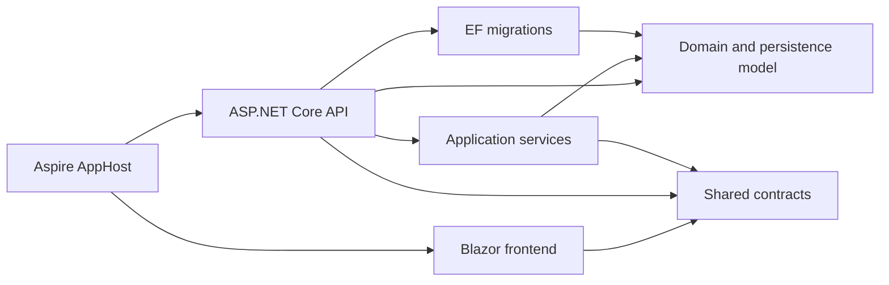

# ARCH-001 - Module map and dependency rules

This document is the implementation boundary for code added after ARCH-001. It
describes the current modular monolith; it is not a request to split the system
into microservices or to rename the repository wholesale.

## Project dependency graph

The arrows are the complete allowed production `ProjectReference` graph. Tests and
test support may depend on production projects; production projects must never
depend on a test project.

| Project | Responsibility | Allowed project references |
|---|---|---|
| `gtas_vpp_shared` | HTTP/request/response contracts, shared constants and framework-neutral status semantics | none |
| `gtas_vpp_be.Model` | EF entities and backend-only database projections | none |
| `gtas_vpp_be.Migrations` | schema history and migration snapshot | Model |
| `gtas_vpp_be.Service` | use cases, business policies, queries and infrastructure adapters | Model, Shared |
| `gtas_vpp_be` | HTTP endpoints, authorization, middleware and composition root | Migrations, Model, Service, Shared |
| `gtas_vpp_fe` | Blazor UI, client state, display metadata and API clients | Shared |
| `MyAspire.AppHost` | local process orchestration | API, FE |
| `MyAspire.ServiceDefaults` | reusable Aspire defaults | none |

Architecture tests enforce this allowlist. A new edge requires an explicit update to
this document and a review explaining why the existing direction cannot support the
use case.

`gtas_vpp.slnx` là solution canonical duy nhất. Format XML ngắn gọn là mặc định của
.NET 10, giảm duplicate và merge conflict; mọi đường dẫn project phải tồn tại.

## Logical modules

Source đã được tổ chức theo `src/Backend`, `src/Frontend`, `src/Hosting`, `src/Shared`
và `tests` ngày 2026-08-03. Assembly/namespace cũ được giữ để tránh thay đổi wire
contract và giảm rủi ro; code mới phải tuân theo ownership logic bên dưới.

| Module | Backend/model ownership | Shared contracts | Frontend ownership |
|---|---|---|---|
| Identity and access | `Model/Auth`, authorization handlers, `AuthController`, `PermissionController`, permission services | `DTOs/Req`, `DTOs/Req/Permission`, `DTOs/Res/Auth`, `DTOs/Res/Permission`, permission constants | authentication, permission pages, `Features/IdentityAccess/Api` clients and `Features/IdentityAccess/State` (`CurrentUserState`, `PermissionState`, `PermissionRefreshSignal`) |
| Catalog and pricing | `Model/Library`, library/price services and controllers | `DTOs/*/Library`, pricing constants | library/catalog and price-management pages |
| Requests | `Model/VPP`, request service/controller | `DTOs/*/VPP` request contracts | regular/additional request journeys |
| Settlement | period settlement service/endpoints | settlement request/response contracts under VPP | settlement panels and confirmation journey |
| Reports | report/insight services and controller | `DTOs/Res/Reports` | reporting pages, charts and exports |
| Notifications | `Model/Notifications`, notification service/controller/hub | `DTOs/Res/Notifications` | `Features/Notifications/{Api,Realtime,State}`: API client, realtime client và inbox state |
| Platform | contexts, Unit of Work, SQL helpers, middleware, configuration and Aspire | only framework-neutral contracts truly consumed by both clients | `Platform/Composition` (startup), `Platform/Api` (shared API problem mapping), `Platform/Auth` (frontend session invalidation), `Platform/State` (cross-feature state), `Platform/Browser` (browser bridge) |

Cross-module writes go through a typed service/use case. Do not add a new generic
repository/controller or a new project merely to satisfy the diagram. Existing flat
folders migrate when they are touched by an approved feature task.

Frontend composition rule: `Program.cs` must remain a short startup outline. Detailed DI registration,
middleware order và endpoint mapping belong to `src/Frontend/Blazor/Platform/Composition/`; do not put
feature registrations or raw HTTP setup back into the composition root. Cross-feature browser/runtime
bridges belong to `Platform/Auth`, `Platform/Browser` or `Platform/State`; feature-specific state stays
with its feature.
Typed feature clients belong to `Features/*/Api`; shell/design-system ownership remains in
`Components/{Layout,DesignSystem}`. Transitional generic transport `Services/APIServices.cs` remains a
migration-on-touch residual, not the target owner for new feature code.

## Shared-contract rules

`gtas_vpp_shared` is a wire-contract assembly, not a common dumping ground.

- It must build with only the .NET BCL: no EF Core, Mapster, Radzen, ASP.NET Core,
  backend project or frontend project dependency.
- It may contain request/response DTOs, enums, constants and deterministic semantics
  required by both API and frontend.
- It must not contain `DbContext` models, database view projections, EF mapping
  attributes, browser storage models, Blazor runtime state, CSS classes, Radzen enum
  names or reflective grid-column metadata.
- Existing JSON names are public API. Legacy casing/spelling such as `UserID`,
  `ErrorMess`, `List_PagePermission` and `PageDesctiprion` cannot be cleaned up without
  an explicit compatibility/cutover task.
- Computed getters currently serialized by System.Text.Json are also public contract
  fields. Do not add `JsonIgnore` or change their type/value semantics casually.
- A contract change needs characterization tests for its sorted JSON property set and
  nested shape. Sensitive fields need a negative serialization assertion.

Backend-only read projections `v_Users` and `v_WFXCompany` belong to
`gtas_vpp_be.Model.View`; their keyless/view mapping remains in `VPPContext`.
Frontend-only state and display metadata belong to the frontend assembly.

## Dependency and contract gates

- `ProductionDependencyRulesTests` locks the exact production project graph and
  forbidden Shared/frontend packages and assembly references.
- `SharedContractSerializationTests` locks representative login, permission, catalog,
  request, report, notification and stored-procedure envelope shapes under
  `JsonSerializerDefaults.Web`.
- `SharedWireContractManifestTests` locks the complete exported Shared DTO/enum wire
  manifest against the base-commit SHA-256, excluding only the eight explicitly moved
  backend/frontend-only types.
- Frontend boundary tests reject EF Core or Mapster assembly references.
- Frontend grid-metadata tests lock the legacy L01/L02/L04 title, width, visibility,
  dropdown, read-only and deterministic order behavior after moving it out of Shared.

Use property-set assertions instead of whitespace/order-sensitive JSON files. Backend
HTTP serialization currently uses ASP.NET Core Web defaults; frontend response reads
are case-insensitive. Standardizing every JSON call is a separate compatibility task.

## Migration-on-touch rules

1. Put new domain behavior in the owning service/module, not in DTOs, Razor code or a
   generic controller.
2. Put EF entities/projections and mapping in Model/Service context ownership, never
   Shared or FE.
3. Put client-only state and presentation metadata in FE.
4. Preserve public wire API shape until both API and FE consumers have characterization
   coverage and an explicit cutover.
5. Move an existing class only while an approved task already touches its behavior;
   do not mass-rename namespaces for cosmetic consistency.
6. Add a project reference only after updating the allowlist test and this map.

## Known residuals and owners

These findings are intentionally not fixed by ARCH-001 because they change behavior
or require a larger compatibility cutover.

Current-tree refresh `2026-08-04`: historical `SQLController` no longer exists and has no callsite;
the B0R HTTP manifest now locks the active controller surface instead of keeping that stale residual.

| Residual | Risk | Follow-up owner |
|---|---|---|
| FE user-group request omits department while BE upsert expects it; an update can clear the department | authorization data integrity | AUTH-001/AUTH-002, with controller and contract tests |
| Duplicate Auth/Permission request and response DTO families | silent shape divergence | AUTH-001 migration to one canonical permission contract |
| DTOs contain no-op disposal patterns and several apparently dead contracts | public-surface clutter | ARCH-002, only after consumer/public API audit |
| Some response/wire DTOs expose formatted/computed display fields | locale and presentation coupling on the wire | UI/API compatibility task; preserve for now |
| Money uses both `long` and `decimal`; `DateTime` semantics are not uniform | precision/time-zone ambiguity | PRICE/SET/ARCH tasks with migration and API compatibility plan |
| Service/API folders remain partly flat and some controllers access `VPPContext` directly | layering erosion | migrate per AUTH/CAT/REQ task; no mass rewrite |

## Rollback boundary

ARCH-001 contains no database migration or business-rule change. If a dependency or
contract regression appears, revert the affected internal-move/package-removal slice
while retaining the characterization tests. Database restoration is not applicable.
