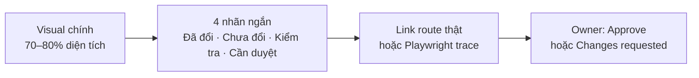

# UI-SYSTEM-001 — Scalable Blazor/Radzen UI System Refactor

- Status: `PLANNED — OWNER REVIEW`
- Priority: P1
- Lập kế hoạch: 2026-07-28 (Asia/Ho_Chi_Minh)
- Frontend authority: `src/Frontend/Blazor/`
- Style contract: Design Atlas M0–M2 đã được owner chuẩn hóa
- Liên quan: [`VPP-PULSE-BLAZOR-UI-RENOVATION-PLAN.md`](../design/VPP-PULSE-BLAZOR-UI-RENOVATION-PLAN.md)

> Tài liệu này chỉ lập kế hoạch. Chưa sửa code UI, backend, API, database, RBAC, LVTN hoặc React cho đến khi owner duyệt mục 9.

---

## 1. Mục tiêu và phạm vi

### Mục tiêu

Xây một UI system Blazor/Radzen có thể mở rộng theo kiểu AI-first: agent mới xác định đúng authority, tìm đúng component, thay đổi một vertical slice nhỏ và chứng minh kết quả trên route thật mà không phải đọc toàn bộ frontend.

Kiến trúc phải đạt bốn đặc tính:

1. **Dễ đọc:** trách nhiệm layout, widget, state và nghiệp vụ không trộn vào một component lớn.
2. **Dễ tùy biến:** visual dùng semantic token và CSS isolation thay vì inline style hoặc `!important` chồng lớp.
3. **Dễ tái sử dụng:** chỉ chia sẻ phần đã xuất hiện ở ít nhất hai consumer thật; route vẫn giữ nghiệp vụ riêng.
4. **Dễ kiểm chứng:** mỗi wave có build/test/browser/accessibility gate và có đường hoàn tác nhỏ.

### Trong scope

- Chuẩn hóa ranh giới Razor/HTML và Radzen.
- Chuẩn hóa token, Radzen bridge, primitive, content state, composite và workspace pattern.
- Di chuyển dần các route Atlas M0–M8 sang kiến trúc mới theo vertical slice.
- Giảm có kiểm soát inline style, hex rời rạc, `!important`, reflection và string configuration.
- Bổ sung architecture test, route-real QA và tài liệu cho AI agent.
- Comment source mới hoặc được chạm viết tiếng Việt ngắn gọn, chỉ giải thích nghiệp vụ/ý đồ khó đoán; identifier vẫn bằng tiếng Anh.

### Ngoài scope

- Không đổi API, DTO, database, RBAC, nghiệp vụ, LVTN hoặc deployment.
- Không khôi phục React POC và không dùng Atlas renderer làm production source.
- Không rewrite toàn frontend, không mass-move file trong một commit và không tạo framework component vạn năng.
- Không tạo `UniversalPage<T>`, `UniversalGrid<T>`, reflection-driven column engine hoặc cấu hình behavior bằng string.

---

## 2. Baseline đã kiểm chứng

Snapshot repository ngày 2026-07-28:

| Bằng chứng | Hiện trạng | Ý nghĩa cho plan |
|---|---:|---|
| Razor component | 81 file | Cần progressive disclosure, không bắt agent nạp cả cây UI. |
| Authenticated route | 23 logical route | `RouteCatalog` tiếp tục là source of truth cho navigation và QA. |
| Anonymous route | 9 logical route | Account flow là regression set riêng. |
| Authored CSS | 27 file | Chưa cần gom một lần; migrate theo owner/consumer. |
| Inline style | 261 occurrence | Debt cần giảm dần ở file được chạm. |
| `!important` | 755 occurrence | Có dấu hiệu cascade/load-order đang bị bù bằng override mạnh. |
| Authored hex | 131 occurrence | Phân loại token hợp lệ và màu rời rạc trước khi thay. |
| CSS isolation | 7 `.razor.css` file | Cần ưu tiên isolation cho component/route mới hoặc được tách. |

Các điểm nóng cần xử lý có thứ tự:

1. `Components/App.razor` đang khai báo project CSS trước `RadzenTheme`; trái contract “Radzen base trước project overrides” và có thể góp phần làm tăng `!important`.
2. `Component_ShareGrid<TType>` trộn reflection, string `SearchFields`, optional `DataEndpoint`, CRUD, edit/render và các nhánh theo `typeof(TType)`. Đây là debt cần thay dần, không rewrite big-bang.
3. `EmptyState`, `VppEmptyState` và `VppStatePanel` đang chồng trách nhiệm; cần một primitive state canonical rồi mới xóa adapter không còn consumer.
4. `VppOrderWorkspacePanel` và `HistoryOrderDetailSheet` có phần order-detail tương đồng, phù hợp làm composite dùng chung đầu tiên sau khi so sánh behavior thật.
5. `RouteCatalog.NavigationQueryParams` chưa phản ánh đầy đủ query đang dùng như `periodTab` và `orderView`; F0 phải audit metadata trước khi mở rộng QA/navigation helper.
6. Một số file lớn như `vpp-layout.css`, `Tab_History.razor.css`, `vpp-admin.css`, `Component_ShareGrid.razor.cs` và `Page_OrderCreate.razor.cs` cần tách theo responsibility, không theo quota dòng máy móc.

---

## 3. Kiến trúc đích

```text
Design token
  ↓
Primitive
  ↓
Composite
  ↓
Workspace pattern
  ↓
Route + API + permission + business state
```

| Tầng | Sở hữu | Không được sở hữu |
|---|---|---|
| Token | màu semantic, spacing, typography, radius, shadow, motion, control size | nghiệp vụ hoặc selector route cụ thể |
| Primitive | một hành vi/visual ổn định: button, badge, field, surface, content state | API call, permission orchestration, entity-specific rule |
| Composite | cụm có mục đích rõ: filter bar, KPI strip, entity header, order-detail surface | router hoặc workflow toàn trang |
| Pattern | bố cục/state composition: Collection, ListDetail, Operation, Analytics | reflection DTO, endpoint string hoặc CRUD generic |
| Route | API, permission, business state, copy và ngoại lệ đã duyệt | tự định nghĩa lại token/shared interaction |

### Cấu trúc hướng tới

```text
src/Frontend/Blazor/
├─ Components/
│  ├─ DesignSystem/
│  │  ├─ Primitives/
│  │  ├─ Composites/
│  │  └─ Patterns/
│  ├─ Layout/
│  └─ Pages/
└─ wwwroot/css/
   ├─ foundations/
   ├─ integrations/
   └─ legacy/
```

Đây là hướng tổ chức, không phải lệnh mass-move. Folder chỉ được tạo khi vertical slice đầu tiên có consumer thật; file legacy chỉ chuyển/xóa khi replacement đã pass regression và không còn consumer.

### Composition contract

- Dùng `RenderFragment`, typed enum/record và parameter có nghĩa; tránh `string Style`, selector hoặc endpoint string cho component mới.
- Chỉ trích xuất abstraction sau khi quan sát ít nhất hai route có cùng layout **và** behavior.
- Nếu hai route chỉ giống visual nhưng khác state/permission/interaction, giữ hai component nhỏ và chia sẻ primitive/composite thấp hơn.
- Component shared phải có API hẹp, default an toàn, trạng thái loading/empty/error/denied và accessible name rõ.

---

## 4. Ranh giới Blazor/Radzen

### Razor/HTML sở hữu

- App shell, navigation, page surface, responsive layout, toolbar và action hierarchy.
- Content state, semantic landmark, ARIA relationship và DOM cần kiểm soát ổn định.
- Composition giữa route, composite và pattern.

### Radzen sở hữu

- `DataGrid`, `Dialog`, `DropDown`, `DatePicker`, `Numeric`, validation và widget phức tạp tạo giá trị rõ.
- Grid route thật phải khai báo column rõ ràng; dataset dài dùng `LoadData`/server paging hoặc virtualization theo contract dữ liệu.
- Không bọc toàn bộ Radzen. Project custom qua token, bridge CSS và component có mục đích.

### CSS cascade contract

Thứ tự mục tiêu:

1. Radzen base/theme.
2. Foundation token/base.
3. Radzen integration bridge.
4. Shared component styles.
5. Route CSS isolation/override hẹp.

Không thêm `!important` mới nếu chưa chứng minh specificity hoặc third-party inline style bắt buộc. Mỗi file được chạm phải giữ nguyên hoặc giảm inline style/hex/`!important`; không dồn debt sang file khác.

---

## 5. Kế hoạch thực thi F0–F7

Đây là bảng canonical duy nhất cho chuỗi wave. Báo cáo tiến độ và bản một ánh nhìn phải link về bảng này, không tạo bảng F0–F7 hoặc routing song song.

| Wave | Trạng thái | Model + effort | Thực hiện | Sau wave anh có gì | Visual review | Gate để mở wave sau |
|---|---|---|---|---|---|---|
| F0 — Baseline & guard | `READY — OWNER APPROVAL` | **Sol · High** | Sửa CSS load order; audit route/query metadata; lập component/debt catalog; thêm architecture checks. | **Nền kỹ thuật:** baseline đáng tin, UI gần như giữ nguyên và có test chặn lỗi kiến trúc quay lại. | Contact sheet before/after của 4 route + mini diagram CSS/cascade. | Không có visual change ngoài ý muốn; build/test và 4 route browser regression pass. |
| F1 — Token & bridge | `PENDING F0` | **Sol · High** | Chuẩn hóa semantic token Light/Dark, Radzen bridge và phân loại legacy CSS. | **Nền visual:** màu, spacing, typography, radius và shadow có một nơi rõ để chỉnh. | Theme board token + cùng một cụm Radzen ở Light/Dark. | Không tăng hex/inline/`!important`; representative contrast pass. |
| F2 — Primitive & state | `PENDING F1` | **Terra · High**; **Sol · High** review | Tạo primitive nhỏ và content-state canonical; migrate tối thiểu 2 consumer; chỉ xóa adapter đã hết consumer. | **Khung cơ bản dùng được:** loading/empty/filter-empty/error/denied nhất quán trên các route đầu tiên. | State matrix desktop/mobile; trace keyboard/focus khi cần. | API typed; unit/architecture/accessibility pass; route thật không regression. |
| F3 — Composite | `PENDING F2` | **Sol · High** | Tạo composite sau khi so sánh 2 consumer thật; ưu tiên order-detail cho My Orders và History nếu behavior cho phép. | **Luồng mẫu hoàn chỉnh:** chứng minh tái sử dụng không làm mất dữ liệu, action hoặc nghiệp vụ. | My Orders và History cạnh nhau, highlight order-detail dùng chung. | Data, action, paging/virtualization và responsive behavior giữ đúng. |
| F4 — Pattern | `PENDING F3` | **Sol · XHigh** | Tạo contract nhỏ, typed và tùy biến bằng slot cho Collection, ListDetail, SplitEditor, Operation, Analytics/Account khi đủ consumer. | **Khung scalable hoàn chỉnh:** đủ nền để migrate nhanh sản phẩm mà route vẫn giữ nghiệp vụ riêng. | Pattern map dạng card + thumbnail consumer thật. | Không reflection/endpoint string; route giữ API/permission; tối thiểu 2 consumer/pattern. |
| F5 — M0–M2 reference | `PENDING F4` | **Terra · High**; **Sol · High** review từng slice | Migrate shell, account, catalog, order create, My Orders và History thành reference implementation. | **UI nhóm người dùng chính hoàn chỉnh** trên UI system mới và trở thành mẫu cho agent. | Contact sheet M0–M2 có mobile/desktop và Light/Dark đại diện. | 4 viewport, VI/EN, Light/Dark, state, console/network và accessibility pass. |
| F6 — M3–M8 rollout | `PENDING F5` | **Terra · High** | Migrate management, period, library, permission, report và system state; gỡ replacement cũ khi hết consumer. | **Toàn bộ UI trong scope hiện tại** chạy trên khung mới. | Contact sheet chia theo subwave/nhóm nghiệp vụ; trace cho period/permission. | Từng vertical slice có test, route-real QA, evidence và owner review trước commit. |
| F7 — Hardening | `PENDING F6` | **Sol · XHigh** | Dọn legacy còn replacement, tối ưu performance/axe/Print và khóa visual baseline đã được owner duyệt. | **`UI-SYSTEM-001` hoàn chỉnh:** sẵn sàng bàn giao và mở rộng lâu dài. | Final board: before/after, 4 viewport, Light/Dark/Print và QA scorecard. | Full frontend verify, route matrix đại diện, performance/accessibility và debt report pass. |

Routing trên áp dụng riêng cho `UI-SYSTEM-001`, dựa trên [OpenAI model selection](https://learn.chatgpt.com/docs/models) và [latest model guide](https://developers.openai.com/api/docs/guides/latest-model) đã kiểm tra ngày 2026-07-28, cùng snapshot owner cung cấp: **10 tài khoản Plus full quota qua CLIProxyAPI**. Snapshot này chưa được CLIProxy tự đo và phải hỏi lại trước khi bắt đầu một wave ở phiên/task mới. Chỉ đổi model ở ranh giới wave hoặc checkpoint lớn; `Sol review` là một lượt review độc lập, không phải hai agent cùng sửa một worktree. Nếu surface hiện tại không cho agent tự chuyển model/effort, owner chọn model được khuyến nghị rồi agent xác minh trước khi tiếp tục. Capacity chỉ ảnh hưởng sequencing/review budget, không cho phép agent truy cập hoặc đổi credential/account hay né rate limit/điều khoản provider.

Mốc dễ hiểu:

- Kết thúc **F0**: nền an toàn, chưa phải UI mới.
- Kết thúc **F4**: khung reusable/scalable đã hoàn chỉnh, nhưng chưa phải toàn bộ màn đã migrate.
- Kết thúc **F6**: toàn bộ UI trong scope hiện tại đã lên khung mới.
- Kết thúc **F7**: hoàn tất kỹ thuật, QA, dọn legacy và handoff của `UI-SYSTEM-001`.

### 5.1 Visual review contract

**Quyết định:** hình ảnh là lớp truyền đạt chính cho owner, nhưng không phải bằng chứng duy nhất. Mỗi wave phải tạo một `Wave Review Board` vừa một màn hình, ưu tiên visual và chỉ dùng nhãn ngắn. Screenshot phải lấy từ Blazor runtime với TEST/isolated fixture sau khi implementation chạy được; không dùng mock hoặc Atlas render để tuyên bố code đã hoàn thành.



Format cố định của mỗi board:

1. Một visual chính đủ lớn để nhìn được trong một lần mở.
2. Tối đa bốn nhãn ngắn: `Đã thay đổi`, `Giữ nguyên`, `Đã kiểm tra`, `Cần owner duyệt`.
3. Một link đến route thật hoặc Playwright trace nếu cần hiểu click, focus, animation, responsive hoặc lỗi.
4. Một mô tả text ngắn nằm ngoài ảnh để tìm kiếm, handoff và đảm bảo accessibility; không nhúng đoạn giải thích dài vào ảnh.

Evidence runtime đầy đủ tiếp tục nằm trong folder ignored. Sau owner approval, mỗi wave được phép commit **một** review board đã nén, dùng deterministic TEST data và không chứa secret/PII vào `docs/design/evidence/ui-system/` nếu nó tạo giá trị handoff lâu dài. Không commit toàn bộ screenshot/trace/video thô.

### Thứ tự migration ưu tiên

1. CSS load order và architecture guard.
2. Content state canonical.
3. Order detail: My Orders + History.
4. Collection workspace: Departments + Categories trước, rồi mới thay dần `Component_ShareGrid<TType>`.
5. Shell, filters, KPI và các route M3–M8.

Không xóa `Component_ShareGrid<TType>` cho đến khi từng consumer đã có replacement, regression pass và rollback commit rõ.

---

## 6. Validation và Definition of Done

### Gate code

```powershell
./scripts/gtas.cmd test-frontend
dotnet build gtas_vpp.slnx -c Release
./scripts/gtas.cmd verify -Scope frontend
git diff --check
```

Chỉ báo pass cho command thực sự đã chạy ở change-set đó; số lượng test lịch sử không phải invariant.

### Gate route thật

- Viewport: `390×844`, `768×1024`, `1366×768`, `1920×1080`.
- Locale/theme: VI/EN và Light/Dark ở representative matrix phù hợp scope.
- State: loading, normal, empty, filter-empty, error, denied và disabled khi route có state đó.
- Kiểm tra interaction, keyboard/focus, semantic/ARIA, overflow, console và network.
- Dataset lớn phải chứng minh bounded DOM/server paging/virtualization; không tải toàn bộ 500 item vào DOM.
- Build/unit pass không thay browser approval. Golden visual baseline chỉ tạo sau owner duyệt visual.

### Definition of Done cho mỗi slice

1. Đúng authority và không đổi nghiệp vụ ngoài scope.
2. Có ít nhất một route thật chứng minh component; shared abstraction cần tối thiểu hai consumer.
3. Không tăng debt bị cấm; debt cũ được giảm hoặc ghi rõ lý do chưa thể giảm.
4. Test hẹp trong vòng lặp, frontend verify khi hoàn tất, browser QA tương xứng rủi ro.
5. Diff review sạch, comment tiếng Việt đúng chỗ, docs/route ledger cập nhật cùng change-set.
6. Một commit logic, không stage file ngoài scope và không push nếu owner chưa yêu cầu.

---

## 7. Vertical slice đầu tiên sau khi owner duyệt

### F0.1 — CSS order contract

- Chuyển Radzen base/theme lên trước project CSS trong `Components/App.razor`.
- Giữ nguyên một cây `InteractiveServer` và không thêm page-level render mode.
- Thêm architecture assertion cho thứ tự stylesheet để lỗi không quay lại.
- Mục tiêu là sửa cascade contract, không redesign. Nếu screenshot khác, dừng và phân loại override nào đang phụ thuộc sai load order.

### F0.2 — Route metadata contract

- Audit `RouteCatalog.NavigationQueryParams` với query thật (`tab`, `managementTab`, `pricingTab`, `periodTab`, `orderView`, ...).
- Bổ sung test catalog/navigation; không đổi URL contract nếu chưa có bằng chứng consumer.

### F0.3 — Regression baseline

Chạy bốn archetype đại diện:

1. `/Account/Login` — account/anonymous.
2. `/dashboard?tab=0` và History — employee/order workspace.
3. `/library` Departments/Categories — collection/reflection debt baseline.
4. `/permission` hoặc `/report` — permission/data visualization.

F0 chỉ được commit khi code gates pass và browser diff được giải thích; không dùng `!important` mới để che cascade regression.

---

## 8. Rủi ro và recovery

| Rủi ro | Cách khóa | Recovery |
|---|---|---|
| Đổi CSS order làm lộ override phụ thuộc sai | F0.1 riêng, route matrix nhỏ, inspect computed style | Revert riêng F0.1; sửa từng bridge selector rồi chạy lại. |
| Tạo design system quá lớn trước nhu cầu | Quy tắc 2 consumer, typed API, route sở hữu nghiệp vụ | Không promote abstraction; giữ local component đến khi đủ evidence. |
| Big-bang thay `Component_ShareGrid` | Migrate Departments/Categories trước; consumer ledger | Giữ component cũ cho consumer chưa migrate. |
| Shared component làm mất ngoại lệ route | Slot/typed parameter hẹp, contract state/action rõ | Hạ abstraction xuống composite/primitive thấp hơn. |
| Build pass nhưng UI sai | Browser route thật là visual authority | Không mở wave tiếp theo, lưu evidence và sửa trong cùng slice. |
| Trôi sang backend/RBAC/LVTN | Scope check + preflight + diff review | Tách proposal và xin approval riêng; không trộn commit. |

---

## 9. Owner approval gate

Trước khi sửa UI thật, owner duyệt ba điểm:

- [ ] Kiến trúc hybrid và quy tắc `2 consumer trước abstraction`.
- [ ] Thứ tự F0–F7 và nguyên tắc migrate dần, không rewrite big-bang.
- [ ] Slice đầu tiên F0.1–F0.3: CSS order, route metadata và regression baseline.

Sau approval, agent thực thi F0 end-to-end, báo bằng chứng và commit local. Push/PR chỉ khi owner yêu cầu rõ.

---

## 10. Nguồn kỹ thuật

- [Microsoft Learn — ASP.NET Core Blazor CSS isolation](https://learn.microsoft.com/aspnet/core/blazor/components/css-isolation)
- [Microsoft Learn — ASP.NET Core Blazor rendering performance](https://learn.microsoft.com/aspnet/core/blazor/performance/rendering)
- [Radzen Blazor DataGrid](https://blazor.radzen.com/datagrid)
- [Radzen DataGrid LoadData](https://blazor.radzen.com/datagrid-loaddata)
- [Radzen DataGrid column picker](https://blazor.radzen.com/datagrid-column-picker)
- [Playwright Trace Viewer](https://playwright.dev/docs/trace-viewer)
- [W3C WAI — Images Tutorial](https://www.w3.org/WAI/tutorials/images/)

Repository source và browser Blazor thật vẫn có thẩm quyền cao hơn ví dụ chung trong tài liệu framework khi behavior dự án khác nhau.
