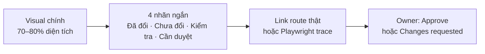

# UI-SYSTEM-001 — Scalable Blazor/Radzen UI System Refactor

- Status: `IN_REVIEW — F0/F1/F2/F3 DONE; F4 IMPLEMENTED`
- Priority: P1
- Lập kế hoạch: 2026-07-28 (Asia/Ho_Chi_Minh)
- Frontend authority: `src/Frontend/Blazor/`
- Style contract: Design Atlas M0–M2 đã được owner chuẩn hóa
- Liên quan: [`VPP-PULSE-BLAZOR-UI-RENOVATION-PLAN.md`](../design/VPP-PULSE-BLAZOR-UI-RENOVATION-PLAN.md)
- CSS ownership: [`VPP-UI-CSS-OWNERSHIP.md`](../design/VPP-UI-CSS-OWNERSHIP.md)

> F0 và F1 đã được tích hợp vào branch authority; owner xác nhận F1 hoàn tất. F2 đã qua Terra implementation, Sol review và lượt fix regression. Owner mở F4 sau khi duyệt F3. F4 đã tích hợp năm lượt owner review, đang chờ duyệt visual cuối; chưa mở F5.

---

## 1. Mục tiêu và phạm vi

### Mục tiêu

Xây một UI system Blazor/Radzen có thể mở rộng theo kiểu AI-first: agent mới xác định đúng authority, tìm đúng component, thay đổi một vertical slice nhỏ và chứng minh kết quả trên route thật mà không phải đọc toàn bộ frontend.

Kiến trúc phải đạt bốn đặc tính:

1. **Dễ đọc:** trách nhiệm layout, widget, state và nghiệp vụ không trộn vào một component lớn.
2. **Dễ tùy biến:** visual dùng semantic token và CSS isolation thay vì inline style hoặc `!important` chồng lớp.
3. **Dễ tái sử dụng:** chỉ chia sẻ phần đã xuất hiện ở ít nhất hai consumer thật; route vẫn giữ nghiệp vụ riêng.
4. **Dễ kiểm chứng:** mỗi wave có build/test/browser/accessibility gate và có đường hoàn tác nhỏ.

### Trong scope

- Chuẩn hóa ranh giới Razor/HTML và Radzen.
- Chuẩn hóa token, Radzen bridge, primitive, content state, composite và workspace pattern.
- Di chuyển dần các route Atlas M0–M8 sang kiến trúc mới theo vertical slice.
- Giảm có kiểm soát inline style, hex rời rạc, `!important`, reflection và string configuration.
- Bổ sung architecture test, route-real QA và tài liệu cho AI agent.
- Comment source mới hoặc được chạm viết tiếng Việt ngắn gọn, chỉ giải thích nghiệp vụ/ý đồ khó đoán; identifier vẫn bằng tiếng Anh.

### Ngoài scope

- Không đổi API, DTO, database, RBAC, nghiệp vụ, LVTN hoặc deployment.
- Không khôi phục React POC và không dùng Atlas renderer làm production source.
- Không rewrite toàn frontend, không mass-move file trong một commit và không tạo framework component vạn năng.
- Không tạo `UniversalPage<T>`, `UniversalGrid<T>`, reflection-driven column engine hoặc cấu hình behavior bằng string.

---

## 2. Baseline đã kiểm chứng

Snapshot repository ngày 2026-07-28:

| Bằng chứng | Hiện trạng | Ý nghĩa cho plan |
|---|---:|---|
| Razor component | 81 file | Cần progressive disclosure, không bắt agent nạp cả cây UI. |
| Authenticated route | 30 logical route | `RouteCatalog` đã phản ánh các view/sub-flow query thật và tiếp tục là source of truth cho navigation/QA. |
| Anonymous route | 10 logical route | Account flow gồm ConfirmEmail động và là regression set riêng. |
| Authored CSS | 27 file | Chưa cần gom một lần; migrate theo owner/consumer. |
| Inline style | 261 occurrence | Debt cần giảm dần ở file được chạm. |
| `!important` | 756 occurrence | Debt baseline hiện tại; F0 không thêm occurrence mới trong diff. |
| Authored hex | 131 occurrence | Phân loại token hợp lệ và màu rời rạc trước khi thay. |
| CSS isolation | 7 `.razor.css` file | Cần ưu tiên isolation cho component/route mới hoặc được tách. |

Các điểm nóng cần xử lý có thứ tự:

1. `Components/App.razor` đang khai báo project CSS trước `RadzenTheme`; trái contract “Radzen base trước project overrides” và có thể góp phần làm tăng `!important`.
2. `Component_ShareGrid<TType>` trộn reflection, string `SearchFields`, optional `DataEndpoint`, CRUD, edit/render và các nhánh theo `typeof(TType)`. Đây là debt cần thay dần, không rewrite big-bang.
3. `EmptyState`, `VppEmptyState` và `VppStatePanel` đang chồng trách nhiệm; cần một primitive state canonical rồi mới xóa adapter không còn consumer.
4. `VppOrderWorkspacePanel` và `HistoryOrderDetailSheet` có phần order-detail tương đồng, phù hợp làm composite dùng chung đầu tiên sau khi so sánh behavior thật.
5. `RouteCatalog.NavigationQueryParams` chưa phản ánh đầy đủ query đang dùng như `periodTab` và `orderView`; F0 phải audit metadata trước khi mở rộng QA/navigation helper.
6. Một số file lớn như `vpp-layout.css`, `Tab_History.razor.css`, `vpp-admin.css`, `Component_ShareGrid.razor.cs` và `Page_OrderCreate.razor.cs` cần tách theo responsibility, không theo quota dòng máy móc.

---

## 3. Kiến trúc đích

```text
Design token
  ↓
Primitive
  ↓
Composite
  ↓
Workspace pattern
  ↓
Route + API + permission + business state
```

| Tầng | Sở hữu | Không được sở hữu |
|---|---|---|
| Token | màu semantic, spacing, typography, radius, shadow, motion, control size | nghiệp vụ hoặc selector route cụ thể |
| Primitive | một hành vi/visual ổn định: button, badge, field, surface, content state | API call, permission orchestration, entity-specific rule |
| Composite | cụm có mục đích rõ: filter bar, KPI strip, entity header, order-detail surface | router hoặc workflow toàn trang |
| Pattern | bố cục/state composition: Collection, ListDetail, Operation, Analytics | reflection DTO, endpoint string hoặc CRUD generic |
| Route | API, permission, business state, copy và ngoại lệ đã duyệt | tự định nghĩa lại token/shared interaction |

### Cấu trúc hướng tới

```text
src/Frontend/Blazor/
├─ Components/
│  ├─ DesignSystem/
│  │  ├─ Primitives/
│  │  ├─ Composites/
│  │  └─ Patterns/
│  ├─ Layout/
│  └─ Pages/
└─ wwwroot/css/
   ├─ foundations/
   ├─ integrations/
   └─ legacy/
```

Đây là hướng tổ chức, không phải lệnh mass-move. Folder chỉ được tạo khi vertical slice đầu tiên có consumer thật; file legacy chỉ chuyển/xóa khi replacement đã pass regression và không còn consumer.

### Composition contract

- Dùng `RenderFragment`, typed enum/record và parameter có nghĩa; tránh `string Style`, selector hoặc endpoint string cho component mới.
- Chỉ trích xuất abstraction sau khi quan sát ít nhất hai route có cùng layout **và** behavior.
- Nếu hai route chỉ giống visual nhưng khác state/permission/interaction, giữ hai component nhỏ và chia sẻ primitive/composite thấp hơn.
- Component shared phải có API hẹp, default an toàn, trạng thái loading/empty/error/denied và accessible name rõ.

---

## 4. Ranh giới Blazor/Radzen

### Razor/HTML sở hữu

- App shell, navigation, page surface, responsive layout, toolbar và action hierarchy.
- Content state, semantic landmark, ARIA relationship và DOM cần kiểm soát ổn định.
- Composition giữa route, composite và pattern.

### Radzen sở hữu

- `DataGrid`, `Dialog`, `DropDown`, `DatePicker`, `Numeric`, validation và widget phức tạp tạo giá trị rõ.
- Grid route thật phải khai báo column rõ ràng; dataset dài dùng `LoadData`/server paging hoặc virtualization theo contract dữ liệu.
- Không bọc toàn bộ Radzen. Project custom qua token, bridge CSS và component có mục đích.

### CSS cascade contract

Thứ tự mục tiêu:

1. Radzen base/theme.
2. Foundation token/base.
3. Radzen integration bridge.
4. Shared component styles.
5. Route CSS isolation/override hẹp.

Không thêm `!important` mới nếu chưa chứng minh specificity hoặc third-party inline style bắt buộc. Mỗi file được chạm phải giữ nguyên hoặc giảm inline style/hex/`!important`; không dồn debt sang file khác.

---

## 5. Kế hoạch thực thi F0–F7

Đây là bảng canonical duy nhất cho chuỗi wave. Báo cáo tiến độ và bản một ánh nhìn phải link về bảng này, không tạo bảng F0–F7 hoặc routing song song.

| Wave | Trạng thái | Model + effort · lý do | Thực hiện | Sau wave anh có gì | Visual review | Gate để mở wave sau |
|---|---|---|---|---|---|---|
| F0 — Baseline & guard | `DONE — OWNER REVIEW` | **Sol · High** — cascade/architecture mơ hồ, sai nền sẽ lan toàn plan. | Sửa CSS load order; audit route/query metadata; lập component/debt catalog; thêm architecture checks. | **Nền kỹ thuật:** baseline đáng tin, UI gần như giữ nguyên ở desktop; breakpoint 390/768 không còn chừa gutter cho sidebar đã ẩn. | Contact sheet before/after 4 route + diagram cascade trong evidence local ignored. | Focused architecture, route-real matrix và full frontend verify đã pass. |
| F1 — Token & bridge | `DONE — OWNER CONFIRMED` | **Sol · High** — token/bridge ảnh hưởng mọi component phía sau. | Chuẩn hóa semantic token Light/Dark, Radzen bridge và phân loại legacy CSS. | **Nền visual:** màu, spacing, typography, radius và shadow có một nơi rõ để chỉnh. | Theme board 4 route thật đặt Light/Dark cạnh nhau. | Hex authored giảm `131 → 108`; inline/`!important` không tăng; resolved bridge, route health và representative axe pass. |
| F2 — Primitive & state | `DONE — SOL REVIEWED` | **Terra · High** implement; **Sol · High** review — khóa API/state contract và regression visual. | Tạo `VppContentState` typed; migrate History + Catalog; giữ adapter còn consumer; sửa class CSS compatibility và khôi phục retry icon. | **Khung cơ bản dùng được:** error và filter-empty đầu tiên đã thống nhất typed API. | Runtime isolated History + Catalog; evidence thô ignored. | Build `0 warning/error`, frontend `180/180`, isolated Playwright `3/3`; fix ở `139e151`. |
| F3 — Composite | `DONE — OWNER APPROVED` | **Sol · High** — phải suy luận behavior chung từ hai consumer thật, rủi ro abstraction sai. | Trích xuất order-detail filter-to-footer typed dùng chung; shared composite sở hữu focus/hover, popup positioning, row feedback, scrollbar gutter, virtualization và footer; route chỉ giữ header/action/API/nghiệp vụ. | **Luồng mẫu hoàn chỉnh:** My Orders và History giống nhau cả interaction + scroll; chỉ header nghiệp vụ và độ rộng route khác nhau. Danh sách đơn History vẫn giữ paging/footer riêng. | Runtime isolated: popup board hai route + fixture 500 dòng; evidence local ignored. | Owner mở F4; build/frontend + direct parity + long-scroll gate đã pass. |
| F4 — Pattern | `IMPLEMENTED — OWNER REVIEW` | **Sol · XHigh** — checkpoint kiến trúc khó nhất, ảnh hưởng scalability dài hạn. | Khóa `page outer inset`; tạo sáu pattern typed/slot-based; chuẩn hóa shell seam, directional indicator, navigation rhythm và transient-surface motion toàn cục. | **Khung scalable hoàn chỉnh:** agent có bản đồ chọn pattern; page giữ cùng nhịp với header/sidebar; interaction nổi dùng một ngôn ngữ; route vẫn sở hữu API/permission/nghiệp vụ. Đây chưa phải toàn bộ màn đã migrate. | Runtime board 6 archetype + 12 route consumer; shell expanded/collapsed; hover/indicator và popup filter; evidence local ignored. | Không reflection/endpoint string; architecture/frontend pass; route geometry, seam, indicator và transient motion pass. |
| F5 — M0–M2 reference | `PENDING OWNER APPROVAL F4` | **Terra · High** implement; **Sol · High** review từng slice — giữ chuẩn reference. | Migrate shell, account, catalog, order create, My Orders và History thành reference implementation. | **UI nhóm người dùng chính hoàn chỉnh** trên UI system mới và trở thành mẫu cho agent. | Contact sheet M0–M2 có mobile/desktop và Light/Dark đại diện. | 4 viewport, VI/EN, Light/Dark, state, console/network và accessibility pass. |
| F6 — M3–M8 rollout | `PENDING F5` | **Terra · High** — rollout lớn nhưng pattern đã ổn định. | Migrate management, period, library, permission, report và system state; gỡ replacement cũ khi hết consumer. | **Toàn bộ UI trong scope hiện tại** chạy trên khung mới. | Contact sheet chia theo subwave/nhóm nghiệp vụ; trace cho period/permission. | Từng vertical slice có test, route-real QA, evidence và owner review trước commit. |
| F7 — Hardening | `PENDING F6` | **Sol · XHigh** — final review cần bắt regression/debt xuyên toàn hệ thống. | Dọn legacy còn replacement, tối ưu performance/axe/Print và khóa visual baseline đã được owner duyệt. | **`UI-SYSTEM-001` hoàn chỉnh:** sẵn sàng bàn giao và mở rộng lâu dài. | Final board: before/after, 4 viewport, Light/Dark/Print và QA scorecard. | Full frontend verify, route matrix đại diện, performance/accessibility và debt report pass. |

Routing trên áp dụng riêng cho `UI-SYSTEM-001`; chỉ đổi model ở ranh giới wave/checkpoint lớn. `Sol review` là lượt review độc lập, không phải hai agent cùng sửa một worktree. Theo quyết định owner mới nhất, plan không kiểm tra hoặc báo cáo quota/% tài khoản trừ khi owner chủ động mở lại phạm vi đó.

Mốc dễ hiểu:

- Kết thúc **F0**: nền an toàn, chưa phải UI mới.
- Kết thúc **F4**: khung reusable/scalable đã hoàn chỉnh, nhưng chưa phải toàn bộ màn đã migrate.
- Kết thúc **F6**: toàn bộ UI trong scope hiện tại đã lên khung mới.
- Kết thúc **F7**: hoàn tất kỹ thuật, QA, dọn legacy và handoff của `UI-SYSTEM-001`.

### 5.2 F2 execution record — 2026-07-28

- F2 được triển khai trên branch authority trước khi hai commit F0/F1 từ worktree tách được tích hợp; hiện dependency đã được hợp nhất đúng thứ tự trong lịch sử branch hiện tại.
- Canonical primitive là `Components/DesignSystem/Primitives/VppContentState.razor` với `VppContentStateKind`; enum bao phủ `Empty`, `FilteredEmpty`, `Loading`, `Error`, `Denied`, `Disabled`, `Success` và `Warning`.
- Hai consumer thật đã migrate: `HistoryOrderList` và `Tab_ProductCatalog`, cho error/retry và filter-empty. `VppStatePanel`/`VppEmptyState` còn consumer nên được giữ làm adapter tương thích, không xóa.
- Sol review phát hiện và sửa hai regression: state class không còn match CSS legacy và retry action mất icon Refresh. Fix commit `139e151`.
- Evidence: `dotnet build src/Frontend/Blazor/gtas_vpp_fe.csproj --no-restore -c Release` (`0 warning/error`); `./scripts/gtas.cmd test-frontend` (`180/180`); isolated Playwright `HistoryTests` + `ProductCatalogTests` (`3/3`). Screenshot/trace thô không commit khi chưa có owner visual approval.

### 5.3 F3 execution record — 2026-07-28

- So sánh hai consumer xác nhận header/action không cùng behavior: My Orders giữ edit/cancel/order-attempt; History giữ drawer/focus/export. F3 không gộp header hoặc nghiệp vụ route.
- Composite canonical là `Components/DesignSystem/Composites/VppOrderItemsSurface.razor`, dùng `VppOrderDetailItem` và enum `VppOrderItemsSurfaceVariant` thay string config/reflection.
- Sau owner review round 2, composite bao phủ toàn bộ từ filter đến footer: search, popup danh mục/đơn vị, clear-filter state, code/note popover, sáu cột `# · Mặt hàng · Danh mục · Đơn vị · Số lượng · Ghi chú`, virtualization, empty/filter-empty và count footer. Variant chỉ giữ context/độ rộng.
- `HistoryOrderDetailSheet` dùng header theo thứ tự dữ liệu của PDF canonical: kicker GTAS VPP, mã + trạng thái, `Kỳ · Loại đơn · Người đặt · Phòng ban · Gửi lúc`, ghi chú và action PDF/Excel. Action `Xem lịch sử phiên bản` đã được gỡ theo yêu cầu owner.
- `HistoryDetailRow` adapter cũ được gỡ; route tiếp tục sở hữu API, filter state, permission, export, edit/cancel và orchestration.
- Một UI test cũ còn tìm `[role=radio]` dù runtime authority đã chuyển sang group button `aria-pressed`; test được cập nhật theo contract hiện hành, không đổi production UI để chiều assertion cũ.
- Evidence round 2: frontend build `0 warning/error`; frontend unit/architecture `188/188`; isolated `DashboardMyOrdersVisualTests` và hai `HistoryTests` pass, bao phủ responsive geometry, dropdown/filter interaction, fixed virtualized header, export actions, console/network và URL-selected view.
- Wave Review Board round 2 local ignored: `gtas-vpp-ui-system-f3-owner-fix/F3-WAVE-REVIEW-BOARD.png`; ảnh thô không commit trước owner approval.
- Owner review round 3 xác nhận danh sách đơn và chi tiết cùng motif nhưng không cùng data behavior: danh sách giữ server paging/nhiều cột/filter riêng; chi tiết giữ virtualization. `VppClearFiltersButton` trở thành primitive dùng chung, toàn bộ control lọc chi tiết về cùng nhịp 32px với danh sách.
- Footer paging danh sách đặt `PagerAlwaysVisible=true`, dùng copy `Hiển thị {from}–{to} trên {total} đơn`; footer paging và footer chi tiết cùng nhịp cao khoảng 42px. Scope owner hiện tại kết thúc ở F3, không tự mở F4.
- Evidence round 3: frontend build `0 warning/error`; frontend unit/architecture `188/188`; isolated `DashboardMyOrdersVisualTests` + hai `HistoryTests` pass `3/3`, gồm parity clear-filter/footer, paging một trang luôn hiện và virtualization không regression.
- Owner review round 4 mở rộng F3 từ visual tĩnh sang interaction/scroll. Atlas là authority cho loại điều hướng dữ liệu (`paging` so với `scroll-virtualized`), không phải pixel authority cho motion; quyết định owner mới nhất yêu cầu hai consumer runtime dùng cùng behavior nên parity này được xử lý ngay trong F3, không đẩy sang F4.
- `VppOrderItemsSurface` sở hữu CSS và JS cho focus/hover, popup neo theo viewport, row hover, scrollbar gutter, overscroll containment và header cố định ngoài scroll host. CSS/JS History không còn điều khiển bên trong shared composite; phần route History chỉ giữ list, chart, header/drawer và orchestration.
- Fixture 500 dòng phát hiện code popover từng khóa theo `Code`, làm nhiều popover cùng mở khi dữ liệu trùng mã. Contract được sửa sang identity số dòng typed; test long-data đồng thời được trỏ từ selector pre-refactor sang `.vpp-order-items-grid` canonical.
- Evidence round 4: build frontend `0 warning/error`; frontend unit/architecture `188/188`; isolated runtime My Orders + History normal/parity `4/4`; fixture 500 dòng My Orders + History long-scroll `2/2`. Gate kiểm focus, hover, popup viewport, row feedback, footer, scrollbar gutter, header ngoài scroll host, bounded DOM và không document-level overflow.
- Feedback owner sau round 4: desktop header tab chưa chọn phải dùng text token tối trên nền sáng; đây là regression shell được sửa ngay. Chuẩn hóa khoảng cách ngoài của mọi page được ghi thành `page outer inset`: mỗi cạnh giữ cùng nhịp giữa các màn hình nhưng bốn cạnh không cần bằng nhau. Phần migrate toàn hệ thống thuộc F4–F6, không triển khai lấn trong F3.

### 5.4 F4 execution record — 2026-07-28

- Owner duyệt F3 bằng yêu cầu mở F4; F3 chuyển `DONE — OWNER APPROVED`. F4 dừng ở review gate hiện tại và không tự mở F5.
- Sáu pattern canonical nằm tại `Components/DesignSystem/Patterns/`: `VppAccountWorkspace`, `VppCollectionWorkspace`, `VppListDetailWorkspace`, `VppSplitEditorWorkspace`, `VppOperationWorkspace` và `VppAnalyticsWorkspace`. API dùng typed enum + `RenderFragment`; folder không chứa reflection, endpoint string hoặc CRUD generic.
- Consumer thật: Account shell cho các account route; Product Catalog + Price Library; Library shared grid + Permission Users; Lookup Library + Order Create; Period Operations + Pending Approval; History + Department Summary. Adapter `VppAccountShell` được giữ để không big-bang bảy route account.
- Bốn token `--vpp-page-inset-block-start`, `--vpp-page-inset-inline-end`, `--vpp-page-inset-block-end`, `--vpp-page-inset-inline-start` là authority cho khoảng cách ngoài page. Mỗi cạnh nhất quán giữa route nhưng bốn cạnh vẫn độc lập để chỉnh theo shell.
- Radzen MCP xác nhận contract `RadzenSplitter`/`RadzenSplitterPane` dùng `Size`, `Min`, `Max` theo px hoặc `%`; `VppSplitEditorWorkspace` chỉ bọc behavior này ở pattern có resize, route cố định dùng CSS grid responsive.
- Regression F4 phát hiện pane master Lookup thiếu 5px sau composition và interaction test đọc màu giữa transition. Production constraint được hiệu chỉnh ở consumer; test tiếp tục so sánh tuyệt đối nhưng chờ transition ổn định trước khi đo.
- Owner review F4 yêu cầu hover tab header theo cùng radius system. Header dùng pseudo-surface inset `--vpp-navigation-surface-cross-inset`, bo `--vpp-radius-md` và hỗ trợ hover/focus-visible; shared indicator vẫn giữ trục đáy nên không biến navigation thành pill.
- Evidence: frontend build `0 warning/error`; frontend unit/architecture `189/189`; `WorkspacePatternTests` pass `1/1` trên 12 route consumer; focused interaction/scroll regression pass `6/6`. `verify -Scope frontend` chạy nhưng dừng ở `model-routing-eval` thuộc nhóm AI-harness đã dirty từ trước và ngoài scope F4 (`62 pass / 1 fail`); không sửa hoặc stage nhóm đó. Screenshot/board thô nằm local ignored, không commit trước owner approval.
- Owner changes round 2 khóa hai thuật ngữ: `symmetric content inset` cho khoảng cách trái–phải của main content và `orientation-aware navigation rhythm` cho gap/cross-axis hover giữa sidebar dọc và header ngang. Block-start/block-end vẫn là token độc lập nhưng phải nhất quán giữa route.
- Divider dọc chuyển từ background của RadzenSidebar sang shell grid pseudo-element, nên header/body/sidebar dùng cùng seam trong cả expanded `286px` và collapsed `72px`. Header native tham gia `vpp-tab-shared-indicator`: chạy ngang cùng duration/easing với rail sidebar chạy dọc; divider/table border không thuộc contract indicator động.
- `vpp-transient-surface` chuẩn hóa enter motion cho user/notification menu, filter menu My Orders + History, code/note/KPI/range popover, column picker và order-note popover; hướng `is-above` mở từ dưới lên, surface dưới trigger mở từ trên xuống, modal giữa màn hình giữ tâm.
- Evidence round 2: frontend build `0 warning/error`; frontend unit/architecture `190/190`; isolated `WorkspacePatternTests`, `ShellNavigationRegressionTests` và `DashboardMyOrdersVisualTests` pass. Gate đo seam mở/thu, content inset bốn cạnh qua 12 consumer, header indicator nhiều frame không teleport, hover rhythm 4px và popup filter dùng motion `200ms cubic-bezier(0.32, 0.72, 0, 1)`. Evidence ảnh ở `tmp/f4-owner-changes/` (ignored); chưa mở F5.
- Owner review round 3 bác kết luận visual đầu tiên vì gate chỉ đo `.vpp-content`, chưa đo mép workspace nhìn thấy. Audit runtime phát hiện hai nguyên nhân gốc: rule legacy `.rz-body { padding: ... !important; }` trong `app.css` ghi đè token shell, và active History panel tự co 30px trong flex container. Rule legacy được giới hạn khỏi `.vpp-layout-body`; History panel nhận `flex/width/min-width` rõ ràng; wrapper route không còn cộng outer padding ẩn.
- Gate mới resolve trực tiếp `--vpp-page-inset-inline-*`, so với computed padding thật, đo visible workspace gap/padding và lặp ở sidebar expanded `286px` lẫn collapsed `72px`. Header/tab con và wizard header vẫn là cấu trúc nội bộ hợp lệ, không bị hiểu nhầm thành outer inset. Evidence round 3: frontend `190/190`; isolated workspace geometry `1/1` trên 10 route ở hai shell state; shell/My Orders/History regression `5/5`; ảnh local ignored ở `tmp/f4-symmetric-inset-final/`. F4 vẫn ở owner review, chưa mở F5.
- Owner review round 4 phát hiện motion dùng `translate + scale` làm sai `getBoundingClientRect()` trong lúc popup fixed-position tự neo theo trigger: surface bị đo khi đang co/dịch rồi nở về kích thước thật, gây lệch ngang và nhảy. Contract toàn cục được đổi sang `opacity + clip-path`; motion chỉ thay đổi phần được vẽ, không thay bounding box hoặc transform định vị của popup/popover.
- Browser gate mới cấm `transform`, `translate`, `scale` trong keyframe transient surface và lấy mẫu mép trái/chiều rộng qua 10 animation frame. Visual QA phải xem bằng mắt chuỗi ảnh start/mid/settled ở runtime thật; geometry test chỉ là lớp phòng hồi quy, không thay kết luận thị giác. `dotnet watch` trên máy owner là tiến trình do owner quản lý: phải kiểm tra port/PID/command line trước mọi thao tác và không tự dừng, restart hoặc chiếm port.
- Evidence round 4: ảnh runtime `1920×1080` start/mid/settled được kiểm bằng mắt, popup giữ cùng mép trái và chiều rộng, không co ngang hoặc đẩy table; My Orders filter + History popover + user menu isolated pass `3/3`; frontend unit/architecture pass `190/190`. `verify -Scope frontend` vẫn dừng ở `model-routing-eval` của nhóm AI-harness dirty ngoài scope (`62 pass / 1 fail`); nhóm đó được giữ nguyên và không stage.
- Owner review round 5 chuyển toàn bộ scrollbar do project tự vẽ/ẩn/gutter sang scrollbar native của browser/OS; các vùng dữ liệu vẫn cuộn nội bộ để route không cuộn cả document. Search chi tiết đơn dùng cùng primitive và visual chrome với search danh sách đơn; header bảng chi tiết dùng cùng token nền/chữ/font-weight với bảng danh sách.
- Product Catalog và Permission Users có page identity header + filter toolbar dùng chung `VppFilterSearch`/`VppFilterSelect`/`VppClearFiltersButton`; popup/popover kế thừa `vpp-transient-surface`. Hai route được bounded theo viewport. Users bỏ nút tải lại, tự reload theo filter và có column picker tương tác; Account được owner duyệt giữ nguyên.
- Create Order dùng nested header `Đơn hàng của tôi › Tạo đơn kỳ này`, header workflow và stepper hai bước rõ hơn; catalog bên trái dùng shared filter motif, nội dung cuộn nội bộ và số thứ tự virtualization lấy từ `RowRenderEventArgs.Index` để không lặp `0/1` sau re-render.
- Evidence round 5: runtime `1920×1080` Catalog, Users + column picker, Create Order và History search parity đã được kiểm bằng mắt; document không overflow, loading overlay đã settle trước capture và controls giữ cùng nhịp 32px. Frontend unit/architecture `190/190`; F4 owner-review browser `2/2`; focused Catalog/workspace/My Orders/History regression `8/8` sau khi sửa selector migration và header-token parity. Evidence thô ở `tmp/f4-owner-review-final2/` (ignored); F4 vẫn chờ owner duyệt, chưa mở F5.
- Owner review round 6 phát hiện account popup ở sidebar thu gọn vẫn kế thừa anchor của sidebar mở rộng: panel rộng nằm từ mép trái và phủ rail. Contract được tách theo shell state: expanded giữ popup trong sidebar; collapsed neo sang phải `--vpp-sidebar-collapsed-width`, bám đáy một compact token và giữ nguyên transient motion không làm đổi geometry.
- Evidence round 6: browser gate chạy cả expanded + collapsed, cấm overlap rail, khóa gap/bottom anchor và width trong viewport; isolated `ShellNavigationRegressionTests.UserMenu_OpensWithoutAnchorDriftOrWidthPulse` pass. Ảnh runtime `f4-user-menu-collapsed-settled.png` đã được kiểm bằng mắt trong folder ignored; chưa mở F5.

### 5.1 Visual review contract

**Quyết định:** hình ảnh là lớp truyền đạt chính cho owner, nhưng không phải bằng chứng duy nhất. Mỗi wave phải tạo một `Wave Review Board` vừa một màn hình, ưu tiên visual và chỉ dùng nhãn ngắn. Screenshot phải lấy từ Blazor runtime với TEST/isolated fixture sau khi implementation chạy được; không dùng mock hoặc Atlas render để tuyên bố code đã hoàn thành. Mọi kết luận về thẳng hàng, khoảng cách, kích thước hoặc motion phải có lượt quan sát bằng mắt trên runtime; motion cần chuỗi frame đại diện thay vì chỉ một ảnh đã settle.



Format cố định của mỗi board:

1. Một visual chính đủ lớn để nhìn được trong một lần mở.
2. Tối đa bốn nhãn ngắn: `Đã thay đổi`, `Giữ nguyên`, `Đã kiểm tra`, `Cần owner duyệt`.
3. Một link đến route thật hoặc Playwright trace nếu cần hiểu click, focus, animation, responsive hoặc lỗi.
4. Một mô tả text ngắn nằm ngoài ảnh để tìm kiếm, handoff và đảm bảo accessibility; không nhúng đoạn giải thích dài vào ảnh.

Evidence runtime đầy đủ tiếp tục nằm trong folder ignored. Sau owner approval, mỗi wave được phép commit **một** review board đã nén, dùng deterministic TEST data và không chứa secret/PII vào `docs/design/evidence/ui-system/` nếu nó tạo giá trị handoff lâu dài. Không commit toàn bộ screenshot/trace/video thô.

### Thứ tự migration ưu tiên

1. CSS load order và architecture guard.
2. Content state canonical.
3. Order detail: My Orders + History.
4. Collection workspace: Departments + Categories trước, rồi mới thay dần `Component_ShareGrid<TType>`.
5. Shell, filters, KPI và các route M3–M8.

Không xóa `Component_ShareGrid<TType>` cho đến khi từng consumer đã có replacement, regression pass và rollback commit rõ.

---

## 6. Validation và Definition of Done

### Gate code

```powershell
./scripts/gtas.cmd test-frontend
dotnet build gtas_vpp.slnx -c Release
./scripts/gtas.cmd verify -Scope frontend
git diff --check
```

Chỉ báo pass cho command thực sự đã chạy ở change-set đó; số lượng test lịch sử không phải invariant.

### Gate route thật

- Viewport: `390×844`, `768×1024`, `1366×768`, `1920×1080`.
- Locale/theme: VI/EN và Light/Dark ở representative matrix phù hợp scope.
- State: loading, normal, empty, filter-empty, error, denied và disabled khi route có state đó.
- Kiểm tra interaction, keyboard/focus, semantic/ARIA, overflow, console và network.
- Dataset lớn phải chứng minh bounded DOM/server paging/virtualization; không tải toàn bộ 500 item vào DOM.
- Build/unit pass không thay browser approval. Golden visual baseline chỉ tạo sau owner duyệt visual.

### Definition of Done cho mỗi slice

1. Đúng authority và không đổi nghiệp vụ ngoài scope.
2. Có ít nhất một route thật chứng minh component; shared abstraction cần tối thiểu hai consumer.
3. Không tăng debt bị cấm; debt cũ được giảm hoặc ghi rõ lý do chưa thể giảm.
4. Test hẹp trong vòng lặp, frontend verify khi hoàn tất, browser QA tương xứng rủi ro.
5. Diff review sạch, comment tiếng Việt đúng chỗ, docs/route ledger cập nhật cùng change-set.
6. Một commit logic, không stage file ngoài scope và không push nếu owner chưa yêu cầu.

---

## 7. Vertical slice đầu tiên sau khi owner duyệt

### F0.1 — CSS order contract

- Chuyển Radzen base/theme lên trước project CSS trong `Components/App.razor`.
- Giữ nguyên một cây `InteractiveServer` và không thêm page-level render mode.
- Thêm architecture assertion cho thứ tự stylesheet để lỗi không quay lại.
- Mục tiêu là sửa cascade contract, không redesign. Nếu screenshot khác, dừng và phân loại override nào đang phụ thuộc sai load order.

### F0.2 — Route metadata contract

- Audit `RouteCatalog.NavigationQueryParams` với query thật (`tab`, `managementTab`, `pricingTab`, `periodTab`, `orderView`, ...).
- Bổ sung test catalog/navigation; không đổi URL contract nếu chưa có bằng chứng consumer.

### F0.3 — Regression baseline

Chạy bốn archetype đại diện:

1. `/Account/Login` — account/anonymous.
2. `/dashboard?tab=0` và History — employee/order workspace.
3. `/library` Departments/Categories — collection/reflection debt baseline.
4. `/permission` hoặc `/report` — permission/data visualization.

F0 chỉ được commit khi code gates pass và browser diff được giải thích; không dùng `!important` mới để che cascade regression.

### 7.1 — Kết quả thực thi F0

- `Components/App.razor` tải Radzen base trước `app.css`, VPP tokens, Radzen bridge và các project override; runtime test xác nhận đúng thứ tự link thật.
- Shell breakpoint đồng bộ với Radzen responsive: `<= 768px` là mobile/overlay, `>= 769px` là desktop/tablet grid. Quy tắc specificity cao không còn giữ cột sidebar 64px khi sidebar đã ẩn.
- `RouteCatalog` bổ sung `periodTab`, `orderView`, mode order-create, selected price list, required password change và ConfirmEmail; architecture test đối chiếu mọi `@page` Razor.
- Browser matrix dùng isolated TEST fixture trên Login, History, Library/Departments và Permission tại `390×844`, `768×1024`, `1366×768`, `1920×1080`; kiểm tra geometry, hidden-sidebar gutter, navigation toggle, console, request failure và HTTP lỗi của document/stylesheet/script.
- Visual diff được giải thích: desktop chỉ còn sai khác nhỏ do render dữ liệu; mobile/768 thay đổi có chủ đích để bỏ gutter ẩn và trả navigation về trạng thái thao tác được. Không thêm `!important`, không đổi API/DTO/RBAC/database/nghiệp vụ.

### 7.2 — Kết quả thực thi F1

- `vpp-tokens.css` là authority duy nhất cho palette thô và semantic role Light/Dark: surface, content, action, border, navigation, DataGrid và elevation; alias `--vpp-bg-*` được giữ để migrate consumer dần thay vì big-bang.
- `vpp-radzen-theme.css` giảm từ 305 xuống 144 dòng và chỉ ánh xạ `--rz-*` sang token VPP; architecture guard chặn màu literal và token tham chiếu chưa được định nghĩa.
- [`VPP-UI-CSS-OWNERSHIP.md`](../design/VPP-UI-CSS-OWNERSHIP.md) phân loại foundation, Radzen bridge, shared, feature, cross-cutting, legacy và vendor CSS để agent biết đúng nơi sửa.
- Retire ba debt không còn hợp đồng hợp lệ: global custom scrollbar, `.vpp-glass`/glass shadow không consumer và token PPJ logo trùng/không dùng. `app.css` chỉ giữ compatibility, không nhận design value mới.
- Authored hex giảm `131 → 108`; F1 không thêm inline style và `!important` giữ nguyên `756`. Role badge dùng semantic foreground mạnh hơn để pass contrast trong Light mode.
- Browser Theme Review chạy My Orders, History, Library/Departments và Permission ở `1366×768`, Light/Dark; xác nhận VPP token và Radzen variable resolve cùng giá trị, không overflow/console/network lỗi và representative axe không có violation critical/serious.

---

## 8. Rủi ro và recovery

| Rủi ro | Cách khóa | Recovery |
|---|---|---|
| Đổi CSS order làm lộ override phụ thuộc sai | F0.1 riêng, route matrix nhỏ, inspect computed style | Revert riêng F0.1; sửa từng bridge selector rồi chạy lại. |
| Tạo design system quá lớn trước nhu cầu | Quy tắc 2 consumer, typed API, route sở hữu nghiệp vụ | Không promote abstraction; giữ local component đến khi đủ evidence. |
| Big-bang thay `Component_ShareGrid` | Migrate Departments/Categories trước; consumer ledger | Giữ component cũ cho consumer chưa migrate. |
| Shared component làm mất ngoại lệ route | Slot/typed parameter hẹp, contract state/action rõ | Hạ abstraction xuống composite/primitive thấp hơn. |
| Build pass nhưng UI sai | Browser route thật là visual authority | Không mở wave tiếp theo, lưu evidence và sửa trong cùng slice. |
| Trôi sang backend/RBAC/LVTN | Scope check + preflight + diff review | Tách proposal và xin approval riêng; không trộn commit. |

---

## 9. Owner approval gate

Trước khi sửa UI thật, owner duyệt ba điểm:

- [ ] Kiến trúc hybrid và quy tắc `2 consumer trước abstraction`.
- [ ] Thứ tự F0–F7 và nguyên tắc migrate dần, không rewrite big-bang.
- [ ] Slice đầu tiên F0.1–F0.3: CSS order, route metadata và regression baseline.

Sau approval, agent thực thi F0 end-to-end, báo bằng chứng và commit local. Push/PR chỉ khi owner yêu cầu rõ.

---

## 10. Nguồn kỹ thuật

- [Microsoft Learn — ASP.NET Core Blazor CSS isolation](https://learn.microsoft.com/aspnet/core/blazor/components/css-isolation)
- [Microsoft Learn — ASP.NET Core Blazor rendering performance](https://learn.microsoft.com/aspnet/core/blazor/performance/rendering)
- [Radzen Blazor DataGrid](https://blazor.radzen.com/datagrid)
- [Radzen DataGrid LoadData](https://blazor.radzen.com/datagrid-loaddata)
- [Radzen DataGrid column picker](https://blazor.radzen.com/datagrid-column-picker)
- [Playwright Trace Viewer](https://playwright.dev/docs/trace-viewer)
- [W3C WAI — Images Tutorial](https://www.w3.org/WAI/tutorials/images/)

Repository source và browser Blazor thật vẫn có thẩm quyền cao hơn ví dụ chung trong tài liệu framework khi behavior dự án khác nhau.
