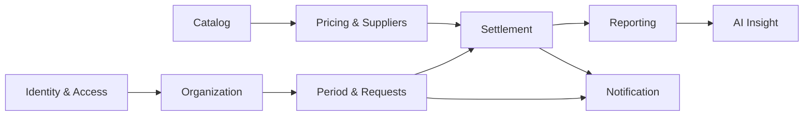

# GTAS VPP — Target Product Definition

> Target: **A+ — core-first + polished UI**, phiên bản bảo vệ luận văn ổn định, thực tiễn cho doanh nghiệp Việt Nam, có điểm nhấn nhưng không over-engineer
> Trạng thái: decision snapshot 15/07/2026; toàn bộ `D-001..D-012` đã `DECIDED`

## 1. Product statement

GTAS VPP là hệ thống quản lý nhu cầu văn phòng phẩm theo kỳ cho một doanh nghiệp: nhân viên lập yêu cầu, quản lý xử lý bổ sung, hệ thống gom nhu cầu hợp lệ thành giỏ hàng toàn công ty, bộ phận mua sắm so sánh whole-basket quote và chọn một NCC chính, rồi chốt thành dữ liệu mua sắm/phân bổ dự kiến có thể kiểm toán; lãnh đạo theo dõi KPI, thông báo và insight theo đúng phạm vi quyền.

Sản phẩm mục tiêu không cố trở thành ERP, phần mềm kho hoặc kế toán. Giá trị cốt lõi là:

1. tạo yêu cầu nhanh và ít sai;
2. nhìn thấy rõ deadline/trạng thái/trách nhiệm;
3. chọn NCC chính, giá và ưu đãi theo tổng giỏ hàng có căn cứ;
4. đóng kỳ bất biến, phân bổ lại cho phòng ban và có audit;
5. báo cáo đúng nghĩa nghiệp vụ;
6. trải nghiệm hiện đại, Việt hóa và có personality riêng.

## 2. Product principles

- **Correct before clever:** business invariant và authorization phải đúng trước animation/AI.
- **Vietnamese-first:** tiếng Việt mặc định, `vi-VN`, VND, timezone `Asia/Ho_Chi_Minh`, search tiếng Việt.
- **Human remains accountable:** AI và rule engine chỉ gợi ý/giải thích; người có quyền xác nhận.
- **Auditability:** mọi thay đổi quyền, duyệt, giá, settlement và correction có actor/time/reason.
- **Least privilege:** own/department/company/action được biểu diễn rõ; UI không phải security boundary.
- **Additive evolution:** schema/API refactor theo phase, giữ compatibility có thời hạn và rollback.
- **One product stack:** .NET 10/Blazor/Radzen/SQL Server; không thêm framework chỉ để “trông xịn”.
- **Thesis evidence by construction:** requirement → ADR → code → migration → test → screenshot/diagram có traceability.

## 3. Vai trò mục tiêu

Vai trò đã chốt tại `D-004` là flat RBAC:

| Persona | Phạm vi mặc định | Nhiệm vụ chính | Không mặc định được làm |
|---|---|---|---|
| Nhân viên | Own | Self-register; theo dõi `PendingApproval`; sau activation tạo/sửa/hủy đơn thường trước hạn, tạo đơn bổ sung, xem lịch sử/thông báo/báo cáo cá nhân | Xem phòng ban/công ty, duyệt, sửa giá, chốt kỳ |
| Quản lý phòng ban | Department + own | Xem completion, duyệt/từ chối đơn bổ sung của phòng, theo dõi người chưa hoàn tất | Quản lý price book, chốt kỳ, quản trị quyền hệ thống |
| Mua sắm / Quản trị kỳ | Company procurement scope | Quản lý catalog/NCC/price book, price coverage, chọn NCC/giá, preview và chốt kỳ, báo cáo mua sắm | Sửa quyền hệ thống; duyệt chính yêu cầu do mình tạo nếu áp dụng four-eyes |
| Quản trị hệ thống | Technical/admin scope | Tài khoản PendingApproval, map employee/department/group, activate/deactivate, nhóm quyền, cấu hình, audit, break-glass | Không tự động có quyền phê duyệt/mua sắm nếu không gán rõ |

Đề xuất v1: một account có một group quyền active và một primary department. Group là tập permission phẳng; bỏ `ParentGroupId` nếu không có inheritance thật. Không dùng Identity Roles song song với business groups.

## 4. Module mục tiêu

### 4.1 Identity & Access

- App-owned ASP.NET Core Identity cho username/email/password hash/lockout/token/security version.
- Registration/activation/recovery triển khai theo D-008 A: self-register → `PendingApproval` → admin map employee/primary department/active group → activate; zero privilege trước activation, email hoặc admin recovery fallback.
- `GTAS_MENU` là schema local mô phỏng công ty: one-time map/import account nếu cần giữ dữ liệu, rồi tắt TripleDES/SP login. Không duy trì external company-user provider.
- Explicit action/scope permission; backend policy/resource check cho từng API.
- Permission change có hiệu lực ở request tiếp theo; SignalR chỉ yêu cầu UI refresh.

### 4.2 Organization

- Single-company v1 đã chốt (`D-002`).
- Department có active state và stable code; account có primary department.
- Nếu sau này multi-company, company được thêm như tenant key theo migration riêng, không giả lập qua dropdown môi trường.

### 4.3 Period & Requests

- `Period` được lưu rõ: label, company, start, submission deadline, supplement deadline, state, rowversion.
- Business time: kỳ 07/2026 `[05/07/2026 00:00, 05/08/2026 00:00)` tại Việt Nam.
- State đề xuất: `Open → SubmissionClosed → Pricing → Settled`; `Reopened/Corrected` là audited exceptional flow.
- Scheduler là trigger/recovery-safe job; mọi command vẫn tự kiểm tra clock/state server-side.
- Một regular request theo account+period trong v1 (`D-003`).
- Cancel là status; không soft-delete business history.
- Submitted request có thể sửa trước deadline qua audited revision; sau `SubmissionClosed` hoặc settlement thì immutable.
- Department/company summary là projection; cuối kỳ basket lấy **regular request mới nhất ở trạng thái `Submitted`/đã khóa và chưa Cancelled** cùng **supplement mới nhất ở trạng thái `Approved`**. `Pending`, `Rejected`, `Cancelled` và revision superseded bị loại. Provenance từng request line vẫn được giữ để phân bổ và audit.

### 4.4 Supplementary request

- Bắt buộc link regular request gốc, reason, sequence và actor.
- State: `Draft → PendingApproval → Approved | Rejected | Cancelled`; resubmit tạo revision theo policy.
- Một pending tại một thời điểm; quota cấu hình per user/base request/period, mặc định 3 theo `D-005`; rejected/cancelled không chiếm quota cuối nhưng giữ audit.
- Department Approver duyệt; Procurement thấy kết quả, không phải approver mặc định.
- Tạo supplement không muộn hơn submission deadline; approval có thể tiếp tục đến `SupplementApprovalDeadline` cấu hình.
- Period không được settle khi còn supplementary pending.

### 4.5 Catalog

- Item, category/class, unit of measure, supplier; active/inactive và soft delete/restore.
- Server-side paging/filter/sort/search; index/projection theo execution plan.
- Internal item code ↔ supplier item code.
- Typed validation/mutation; generic read grid có thể tái sử dụng nhưng không generic PATCH/DELETE.
- Import có dry-run/validation/error workbook nếu nằm trong phạm vi sau core; CSV export giữ.

### 4.6 Pricing & Suppliers

Mô hình khuyến nghị:

- `Supplier`: code, name, active, contact metadata tối thiểu.
- `PriceBook`: một supplier, contract/reference, version, effective from/to, status Draft/Published/Expired/Withdrawn, currency VND, VAT policy.
- `PriceBookItem`: internal item, supplier SKU, net unit price, VAT rate, gross value dẫn xuất, MOQ/order-multiple/lead time tùy chọn, rowversion. A+ chỉ nhận cùng UOM và không tự quy đổi pack/MOQ; mismatch là blocker có giải thích.
- Không có hai published price book/item cùng priority và hiệu lực mơ hồ; ambiguity là blocker. Resolver dùng `PriceAsOfUtc` do server cấp (hiển thị theo `Asia/Ho_Chi_Minh`), với `EffectiveFrom <= as-of < EffectiveTo`.
- Price priority: manual locked selection có reason → active contract/published price book → configured default; không có fallback “first row”. Nếu giá hết hiệu lực hoặc version đổi giữa preview và confirm, phải báo stale và re-preview.

### 4.7 Supplier selection

Mục tiêu đã chốt là **một NCC chính cho whole-company basket của một kỳ** (`D-006`):

- hệ thống aggregate mọi request line hợp lệ thành basket theo item/UOM, đồng thời giữ provenance request/department;
- comparison xếp hạng NCC theo coverage, subtotal chưa VAT, discount/rebate, fee/shipping, VAT, grand total, MOQ, lead time và validity của **toàn giỏ hàng**; tie-break deterministic là grand total → coverage/exception count → supplier code/quote id.
- strict path chỉ coi NCC có 100% **primary coverage** là eligible; item thiếu/ambiguous/expired price phải được xử lý minh bạch trong preview và chặn confirm cho đến khi có line-exception supplier/quote hợp lệ hoặc người có quyền loại dòng đó. Final resolved coverage chỉ đủ khi mọi dòng còn lại có supplier/quote hiệu lực; exception không được làm giả tỷ lệ primary coverage;
- Procurement chọn `PrimarySupplier` và quote/price-book version; weighted score chỉ advisory, người có quyền xác nhận; quote id, calculation version và `PriceAsOfUtc` nằm trong preview hash/audit.
- line exception chỉ khi NCC chính không cung ứng/không đủ MOQ hoặc có lý do nghiệp vụ rõ, kèm actor/time/reason và quyền riêng; không silent fallback;
- không mở full RFQ/PO/inventory/receiving/accounting trước bảo vệ.

`SettlementItem.SupplierId` vẫn được snapshot dù bình thường bằng header `PrimarySupplierId`, để lịch sử chính xác và có đường mở rộng ngoại lệ sau này.

### 4.8 Settlement và phân bổ

- `Settlement`: period/company/revision/status/idempotency/input hash/calculation version/rounding mode, `PrimarySupplierId`, quote/reference, `PriceAsOfUtc`, actor/time và totals snapshot. Mỗi revision có đúng một primary supplier; correction có thể đổi supplier nhưng phải có reason/actor, revision cũ bất biến và chỉ latest effective revision được vận hành.
- `SettlementItem`: item/UOM/SKU, requested quantity, quoted/order quantity, conversion factor (A+ = 1), supplier/price-book/version, quoted net unit, line discount, taxable net, VAT rate/amount, gross, selection source/reason.
- `SettlementAllocation`: request line + department code/name snapshot, quantity, allocated net/discount/fee/VAT/gross và rounding adjustment; tổng allocation phải reconcile đúng item/header.
- `SettlementCharge`: order-level discount/rebate/shipping/fee có type, amount/rate, taxable flag, source/reference, allocation policy và actor/reason. Không cho implicit/unallocated bucket.
- Default allocation: discount/fee theo tỷ trọng pre-discount net; shipping có thể `ByQty`; rounding VND một mode cố định, residual gán deterministically và được snapshot.
- Formula invariant: `subtotal - discount + fee + VAT = grand total`; VAT tính theo rate từng item/charge trên taxable net sau discount. Header luôn bằng tổng child rounded.
- Quantity contract A+: requested UOM = quoted UOM và conversion factor = 1; nếu pack size/MOQ/order multiple tạo excess hoặc cần đổi UOM thì block, không silent round. Future extension phải snapshot conversion, order multiple, excess quantity và allocation policy.
- Preview/readiness bắt buộc: period state, pending supplement, latest effective regular `Submitted`/locked revision, latest effective supplement `Approved` revision, compatible UOM, coverage/MOQ, missing/ambiguous/expired price, quote validity, supplier, adjustments, totals và allocation reconciliation.
- Confirm yêu cầu typed period/name; duplicate click/key tạo đúng một settlement. Không overwrite; sửa sai tạo correction revision có relation/reason.
- Allocation chỉ là kế hoạch mua/chia theo yêu cầu đã duyệt, không phải chứng từ đã nhận hàng hoặc bằng chứng giao thực tế.

### 4.9 Reporting

Metric semantic contract phải định nghĩa status/scope/time/value source:

- requested quantity/value;
- submitted/on-time rate;
- approved supplementary quantity/value;
- settled procurement value;
- quoted/list subtotal, discount/rebate, fee/shipping, VAT và final estimated procurement cost;
- cost allocation theo request/phòng ban và rounding reconciliation;
- supplementary rate;
- price coverage/missing/ambiguous rate;
- price variance giữa kỳ/reference;
- primary-supplier basket coverage và exception rate;
- savings chỉ khi có comparable reference snapshot; không tự gọi chênh lệch thiếu baseline là “tiết kiệm”;
- department completion/aging;
- top items/categories và period-over-period trend.

Dashboard:

- **Nhân viên:** deadline/current status, draft/action, lịch sử, frequent/reorder.
- **Quản lý:** completion, người/phòng chưa hoàn tất, pending approval/aging, supplementary trend.
- **Mua sắm:** whole-basket comparison, settlement readiness, price coverage, discount/fee/VAT/final total, allocation reconciliation và supplier exception.
- **System admin:** account/permission/audit/notification health, không trộn KPI procurement nếu không có quyền.

Mọi chart có table alternative và drill-down giữ nguyên filter/scope. CSV và Excel nằm trong thesis release; PDF report để sau.

### 4.10 Notification

- Durable inbox là source of truth; SignalR chỉ báo có thay đổi.
- Category: Đơn, Duyệt, Kỳ, Giá/NCC, Hệ thống.
- Read/unread/archive, pagination/search, allowed internal deep link, action state và preference/digest.
- Idempotent correlation key, retention policy và permission check khi mở target.
- Email là channel bắt buộc bên cạnh inbox: event allowlist, template Việt hóa, outbox/retry/idempotency, delivery status và deep link recheck permission. User thiếu email vẫn thấy inbox/status; local sandbox chỉ chứng minh pipeline, còn gửi tới địa chỉ thật cần `NOTIF-003` provider/domain gate green. Teams/Zalo để sau (`D-010`).

### 4.11 AI Insight

- Optional Vietnamese narrative cho report aggregate đã phân quyền.
- Deterministic service tính số; AI chỉ diễn giải/anomaly hypothesis.
- Structured schema, evidence link, disclosure “Nội dung do AI hỗ trợ”, timestamp/model/prompt version và human review.
- Cache theo user/scope/filter/data-version, budget/rate limit, timeout, audit và deterministic fallback.
- Không gửi username/email/raw request line nếu không cần; không mutation/tool access.
- Model là config, không hard-code logic theo model; current `gpt-5.6-luna` phù hợp cost-sensitive workload theo official catalog, nhưng phải kiểm tra lại tại thời điểm deploy ([OpenAI models](https://developers.openai.com/api/docs/models)).

## 5. Kiến trúc kỹ thuật mục tiêu

### 5.1 Solution

- Giữ solution/project hiện tại để giảm churn.
- Tổ chức namespace/folder theo module dần trong API/Service/Model/FE.
- Shared DTO duy nhất: request/response contract thuần, không EF dependency/UI labels.
- Không thêm mediator/event bus nếu typed service trực tiếp đã đủ.

### 5.2 Backend request flow

1. Authentication xác lập stable subject/session.
2. `ICurrentUserContext` tải active account/membership/company/department/security version một lần mỗi request.
3. Policy kiểm tra action; resource handler kiểm tra owner/department/company.
4. Typed application service thực thi invariant trong transaction.
5. EF/parameterized SQL ghi dữ liệu; DB constraint bảo vệ race.
6. Audit record/outbox-like durable notification được ghi cùng hoặc sau commit theo semantics rõ.
7. API trả ProblemDetails an toàn với trace ID; không trả raw exception.

### 5.3 Data/migration

- SQL Server, `datetimeoffset`/UTC persistence + explicit Vietnam conversion cho instant; business date/period label lưu rõ.
- `rowversion` cho aggregate mutable.
- Filtered unique index cho active membership, regular-per-period và pending supplement khi khả thi; transaction/app lock cho aggregate quota.
- Additive migration → backfill/probe → dual read/write nếu cần → cutover → drop legacy ở release sau.
- Reviewed idempotent SQL/bundle trong production; SSMS validation cho SP.
- Snapshot/correction thay vì temporal-table mọi nơi. Temporal table là lựa chọn sau cho master audit, không cần cho core settlement vì immutable snapshot đã rõ.
- Settlement header/item/allocation/charge immutable theo revision; snapshot supplier/price/VAT/UOM/requested-vs-ordered quantity/department/calculation version và không đọc current master data để tái dựng lịch sử. Mỗi revision có một primary supplier; correction đổi supplier chỉ bằng revision mới.

### 5.4 Frontend

- Blazor Interactive Server + Radzen.
- Một `NavigationDefinition` typed.
- App shell/task-first IA và design tokens.
- Shared primitives: PageHeader, PeriodBanner, KPI Card, FilterBar, StateView, OrderGrid/Card, StatusTimeline, Confirmation, SettlementWizard.
- Cancellable/versioned async loading; safe localized error mapper.
- P1: tiếng Việt mặc định và resource-ready; English có chọn lọc chỉ thêm nếu trực tiếp giúp màn demo. D-012 đã defer phủ English đầy đủ và dark mode; hai hạng mục này không được lấy thời gian khỏi A+ mandatory slice.
- Three viewport contract: 390×844, 768×1024, 1920×1080.
- WCAG 2.2 AA target; keyboard/focus/contrast/reduced-motion.

### 5.5 Operations

- One environment/database per deployment.
- App image không có secret/demo credential.
- Production schema migration tách khỏi demo seed.
- Health, structured log, trace/correlation và security/audit event.
- Single instance acceptable for thesis; Redis/backplane deferred.
- Backup ngoài host nếu production thật; restore rehearsal trước release.
- Email provider secret nằm ngoài repo/DB; local dùng mail sink/sandbox, server chỉ bật adapter sau delivery rehearsal.

## 6. Đánh giá feature candidates

Thang: Giá trị/Demo `1–5`; Độ khó/Rủi ro/Chi phí `1–5` (cao là khó/rủi ro/tốn hơn).

### 6.1 Non-AI

| Feature | Business | Demo | Khó | Dữ liệu | Vận hành | Rủi ro | Quyết định |
|---|---:|---:|---:|---|---:|---:|---|
| Copy kỳ trước + eligibility diff | 5 | 4 | 2 | Request/catalog history | Thấp | 2 | Showcase sau CP4 nếu còn thời gian; không block |
| Recent/favorite/frequent items | 4 | 4 | 2 | User history | Thấp | 2 | Showcase sau CP4 nếu còn thời gian; không block |
| Autosave draft an toàn | 5 | 3 | 3 | User+period | Thấp | 3 | Để sau; không thuộc A+ mandatory slice |
| Settlement readiness wizard | 5 | 5 | 4 | Period/request/price | Thấp | 3 | Bắt buộc |
| Price coverage/variance heatmap | 5 | 5 | 3 | Price snapshots | Thấp | 2 | Showcase sau CP4 nếu còn thời gian; không block |
| Whole-basket supplier comparison + allocation preview | 5 | 5 | 4 | Request/price/VAT/MOQ/discount | Thấp | 3 | Bắt buộc |
| Full notification center | 4 | 4 | 3 | Notification history | Thấp | 2 | **Bắt buộc A+** (`NOTIF-001`) |
| Email notification | 5 | 4 | 3 | Notification event/email | Vừa | 3 | Bắt buộc; provider rehearsal riêng |
| Saved filters/columns | 3 | 3 | 2 | User preference | Thấp | 1 | Nếu còn thời gian |
| Excel export | 4 | 3 | 2 | Report queries | Thấp | 2 | Trước bảo vệ |
| PDF business report | 2 | 3 | 3 | Report/template | Thấp | 2 | Sau core/thesis |

### 6.2 AI

| Feature | Business | Demo | Khó | Dữ liệu | Chi phí | Rủi ro | Quyết định |
|---|---:|---:|---:|---|---:|---:|---|
| Report narrative tiếng Việt | 4 | 5 | 3 | Aggregates | Thấp-vừa | 3 | Optional sau CP4; AI feature duy nhất được ưu tiên nếu còn thời gian |
| Explain price/cost anomaly | 4 | 5 | 4 | Snapshot/trend/evidence | Thấp-vừa | 4 | Sau KPI đúng |
| Natural-language catalog search | 3 | 4 | 3 | Catalog text | Vừa | 3 | Sau luận văn; search rule-based trước |
| Quantity suggestion | 3 | 4 | 3 | Sufficient history | Thấp-vừa | 4 | Rule-based trước; AI later |
| Natural-language order edit | 2 | 5 | 5 | Raw request/catalog | Vừa | 5 | Defer |
| General chatbot/RAG | 2 | 5 | 5 | Docs/permissions | Vừa-cao | 5 | Defer/drop |
| Auto supplier decision | 4 | 5 | 5 | Contract/price/MOQ | Vừa | 5 | Không cho final decision |

## 7. Feature disposition

### Giữ

- Blazor/Radzen, server paging, DB-backed permissions, SignalR notification hint.
- Regular/supplement request, catalog/UOM/supplier/price book, report/CSV, audit, deployment pipeline.
- AI report insight foundation.
- Login visual direction sau khi rebrand GTAS VPP độc lập.

### Sửa

- Auth/environment/session/password.
- Permission action/scope và user membership.
- Period/request/supplement lifecycle/concurrency.
- Price book/VAT/effectivity/whole-basket supplier selection.
- Settlement item/allocation/charge snapshot, idempotency và correction.
- KPI semantics, notification idempotency/full inbox.
- UI localization/accessibility/error/async state.

### Gộp

- `PeriodReviewPanel` và `PeriodSettlementPanel` thành một settlement workflow sau parity tests.
- Duplicate route/sidebar/tab/fallback definitions thành `NavigationDefinition`.
- Duplicate order grids/state patterns thành domain UI primitives.
- Theme initialization/logout/clock logic thành một source.
- Word audit rule scripts thành một canonical compliance pipeline.

### Loại bỏ dần

- Test/Live selector và client environment claim.
- Broad `PermissionCompatibility` sau data migration.
- Generic write/PATCH/hard-delete endpoint/UI theo từng catalog.
- Routine hard-delete controls.
- Raw exception message/console debug path.
- Unused group hierarchy nếu `D-004` xác nhận flat RBAC.
- Aspire/ServiceDefaults nếu không tích hợp thực tế theo `OBS-001`.

### Sau luận văn

- Multi-company/multi-tenant thật.
- Full procurement PO, inventory, receiving, AP/accounting.
- Redis/Kafka/microservices/multi-region.
- Mobile native/offline/PWA.
- OCR, RAG chatbot, NL mutation, automated optimizer.
- Full English localization và dark mode nếu chưa được chọn trong thesis cutline.

## 8. Demo story mục tiêu

1. Người dùng self-register, thấy `PendingApproval`; admin map employee/department/group và activate, sau đó user đăng nhập với quyền đúng.
2. Nhân viên vào dashboard GTAS VPP đã rebrand, thấy kỳ/deadline, copy kỳ trước, điều chỉnh và submit.
3. Nhân viên tạo supplementary có reason; manager nhận notification và approve/reject với audit timeline.
4. Procurement mở whole-company basket, thấy item thiếu/giá hết hạn rồi so sánh total landed cost/coverage của các NCC.
5. Procurement chọn một NCC chính, nhập/kiểm tra discount/fee, xem phân bổ về phòng ban và chốt bằng idempotent confirmation.
6. Sửa price book sau đó không thay đổi supplier/price/VAT/discount/allocation snapshot; correction tạo revision mới.
7. Manager/Admin drill-down KPI, Excel và email notification; AI narrative chỉ xuất hiện nếu AI gate đã pass.
8. System admin revoke permission; request tiếp theo bị 403 và UI cập nhật best-effort.

Đây là một câu chuyện bảo vệ có tính kỹ thuật, nghiệp vụ và UX rõ ràng hơn việc trình diễn nhiều màn CRUD rời rạc.

## 9. Definition of target product done

- Không còn đường Test credential → Live business data.
- Production không seed demo account/secret.
- Role/action/scope matrix được test 401/403/200.
- Existing account lifecycle/cutover và registration/activation/recovery an toàn; không account nào có privilege trước activation.
- Period/order/supplement concurrency invariant pass trên SQL Server.
- Settlement preview chặn incomplete data; one-primary supplier, charge/allocation snapshot immutable và correction có revision.
- KPI reconcile với fixture, allocation/header totals và drill-down cùng scope.
- Durable inbox, Excel và email sandbox/provider path đã test; provider failure không làm business mutation thất bại.
- UI tiếng Việt mặc định, keyboard usable, không critical/serious axe issue, không overflow ở 3 viewport.
- Build/backend/frontend/isolated UI suite pass; migration apply/rollback/restore rehearsal có evidence.
- Thesis/diagram/screenshot phản ánh đúng source final, fields/link/page được cập nhật và toàn bộ trang được render/visual QA.
