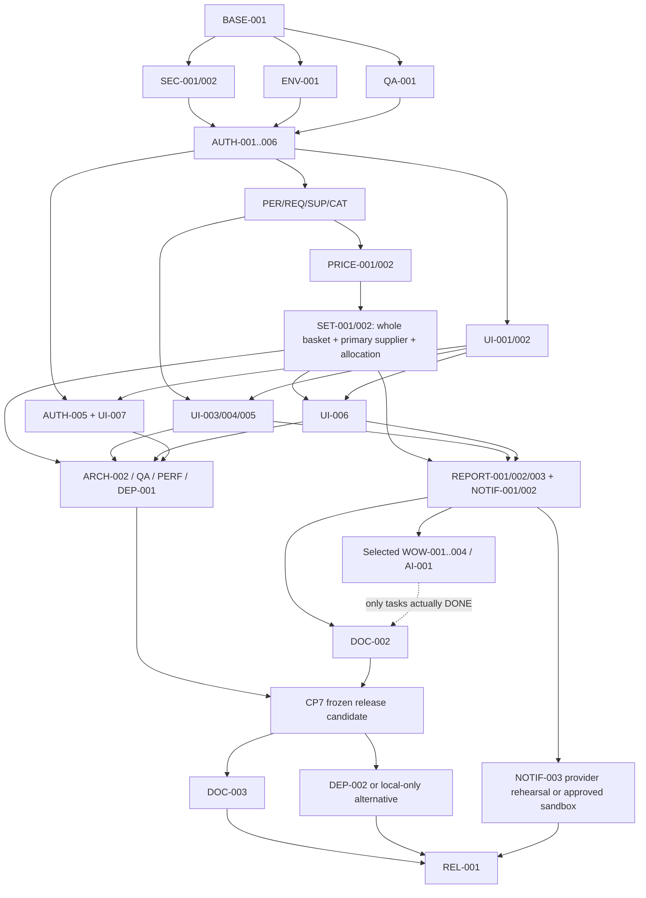

# GTAS VPP — Master Implementation Plan

> Version: 1.2-decisions, 15/07/2026 — **audit/traceability annex**.
> Kể từ 15/07/2026, nguồn điều hành cho deadline một tháng là
> [`06-LEAN-A-PLUS-EXECUTION-PLAN.md`](06-LEAN-A-PLUS-EXECUTION-PLAN.md).
> Các card dưới đây giữ acceptance và lịch sử quyết định, nhưng không còn được
> chạy thành 52 Goal riêng. BASE-001, SEC-002, ENV-001, QA-001 và ARCH-001 đã
> DONE; SEC-001 đang là containment gate.

## 1. Cách vận hành plan

### 1.1 Trạng thái hợp lệ

- `NOT_STARTED`: chưa làm, dependency đã/chưa đủ.
- `BLOCKED_DECISION`: chờ một `D-*` trong `03-DECISIONS-REQUIRED.md`.
- `BLOCKED_EXTERNAL`: chờ quyền truy cập, backup, secret owner, môi trường hoặc người khác.
- `IN_PROGRESS`: chỉ một task chính tại một thời điểm cho mỗi agent/branch.
- `IN_REVIEW`: code xong, đang review/QA/migration/UI inspection.
- `DONE`: acceptance và evidence đầy đủ, commit đã ghi.
- `DEFERRED`: chủ động chuyển sau luận văn, có lý do.
- `DROPPED`: không còn làm, có ADR/approval.

Không dùng phần trăm hoàn thành. Không đánh dấu `DONE` nếu mới build pass nhưng migration/UI/acceptance chưa được chứng minh.

**Quy ước alternative/waiver:** khi checkpoint cho phép đường thay thế (ví dụ QA-001 dùng isolated-test strategy đã duyệt, DEP-002 dùng local-only restore rehearsal, NOTIF-003 dùng email sandbox), execution record vẫn giữ đúng task ID nhưng phải ghi `Path: ALTERNATIVE`, người duyệt, evidence và acceptance tương ứng. Sau khi evidence pass, task được đánh `DONE` theo alternative; không để task đã được dùng để đóng checkpoint ở `BLOCKED_EXTERNAL` hoặc bỏ qua dependency bằng lời nói.

### 1.2 Quy tắc Target mode

1. Đọc `AGENTS.md`, task card này, ADR liên quan, `05-EXECUTION-TEMPLATE.md` và `git status` trước khi sửa.
2. Không tự trả lời `D-*`; nếu decision block, dừng đúng task và vẫn có thể làm task độc lập khác.
3. Một task = một mục tiêu rollback được. Không gộp schema, auth, UI redesign và report vào cùng commit.
4. Trước task DB: backup/sanitized clone, preflight duplicate/orphan, generated SQL review, apply trên DB disposable và kiểm tra rollback/restore.
5. Stored procedure phải test trong SQL Server/SSMS theo repository instruction.
6. Mỗi code task phải chạy targeted tests và các lệnh tối thiểu phù hợp:

```powershell
dotnet build gtas_vpp.sln -c Release
dotnet test tests/Backend.UnitTests/gtas_vpp_be.Tests.csproj -c Release
dotnet test tests/Frontend.UnitTests/gtas_vpp_fe.Tests.csproj -c Release
git diff --check
git status --short
```

7. UI task phải kiểm tra console/network/keyboard/overflow ở 390×844, 768×1024, 1920×1080 và render screenshot evidence trong thư mục ignored.
8. Không stage file dirty của người dùng ngoài scope. Commit message đề xuất: `<type>(<module>): <task-id> <outcome>`.
9. Mỗi task cập nhật execution record; mỗi checkpoint cập nhật bảng trạng thái trong file này và changelog/ADR nếu có.
10. Thesis mô tả source đã hoàn thành; không sửa source chỉ để khớp Word.

### 1.3 Khôi phục sau mất context

Agent mới phải đọc theo thứ tự:

1. `docs/planning/04-MASTER-IMPLEMENTATION-PLAN.md` — task/dependency/status.
2. `docs/planning/03-DECISIONS-REQUIRED.md` và `docs/decisions/` — quyết định đã chốt.
3. Execution record gần nhất theo `05-EXECUTION-TEMPLATE.md`.
4. `git status`, log của branch và diff chưa commit.
5. Test/migration/UI evidence của task đang `IN_PROGRESS`.

Ghi chú continuation phải nêu: last known good commit, command cuối pass/fail, file đang sửa, migration state, blocker và next exact action. Không “nhớ theo chat”.

## 2. Priority và cutline

| Priority | Nghĩa | Quy tắc |
|---|---|---|
| P0 | Rủi ro bảo mật/toàn vẹn nghiêm trọng | Làm ngay sau approval, trước feature/UI |
| P1 | Bắt buộc trước bảo vệ | Không được cắt nếu muốn claim sản phẩm ổn định |
| P2 | Nâng chất lượng/điểm nhấn | Chỉ làm sau checkpoint core tương ứng |
| P3 | Sau luận văn | Không đưa vào release bảo vệ trừ khi scope đổi |

### 2.1 A+ release cutline — working deadline 15/08/2026

`D-012` đã chốt **A+ — core-first + polished UI**. Một tháng full-time không đồng nghĩa làm mọi task; release bảo vệ được khóa như sau:

- **Safety floor bắt buộc:** toàn bộ P0; explicit authorization/account cutover hiện hữu; Period/request/supplement; price book/VAT; whole-company basket, one-primary-supplier settlement, charge/allocation snapshot; SQL/API/UI quality gates.
- **Product/UI bắt buộc:** AUTH-005, UI-001..007, REPORT-001..003, NOTIF-001/002, rebrand/anonymization, dashboard/drill-down, Excel và email sandbox/local delivery. Registration phải xuất hiện trong thesis demo.
- **Conditional:** NOTIF-003 chỉ bắt buộc cho server demo/production email; local demo dùng sandbox được phê duyệt. WOW/AI vẫn là showcase sau CP4/CP5.
- **Selected showcase sau CP4/CP5:** WOW-001/002/004 và AI-001 theo thứ tự thời gian còn lại; không được làm chậm CP7.
- **Defer mặc định:** REPORT-004, Teams/Zalo, full English/dark mode, full PO/inventory/receiving/accounting, microservices/Kafka/Redis và AI mutation/chatbot.

Mốc điều hành đề xuất: 15–21/07 containment/access; 22–31/07 domain/settlement; 01–07/08 UI/report/email; 08–12/08 hardening/source freeze; 13–15/08 Word final và demo rehearsal. Đây là timebox quản trị rủi ro, không thay acceptance của từng task.

**Mid-cutline gate:** CP4 (domain/settlement) phải có evidence green trước 31/07 và CP5 (minimum polished core routes: shell, registration/PendingApproval, request, supplement, procurement, report) trước 04/08. Nếu trượt, cắt WOW/AI/autosave/saved views và giảm route polish ngoài core; không cắt safety floor, registration security, dashboard/Excel, durable inbox hoặc email sandbox.

## 3. Checkpoints

| Checkpoint | Task tối thiểu | Exit criteria |
|---|---|---|
| CP0 — Approved baseline | BASE-001, QA-001 hoặc QA-001 execution record với `Path: ALTERNATIVE` và isolated-test strategy được duyệt | Git/source/test baseline, decision register, test-data boundary và branch rõ; dirty tree an toàn |
| CP1 — Contained | SEC-001, SEC-002, ENV-001 | Không demo seed prod; secret handled; Test→Live path đóng |
| CP2 — Trusted access và account lifecycle | AUTH-001..006 | Permission matrix, membership, app-owned account cutover, session pass và registration PendingApproval/activation/recovery pass; registration không được làm suy yếu core |
| CP3 — Correct requests | PER-001, REQ-001, SUP-001, CAT-001 | Period/request/supplement invariants pass SQL tests |
| CP4 — Immutable procurement | PRICE-001/002, SET-001/002 | Price/supplier/settlement snapshot và correction pass |
| CP5 — Coherent UX | UI-001..007 | Core journeys VI/a11y/role/3 viewport pass, gồm registration/PendingApproval/activation/recovery |
| CP6 — Reporting/email product core | REPORT-001/002/003, NOTIF-001/002; selected showcase DONE hoặc DEFERRED | KPI/allocation reconcile; dashboard+Excel; durable inbox+email sandbox; AI không bắt buộc |
| CP7 — Frozen release candidate | ARCH-002, PERF-001, QA-002/003, DEP-001, DOC-002 và mọi P1 thuộc **A+ release cutline**; loại trừ handoff CP8 | Source/schema/UI freeze, selected P1 gates green, conditional tasks DONE/DEFERRED rõ, thesis khớp candidate |
| CP8 — Defensible handoff | DEP-002 hoặc DEP-002 alternative record; NOTIF-003 hoặc NOTIF-003 alternative/sandbox record; DOC-003, REL-001 | Restore/deploy or local fallback rehearsal, email path, final Word, demo/tag/handoff hoàn tất |

Không bắt đầu AI trước CP4. Không đóng Word final trước CP7. P2/P3 không được block CP7 nếu D-012 đã ghi rõ `DEFERRED`.

## 4. Task registry

| ID | Phase | Priority | Baseline status (historical) | Dependencies / decisions |
|---|---|---:|---|---|
| BASE-001 | 0 | P0 | DONE | Plan approval |
| SEC-001 | 0 | P0 | BLOCKED_EXTERNAL | BASE-001, D-011 |
| SEC-002 | 0 | P0 | DONE | BASE-001 |
| ENV-001 | 0 | P0 | DONE | BASE-001; không phụ thuộc tenant decision |
| QA-001 | 0 | P0 | DONE | BASE-001 |
| ARCH-001 | 1 | P1 | DONE | CP0 |
| AUTH-001 | 1 | P0 | NOT_STARTED | CP1, ARCH-001, D-002 decided, D-004 decided |
| AUTH-002 | 1 | P0 | NOT_STARTED | AUTH-001, QA-001, D-002 decided, D-004 decided |
| AUTH-003 | 1 | P1 | NOT_STARTED | AUTH-001/002, QA-001, D-001 decided |
| AUTH-005 | 1 | P1 | NOT_STARTED | AUTH-002/003, QA-001, D-008 decided |
| AUTH-006 | 1 | P1 | NOT_STARTED | AUTH-002/003, QA-001, D-001 decided |
| AUTH-004 | 1 | P1 | NOT_STARTED | AUTH-002/003/006, ENV-001 |
| PER-001 | 2 | P1 | NOT_STARTED | CP2, QA-001, D-002 decided, D-003 decided, D-005 decided |
| REQ-001 | 2 | P1 | NOT_STARTED | PER-001, AUTH-001/004, QA-001, D-003 decided |
| SUP-001 | 2 | P1 | NOT_STARTED | PER-001/REQ-001, AUTH-001, QA-001, D-004 decided, D-005 decided |
| CAT-001 | 2 | P1 | NOT_STARTED | ARCH-001, AUTH-001, QA-001 |
| PRICE-001 | 3 | P1 | NOT_STARTED | CAT-001, QA-001, D-006 decided, D-007 decided |
| PRICE-002 | 3 | P1 | NOT_STARTED | PRICE-001, AUTH-001 |
| SET-001 | 3 | P1 | NOT_STARTED | PER-001, REQ-001, SUP-001, PRICE-001/002, D-006 decided, D-007 decided |
| SET-002 | 3 | P1 | NOT_STARTED | SET-001, PER-001, AUTH-001, QA-001, D-004 decided |
| UI-001 | 4 | P1 | NOT_STARTED | AUTH-001, ARCH-001 |
| UI-002 | 4 | P1 | NOT_STARTED | UI-001, D-009 decided |
| UI-003 | 4 | P1 | NOT_STARTED | CP3, UI-001/002 |
| UI-004 | 4 | P1 | NOT_STARTED | CP2, UI-001/002, D-004 decided |
| UI-005 | 4 | P1 | NOT_STARTED | CP3, UI-001/002, D-004 decided, D-005 decided |
| UI-006 | 4 | P1 | NOT_STARTED | CP4, UI-001/002 |
| UI-007 | 4 | P1 | NOT_STARTED | AUTH-005, UI-001/002, D-008 decided |
| REPORT-001 | 5 | P1 | NOT_STARTED | CP4, AUTH-001, D-007 decided |
| REPORT-002 | 5 | P1 | NOT_STARTED | REPORT-001, UI-002 |
| REPORT-003 | 5 | P1 | NOT_STARTED | REPORT-001/002, D-010 decided |
| REPORT-004 | 5 | P3 | DEFERRED | PDF explicitly deferred for A+ release |
| NOTIF-001 | 5 | P1 | NOT_STARTED | CP3, AUTH-004, UI-001/002 |
| NOTIF-002 | 5 | P1 | NOT_STARTED | NOTIF-001, D-010 decided |
| NOTIF-003 | 5/6 | P1 | BLOCKED_EXTERNAL | NOTIF-002, D-010 decided, provider/domain sandbox, DEP-002 for server |
| WOW-001 | 5 | P2 | NOT_STARTED | CP3, UI-003 |
| WOW-002 | 5 | P2 | NOT_STARTED | CP3, UI-003 |
| WOW-003 | 5 | P2 | NOT_STARTED | REPORT-001, WOW-002 |
| WOW-004 | 5 | P2 | NOT_STARTED | CP4, REPORT-001/002 |
| AI-001 | 5 | P2 | NOT_STARTED | REPORT-001, CP5 |
| ARCH-002 | 6 | P1 | NOT_STARTED | CP5 |
| ARCH-003 | 6 | P2 | NOT_STARTED | CAT-001, PRICE-002, FE consumer cutover |
| ARCH-004 | 6 | P2 | NOT_STARTED | CP5, UI-002 shell cutover |
| PERF-001 | 6 | P1 | NOT_STARTED | CP5, REPORT-001, QA-001 |
| OBS-001 | 6 | P2 | NOT_STARTED | CP1, AUTH-004 |
| QA-002 | 6 | P1 | NOT_STARTED | CP4, QA-001 |
| QA-003 | 6 | P1 | NOT_STARTED | CP5, QA-001, UI-001..007 |
| DEP-001 | 6 | P1 | NOT_STARTED | SEC-002, ARCH-002, QA-001/002/003 |
| DEP-002 | 6 | P1 | BLOCKED_EXTERNAL | CP7, SEC-001/002, ENV-001, D-011 |
| DOC-001 | 0/continuous | P1 | NOT_STARTED | Decisions begin to close |
| DOC-002 | 7 | P1 | NOT_STARTED | CP6 core, DOC-001, source freeze, D-009 decided, D-012 decided; selected optional tasks only |
| DOC-003 | 7 | P1 | NOT_STARTED | CP7, DOC-002 |
| REL-001 | 7 | P1 | NOT_STARTED | CP7, DOC-003, DEP-002 or approved local-only alternative, D-012 decided |

The status column above is the original planning baseline and is retained for
history. It must not be used as the current release status. The authoritative
execution reconciliation is below and the detailed task cards retain their
original scope so reduced/folded alternatives remain auditable.

### 4.1 Current execution reconciliation — 2026-07-17

| Original task(s) | Current status | Authoritative evidence / cutline |
|---|---|---|
| BASE-001, SEC-002, ENV-001, QA-001, ARCH-001 | DONE | Matching records under `docs/execution/` |
| SEC-001 | DONE WITH ACCEPTED RESIDUAL RISK | `docs/execution/SEC-001.md`; eight historical Google-key alerts remain waived, not revoked |
| AUTH-001..006 | DONE (folded into LEAN-02/03) | `docs/execution/LEAN-02.md`, `LEAN-03.md`; app-owned Identity, canonical RBAC, lifecycle, cutover and session gates |
| PER-001, REQ-001, SUP-001 | DONE | `docs/execution/LEAN-05.md` |
| CAT-001, PRICE-001/002, SET-001/002 | DONE | LEAN-06 execution records, including `SET-002/UI-006` |
| UI-001..007 | DONE for the retained A+ slice after corrective review | LEAN-02..06 plus `docs/execution/UI-008.md`; safe localized login feedback and bounded toast geometry are proved at all three viewports |
| REPORT-001/002/003, NOTIF-001/002 | DONE after notification presentation remediation | `docs/execution/LEAN-07.md`, `docs/execution/UI-008.md`; durable inbox plus explicit loading failure/stale-data/retry states |
| UI-008 corrective acceptance pass | DONE | Production screenshot exposed the raw-JSON/full-width toast gap; `docs/execution/UI-008.md` records root cause, implementation and visual evidence |
| NOTIF-003 | DONE (ALTERNATIVE: local SMTP sandbox) | `docs/execution/NOTIF-003.md`; no real-provider claim |
| REPORT-004, WOW-001/002/003/004, AI-001 | DEFERRED as non-gating showcase work | D-012/source-freeze cut; existing copy/AI code may remain but is not a release claim |
| ARCH-002 | DONE (REDUCED) | Touched-file discipline, Release build, `git diff --check` and CI ratchet; no mass-format commit |
| ARCH-003 | DEFERRED except retained-flow security guards | Broad generic-endpoint retirement remains post-release |
| ARCH-004 | DONE (FOLDED) | LEAN-04 shell/theme/logout/clock slice; no separate broad sweep |
| PERF-001 | DONE (REDUCED) | Catalog synthetic scale, report/settlement targeted gates; no full-system SLA claim |
| OBS-001 | DONE (REDUCED) | Structured scrubbed logs, trace IDs, audit and health; external telemetry platform deferred |
| QA-002/003 | DONE (FOLDED/REDUCED) | Relational integration gates and two isolated authenticated UI rehearsals |
| DEP-001 | DONE (PRODUCTION VALIDATED) | `docs/execution/DEP-001.md`; PR #4/#5, CI gates and DigitalOcean run `29553512300` |
| DEP-002 | DONE (ALTERNATIVE: local restore rehearsal) | `docs/execution/DEP-002.md`; deployed/server recovery remains conditional |
| DOC-001/002/003, REL-001 | DONE for local-only handoff | `docs/execution/LEAN-09.md`, traceability matrix, final DOCX audit and release tag |

## 5. Detailed task cards

## Phase 0 — Baseline và containment

### BASE-001 — Freeze Git/source/test baseline và decision register

| Field | Nội dung |
|---|---|
| Status / Priority / Difficulty | `DONE` / P0 / M |
| Mục tiêu | Tạo baseline có thể lặp lại trước mọi mutation: bảo tồn dirty worktree, branch theo task, inventory route/API/SP/permission, command/results và decision register. |
| Lý do | Không thể rollback hoặc so sánh nếu không biết commit/test/source baseline; quyết định mở phải được map đúng task thay vì nhớ theo chat. |
| Dependency | Chỉ cần plan được duyệt. D-009/011/012 không block task này. |
| Phạm vi / file dự kiến | `docs/decisions/`, execution record và baseline inventory; Git branch `codex/base-001-baseline`; không sửa business source/database/config. |
| Frontend | Chụp baseline route/viewport đã được phép; inventory route/action/permission. |
| Backend | Inventory endpoints/policies/SP/background jobs; record coverage/build/test baseline. |
| Database | Chỉ ghi inventory/backup strategy và access boundary; không kết nối/migrate. Backup thực tế là preflight của task DB/external tương ứng. |
| Business rule | Viết examples: mốc ngày 05, cancel/replacement, supplement, settlement; ADR không tự bịa decision. |
| Tests | Chạy Release build, 147+ backend, 29+ frontend; UI discovery; record missing Playwright/test credentials. |
| Verification | `git status`, base commit, build/test commands và route/API/SP/permission inventory; decision→task mapping không hở. |
| Acceptance | Baseline commit/source/commands/evidence rõ; không file user dirty bị stage; test-data boundary và backup strategy được mô tả; ADR cho quyết định đã trả lời. |
| Rủi ro / rollback | Inventory sai/stale → ghi timestamp/commit. Rollback: xóa branch/docs generated; không có DB mutation. |
| Commit strategy | Một docs/baseline commit; test fixture code nếu cần ở commit riêng. |
| Cần người dùng xác nhận | Chỉ plan approval; hỏi owner nếu task sau này phải chạm file dirty. |

### SEC-001 — Rotate secrets và kiểm tra/khóa demo accounts

| Field | Nội dung |
|---|---|
| Status / Priority / Difficulty | `BLOCKED_EXTERNAL` / P0 / M |
| Mục tiêu | Xử lý secret trong history và khả năng demo account đã được seed trên mọi môi trường được người dùng đặt trong scope. |
| Lý do | Secret removal ở HEAD không thu hồi credential; demo account có credential compatibility public là incident risk. |
| Dependency | BASE-001, D-011, owner/authority của secrets và server. |
| Phạm vi / file dự kiến | Secret manager/provider dashboards, DB account audit runbook, `.env.example`/docs/CI secret scan nếu cần; không ghi secret value. |
| Frontend | Không đổi, trừ Radzen key deployment nếu bị rotate. |
| Backend | Verify config fail-fast và credential reload; không hard-code replacement. |
| Database | Read-only account query trước; disable/reset/delete demo account theo approved runbook; backup/audit evidence. |
| Business rule | Break-glass/bootstrap account phải riêng, one-time và bắt đổi password. |
| Tests | Login approved accounts, rejected demo/old credential, service startup với new secret reference; no-secret scan current+history. |
| Verification | Provider audit/rotation timestamp, DB active-user list sanitized; current tree/build artifacts/runtime logs không chứa secret value đang dùng. |
| Acceptance | Mọi affected secret rotated/revoked; demo account không active; production vẫn healthy; owner ký xác nhận. |
| Rủi ro / rollback | Rotation gây outage. Roll forward bằng corrected new secret; không bật lại compromised secret. App image rollback vẫn dùng new secret. |
| Commit strategy | Config-reference/CI changes riêng; incident evidence không chứa secret và không commit PII. |
| Cần người dùng xác nhận | Bắt buộc — external mutation và quyền truy cập. |

### SEC-002 — Tách migration, reference seed và demo seed; fail-fast

| Field | Nội dung |
|---|---|
| Status / Priority / Difficulty | `DONE` / P0 / M |
| Mục tiêu | Production chỉ migrate schema/reference data an toàn; demo seed là opt-in command; SQL bắt buộc lỗi thì deployment fail. |
| Lý do | `MigrateAndSeed` production và swallowed SQL exception có thể tạo user demo/half-initialized DB. |
| Dependency | BASE-001; không cần quyết định nghiệp vụ. |
| Phạm vi / file dự kiến | `gtas_vpp_be.Migrations`, `SeedData.cs`, `SqlBatchExecutor.cs`, SQL seed files, `docker-compose*.yml`, `deploy/deploy.sh`, tests/docs. |
| Frontend | Không đổi. |
| Backend | Tách mode/command; validation probes; actor/config logging không lộ secret. |
| Database | Không thêm EF migration; tách reference và demo manifest; không đánh dấu seed version khi batch lỗi. |
| Business rule | Không tạo business/demo user trong production hoặc demo bootstrap; account provisioning thuộc AUTH. |
| Tests | Missing/corrupt SQL fails; idempotent rerun; prod mode không có demo rows; fresh DB and upgraded DB integration. |
| Verification | Generate/review script; run migrator on disposable DB; inspect rows/probes; full build/test. |
| Acceptance | `docker-compose.prod` không chứa demo-seed mode; intentional SQL failure non-zero; successful rerun idempotent. |
| Rủi ro / rollback | Existing deploy phụ thuộc seed. Giữ explicit demo command cho local; rollback image chỉ sau DB compatibility check. |
| Commit strategy | 1) service/tests; 2) deploy compose/script; không trộn auth rewrite. |
| Cần người dùng xác nhận | Không cho local/source; có nếu apply bất kỳ server nào. |
| Execution evidence | [`docs/execution/SEC-002.md`](../execution/SEC-002.md): LocalDB fresh reference/demo, semantic rerun + delete/repair, upgrade, missing/corrupt SQL; Release 164 backend + 29 frontend + 12 UI discovery; rollback, static, security/scope và documentation gates PASS. |

### ENV-001 — Một environment/database cho mỗi deployment

| Field | Nội dung |
|---|---|
| Status / Priority / Difficulty | `DONE` / P0 / L |
| Mục tiêu | Loại client Test/Live selector/claim và đảm bảo auth, permission, report, notification, business dùng cùng database binding. |
| Lý do | Hiện có khả năng identity/permission từ DB mặc định vận hành business DB khác. |
| Dependency | BASE-001. Không phụ thuộc D-002 vì environment binding khác tenant model; SEC-002 có thể chạy song song. |
| Phạm vi / file dự kiến | `AuthController.cs`, `EnvironmentResolver.cs`, `Program.cs`, UnitOfWork/DbContext registrations, login UI/DTO/config/tests. |
| Frontend | Bỏ selector; thông tin môi trường chỉ là server-provided non-sensitive badge nếu cần. |
| Backend | Bỏ `Server` claim; bind context từ deployment config; startup validation. |
| Database | Không schema change bắt buộc; connection ownership/config thay đổi. |
| Business rule | Environment không phải user choice/tenant. |
| Tests | Unit/static matrix: request/legacy claim không chọn được DB; mọi runtime factory/context dùng cùng binding; invalid/dual/mismatched config và cross-audience replay fail. Disposable SQL integration thuộc QA-001. |
| Verification | Inspect JWT/login payload; Release build + backend/frontend tests; Compose semantic checks; anonymous local 3-viewport UI smoke. Real startup/deploy smoke thuộc QA-001/DEP-001. |
| Acceptance | Không request/client input quyết định connection; all authenticated scopes cùng DB; selector biến mất. |
| Rủi ro / rollback | Demo multi-env workflow mất. Rollback qua deployment-specific config/image, không phục hồi unsafe claim path. |
| Commit strategy | Backend binding/tests trước, FE selector removal sau trong cùng task với compatibility window ngắn. |
| Cần người dùng xác nhận | Chỉ cần xác nhận deployment target/config khi apply; không chờ quyết định single/multi-company. |
| Execution evidence | [`docs/execution/ENV-001.md`](../execution/ENV-001.md): immutable deployment binding, environment-free login/JWT/client state, fail-fast config and physical DB guards; Release 201 backend + 32 frontend, Compose 2/2, anonymous UI 1/1, 14 UI discovery; no DB/deploy apply. |

### QA-001 — SQL Server và UI test fixture cô lập

| Field | Nội dung |
|---|---|
| Status / Priority / Difficulty | `DONE` / P0 / L |
| Mục tiêu | Tạo disposable SQL Server fixture/data builder/accounts theo role và Playwright setup không chạm shared/prod DB. |
| Lý do | InMemory không kiểm tra SP/constraint/transaction; E2E hiện có thể làm hỏng permission/order thật. |
| Dependency | BASE-001; Docker/SQL Server local availability. |
| Phạm vi / file dự kiến | Backend integration test project/fixtures, UI test config/global setup, ignored artifacts, CI service container docs. |
| Frontend | Storage state/login helpers; semantic test IDs chỉ khi thật cần và không lạm dụng. |
| Backend | WebApplicationFactory/test auth or real login fixture; reset/idempotent seeding. |
| Database | Disposable database/container; apply all migrations/SP; deterministic seed; cleanup. |
| Business rule | Accounts: employee, manager, procurement, system admin; own/dept/company fixture data. |
| Tests | Self-test fixture create/reset/concurrent isolation; UI setup fails closed nếu URL/DB không phải test. |
| Verification | Run twice locally/CI; crash test không để state bẩn; Playwright browser install documented. |
| Acceptance | State-mutating E2E chỉ chạy khi explicit test marker/config; repeatable, no shared DB; 12 current tests có đường chạy. |
| Rủi ro / rollback | Container/tooling phức tạp. Fallback: dedicated local SQL instance/database per run; remove fixture branch nếu unstable. |
| Commit strategy | DB fixture commit; UI harness commit; không sửa assertions trong cùng task. |
| Cần người dùng xác nhận | Chỉ cần xác nhận resource/tooling; không cần business decision. |
| Execution evidence | [`docs/execution/QA-001.md`](../execution/QA-001.md): LocalDB per-run marker/cleanup, 6 persona + own/department/company data, migrations/SP/reset/concurrency/crash recovery 17/17 hai vòng, fail-closed UI guards, isolated login 1/1, Release 201 backend + 32 frontend; existing order/permission UI journey residual được chuyển QA-003. |

## Phase 1 — Architecture boundary, permission và account

### ARCH-001 — Thiết lập module boundary và clean shared contracts

| Field | Nội dung |
|---|---|
| Status / Priority / Difficulty | `DONE` / P1 / M |
| Mục tiêu | Ghi/thi hành dependency rules tối thiểu; bỏ EF/UI concern khỏi shared DTO; tạo module map mà không di chuyển toàn repo. |
| Lý do | Shared/frontend đang tham chiếu EF/Mapster không cần thiết; layering mơ hồ làm AI thêm logic sai chỗ. |
| Dependency | CP0. |
| Phạm vi / file dự kiến | `.csproj`, shared DTO/contracts, architecture tests/docs, namespace/module map. |
| Frontend | Chỉ dùng contract/client models; không EF entity/attribute. |
| Backend | Module interfaces và dependency test; không tạo generic abstraction vô ích. |
| Database | Không schema change. |
| Business rule | Không đổi behavior/API trong task này. |
| Tests | Architecture dependency tests; serialization contract tests; existing full tests. |
| Verification | `dotnet list reference`; build; public API/JSON snapshot diff. |
| Acceptance | Shared DTO build không cần EF; FE không cần persistence dependency nếu thực sự unused; behavior không đổi. |
| Rủi ro / rollback | Contract serialization drift. Rollback package/project reference commit; giữ characterization tests. |
| Commit strategy | Reference removal từng project; contract cleanup nhỏ, không mass move/rename. |
| Cần người dùng xác nhận | Không. |
| Execution evidence | [`docs/execution/ARCH-001.md`](../execution/ARCH-001.md): Shared zero-package/framework-neutral; FE bỏ EF/Mapster; backend view và FE state/display metadata về đúng owner; exact dependency graph; full wire-DTO manifest base/current cùng SHA-256; JSON/transport/grid/status gates; Release 212 backend + 53 frontend, LocalDB 17/17; không migration-model/schema delta, runtime keyless view remap tương đương; UI residual tái hiện tại base. |

### AUTH-001 — Explicit permission/action/scope matrix

| Field | Nội dung |
|---|---|
| Status / Priority / Difficulty | `NOT_STARTED` / P0 / L |
| Mục tiêu | Thay broad compatibility bằng explicit permission cho action và own/department/company/export. |
| Lý do | User thường có thể được suy ra report-all/export và library-manage từ legacy permission. |
| Dependency | CP1, ARCH-001, D-002, D-004. |
| Phạm vi / file dự kiến | Authorization policies/handlers, `PermissionService.cs`, permission constants/seed/SP/migration, API attributes/handlers, FE permission map/tests. |
| Frontend | Chỉ render action được phép; route/action matrix; không coi hide là security. |
| Backend | Policy + resource checks; compatibility feature flag/telemetry/cutoff. |
| Database | Add explicit permissions/mappings; backfill groups; preflight and compatibility mapping. |
| Business rule | Own/department/company, create/update/cancel/approve/settle/export tách rõ; người settlement không được tự sửa permission bằng cùng actor/role (four-eyes). |
| Tests | 401/403/200 matrix cho 4 personas; direct API bypass; revoke next-request behavior; adversarial settlement-actor permission mutation bị 403/409. |
| Verification | SQL mapping review, WebApplicationFactory integration, UI role audit. |
| Acceptance | User thường không report-all/export/library-write; mỗi API mutation có policy/resource guard; settlement/correction actor không thể tự cấp quyền bằng cùng role; no orphan route. |
| Rủi ro / rollback | Khóa nhầm user. Additive permission + compatibility flag; backfill audit; break-glass admin. |
| Commit strategy | Constants/handlers/tests → DB seed/backfill → endpoints → FE; separate commits, one feature branch. |
| Cần người dùng xác nhận | Không — D-002/D-004 đã chốt. |

### AUTH-002 — Membership integrity và last-admin protection

| Field | Nội dung |
|---|---|
| Status / Priority / Difficulty | `NOT_STARTED` / P0 / L |
| Mục tiêu | Một command DTO, một active membership/user, department/company validation và transactional last-admin invariant. |
| Lý do | DTO mismatch có thể xóa department; multiple group và concurrency có thể khóa hệ thống. |
| Dependency | AUTH-001, D-002, D-004, QA-001. |
| Phạm vi / file dự kiến | P04/P06 models/config/migration, `PermissionController` → typed service/endpoints, DTO, FE admin state, tests. |
| Frontend | Staged diff/confirm; server result là truth; rollback UI; không client audit timestamp. |
| Backend | Transaction/service duy nhất; 409 conflict; actor from current context; last-admin app lock/serializable. |
| Database | Filtered unique active `UserId`; FK/check/preflight duplicate/orphan; company key nếu multi-company. |
| Business rule | Một group + primary department v1; ít nhất một active break-glass/system admin; người đang giữ quyền settlement không được tự thay đổi membership/permission để vượt separation of duties. |
| Tests | Two concurrent assignments → one commit/one 409; last two admin concurrent removal blocked; invalid department rejected; settlement-admin self-escalation bị chặn và correction phải có actor khác khi có actor phù hợp. |
| Verification | Apply migration on dirty synthetic data; SSMS constraint checks; API/UI tests. |
| Acceptance | Không multiple active membership; department không mất; không thể xóa/reassign admin cuối; settlement/permission separation được enforce server-side; all mutations audited. |
| Rủi ro / rollback | Existing duplicates block migration. Preflight report/manual resolution; additive index; restore backup for destructive cleanup. |
| Commit strategy | Preflight/tests → migration/model → service/API → FE. |
| Cần người dùng xác nhận | Không — single-company, one active group + primary department đã chốt. |

### AUTH-003 — App-owned account persistence và authentication boundary

| Field | Nội dung |
|---|---|
| Status / Priority / Difficulty | `NOT_STARTED` / P1 / L |
| Mục tiêu | Tạo app-owned account store dùng one-way password hash/token/lockout primitives; không dựng multi-provider abstraction khi không còn company user source. |
| Lý do | Reversible TripleDES không chấp nhận cho account mới; persistence/provider phải ổn định trước lifecycle/cutover. |
| Dependency | AUTH-001/002, QA-001, D-001. |
| Phạm vi / file dự kiến | Identity account models/context/migration, account/auth service boundary, DI/config/tests; chưa import local `GTAS_MENU` hoặc mở registration. |
| Frontend | Không đổi behavior; chỉ contract compile nếu cần. |
| Backend | Identity account/user store, normalized unique identity foundation, password policy primitives; business RBAC vẫn P02/P04/P06. Ưu tiên `IdentityUser<int>` để giữ stable local `UserID`; nếu provider bắt buộc key khác thì dùng mapping một-một, không tạo hai active identity. |
| Database | Additive Identity/app account tables và explicit `IdentityUserId ↔ LegacyUserId` bridge khi cần; claims/FK/audit/SignalR subject phải map cùng một human identity; chưa drop legacy. New password chỉ salted one-way hash. |
| Business rule | Account identity tách employee/membership; chưa account nào tự active vì task này. |
| Tests | Account create/hash/verify/duplicate normalization/lockout primitives/auth boundary; int-key/bridge mapping, claims/FK/audit/SignalR continuity; migration fresh/upgrade. |
| Verification | DB không có reversible password cho account mới; dependency/provider tests; logs scrubbed. |
| Acceptance | Account store/auth boundary pass relational tests; không thay current user login trong task này; rollback bằng bỏ feature path/additive schema. |
| Rủi ro / rollback | Schema/ID mapping sai. Additive only, feature unused by current login, no legacy drop. |
| Commit strategy | Persistence/migration/tests một task/commit series; không UI/cutover. |
| Cần người dùng xác nhận | Không — D-001 đã chốt app-owned, không reconnect DB công ty. |

### AUTH-005 — Registration, PendingApproval, activation và recovery

| Field | Nội dung |
|---|---|
| Status / Priority / Difficulty | `NOT_STARTED` / P1 / L |
| Mục tiêu | Thêm self-register → PendingApproval → admin map/activate, lockout và reset/confirm theo email capability đã chốt tại D-008. |
| Lý do | Registration là lifecycle riêng, cần rollback/acceptance độc lập với legacy cutover nhưng đã nằm trong A+ mandatory slice. |
| Dependency | AUTH-003, AUTH-002, QA-001, D-008 decided. |
| Phạm vi / file dự kiến | Registration/activation/reset endpoints hoặc supported Razor UI, account service, admin activation contract, tests; UI polish ở UI-007. |
| Frontend | Minimal accessible register/pending/reset/activation status; generic anti-enumeration response. |
| Backend | PendingApproval, unique rules, password policy, token/lockout; email sender hoặc admin activation/reset path. |
| Database | Account lifecycle/token/security fields từ Identity; employee/membership link chỉ khi admin xác nhận. |
| Business rule | Username/email unique; employee code unique khi có; account mới `PendingApproval` và zero privilege trước admin map employee/primary department/active group + activation; không self-approve/auto-active. |
| Tests | Duplicate username/email/employee-code, weak password, pending login denied, admin mapping/activation, lockout, reset expiry/replay, no-email admin fallback, anti-enumeration/rate limit. |
| Verification | API/UI flow, DB lifecycle state, email sandbox/provider hoặc admin fallback, logs no PII/secret, membership/permission parity. |
| Acceptance | Registration không auto-active; pending account không gọi được protected API; admin activation/mapping audited; recovery không enumerate account; email path hoặc admin fallback hoạt động; rollback giữ lại Pending/history. |
| Rủi ro / rollback | Abuse/email outage. Rate limit, feature flag, admin-only fallback; account rows giữ Pending, không xóa history. |
| Commit strategy | Backend lifecycle/tests → minimal UI/email adapter; không legacy migration. |
| Cần người dùng xác nhận | Không — D-008 A đã chốt; provider thật vẫn là external gate của NOTIF-003. |

### AUTH-006 — One-time local `GTAS_MENU` cutover và legacy login retirement

| Field | Nội dung |
|---|---|
| Status / Priority / Difficulty | `NOT_STARTED` / P1 / L |
| Mục tiêu | One-time map/import account local cần giữ, cutover login sang app-owned Identity và retire TripleDES/SP login; không duy trì migrate-on-login/provider chain lâu dài. |
| Lý do | `GTAS_MENU` chỉ là demo schema local; compatibility dài hạn sẽ giữ coupling/rủi ro mà không có external requirement. |
| Dependency | AUTH-002/003, QA-001, D-001 đã chốt; account/reference mapping dry-run. |
| Phạm vi / file dự kiến | One-time import/mapping command cho local account và business-RBAC, mapping table/fields, auth cutover/telemetry/runbook/tests; legacy table chỉ giữ read-only qua một release nếu còn FK/history. Không reconnect DB công ty. |
| Frontend | Login behavior tương thích; thông báo bắt đổi password nếu policy yêu cầu. |
| Backend | One-time collision handling/import, cutoff/disable flag, generic errors; không copy/decrypt password thành hash mới. |
| Database | Map stable local `GTAS_MENU` UserId/employee/group/department references; collision/orphan report; account demo được reset/seed an toàn, không copy/decrypt password legacy. |
| Business rule | Một human identity không tạo hai active accounts; membership/RBAC giữ nguyên; legacy verifier có cutoff date. |
| Tests | One-time import/mapping success, duplicate/collision/orphan, retry/idempotency, RBAC parity/no privilege drift, cutover flag, rollback trước cutoff. |
| Verification | Sanitized dry-run counts/reconciliation, staged cohort login, audit/telemetry no credential. |
| Acceptance | Approved/demo users cần giữ login qua account mới không privilege drift; TripleDES/SP login disable; no blind drop nếu còn historical FK. |
| Rủi ro / rollback | Lockout/collision. Staged cohort, compatibility flag, backup; rollback app/provider before cutoff, never restore compromised secret. |
| Commit strategy | Dry-run/report → adapter/tests → staged cutover/config; destructive cleanup deferred. |
| Cần người dùng xác nhận | Không — D-001 đã chốt; destructive drop vẫn cần approval sau telemetry/FK proof. |

### AUTH-004 — Current-user context, session invalidation và auth hardening

| Field | Nội dung |
|---|---|
| Status / Priority / Difficulty | `NOT_STARTED` / P1 / L |
| Mục tiêu | JWT giữ stable subject; account/membership/status/security version được kiểm tra request tiếp theo; safe error/rate limit. |
| Lý do | Group/company/department/status trong token stale; locked account vẫn có thể dùng session. |
| Dependency | AUTH-002/003/006, ENV-001. AUTH-005 là registration path riêng; session/auth hardening vẫn phải bảo vệ cả account PendingApproval và account đã activate. |
| Phạm vi / file dự kiến | Token issuance/validation, `ICurrentUserContext`, policies, login SP cleanup if retained, ProblemDetails/logging, tests. |
| Frontend | Xử lý session invalid/re-login rõ; reconnect realtime theo user; không giữ stale claims làm authority. |
| Backend | Security stamp/version, account+IP rate limit, generic login error, body validation; notification failure post-commit không trả false 500. |
| Database | Security version/last login/lockout fields do Identity; bỏ `NOLOCK`/credential `PRINT` trong retained SP. |
| Business rule | Lock/deactivate/password/group/company/department change có hiệu lực request kế tiếp. |
| Tests | Token before/after each mutation; 401 vs 403; rate limit; error non-disclosure; SignalR degraded path. |
| Verification | Decode token; inspect logs; integration test middleware; build/full tests. |
| Acceptance | Stale token không vượt account/membership change; anonymous không nhận internal error; realtime failure không đổi mutation result. |
| Rủi ro / rollback | DB lookup mỗi request tăng latency. Cache tối đa request scope; measure; feature flag token validation changes. |
| Commit strategy | Current context/tests → token/security stamp → error/rate limit → FE session UX. |
| Cần người dùng xác nhận | Không, sau khi account decisions đã chốt. |

## Phase 2 — Period, request, supplement và catalog

### PER-001 — Explicit Period aggregate và state machine

| Field | Nội dung |
|---|---|
| Status / Priority / Difficulty | `NOT_STARTED` / P1 / L |
| Mục tiêu | Lưu kỳ, deadline, state, timezone, rowversion và idempotent transition/recovery. |
| Lý do | Closed hiện suy ra từ request; kỳ rỗng/tương lai/downtime không xử lý chắc chắn. |
| Dependency | CP2, QA-001, D-002/003/005. |
| Phạm vi / file dự kiến | Model/migration/config, Period service/API/background job, shared DTO, FE period state/banner, tests. |
| Frontend | Current period/deadline/state banner; refresh qua boundary; admin state view. |
| Backend | `TimeProvider`; server-side transition guard; scheduler recovery/idempotency. |
| Database | Period unique company+label, StartAt/SubmissionDeadline/SupplementApprovalDeadline/State/RowVersion/audit. |
| Business rule | `[05 00:00, next 05 00:00)` Asia/Ho_Chi_Minh; create supplement dừng cùng submission, pending approval có deadline riêng; `Open→SubmissionClosed→Pricing→Settled`; no arbitrary future settle. |
| Tests | 04:59:59/05:00, month/year/leap, downtime/retry, concurrent transition, empty period. |
| Verification | SQL integration with frozen time; UI boundary refresh; migration fresh/backfill. |
| Acceptance | Source không suy state từ any request; transition invalid trả 409; scheduler retry không duplicate. |
| Rủi ro / rollback | Backfill period ambiguous. Additive table, dry-run mapping; feature flag reads; retain calculator until cutover. |
| Commit strategy | Domain/tests → migration/backfill → API/job → FE banner. |
| Cần người dùng xác nhận | Không — D-002/003/005 đã chốt; apply production cần approval. |

### REQ-001 — Regular request lifecycle, revision và concurrency

| Field | Nội dung |
|---|---|
| Status / Priority / Difficulty | `NOT_STARTED` / P1 / L |
| Mục tiêu | Một regular per subject/period, cancel giữ lịch sử, submitted edits/replacement audit, settled immutable. |
| Lý do | Cancel hiện delete và giải phóng slot; settled request còn sửa/hủy. |
| Dependency | PER-001, AUTH-001/004, D-003, QA-001. |
| Phạm vi / file dự kiến | Request model/config/migration, `VPPRequestService/Controller` typed commands, DTO, FE create/edit/history, tests. |
| Frontend | Create vs edit-own permission; period eligibility; 2-step wizard; timeline; confirm cancel/replacement; duplicate-click guard. |
| Backend | State guard, idempotency/concurrency, revision history, owner/department scope. |
| Database | Current-effective filtered unique `(SubjectId, PeriodId)`/aggregate pointer, rowversion, status/history/replacement link; Cancelled không bị xóa và không phá lịch sử. Không dùng plain unique trên toàn bộ history. |
| Business rule | Per-user owner; server deadline; copy previous filters inactive items; no edit/cancel after SubmissionClosed/Settled; replacement chỉ qua command có link và làm current pointer duy nhất; company basket lấy latest regular `Submitted`/locked non-cancelled và supplement `Approved`, giữ provenance. |
| Tests | Concurrent create one success; concurrent replacement chỉ một current revision; cancel visible; settled immutable; stale rowversion 409; copy diff; direct scope 403. |
| Verification | SQL fixtures, API integration, browser user journey, report history check. |
| Acceptance | Không duplicate; history đầy đủ; request boundary đúng; all mutations audited; retry không duplicate. |
| Rủi ro / rollback | Existing cancelled/deleted rows. Backfill/report before constraint; dual-read; restore for destructive cleanup. |
| Commit strategy | Characterization → migration/domain → commands/API → FE; no settlement change same task. |
| Cần người dùng xác nhận | Không — D-003 đã chốt. |

### SUP-001 — Supplement workflow, quota và approval

| Field | Nội dung |
|---|---|
| Status / Priority / Difficulty | `NOT_STARTED` / P1 / L |
| Mục tiêu | Link base request, reason/deadline/sequence, one pending, configurable quota và transactional approval/resubmit. |
| Lý do | Max 3/pending check race; thiếu business definition và UI lineage. |
| Dependency | PER-001, REQ-001, AUTH-001, D-004/005, QA-001. |
| Phạm vi / file dự kiến | Supplement model/migration/service/API/DTO, approval UI/timeline/notifications, tests. |
| Frontend | Eligibility explanation, remaining quota, reason validator, base link, approve/reject reason, clear status badges. |
| Backend | Atomic create/approve/reject/resubmit; resource scope; no self-approval if four-eyes. |
| Database | BaseRequestId, Sequence, Reason, State, reviewer/audit, rowversion; pending uniqueness/app lock/quota và configurable `MaxAttempts`. |
| Business rule | `MaxApproved=1` per user/base/period; one pending; rejected/cancelled không chiếm quota approved nhưng audit; `MaxAttempts` là anti-spam cap cấu hình riêng (mặc định 6 cho demo), áp dụng cả reject/resubmit; create trước submission deadline, approval trước SupplementApprovalDeadline; pending blocks settlement. |
| Tests | Four concurrent create never exceed max/one pending; repeated reject→resubmit/cancel obeys MaxAttempts while approved quota remains correct; approval scope; stale/retry; deadline; no base request. |
| Verification | SQL concurrency integration, UI manager/employee flow, report reconciliation. |
| Acceptance | Policy enforced DB/server, not only UI; lineage/audit complete; state colors/terms unambiguous. |
| Rủi ro / rollback | Legacy supplement lacks base link/reason. Backfill nullable then enforce; manual exception report; no history delete. |
| Commit strategy | Schema/domain/tests → API → FE/notification. |
| Cần người dùng xác nhận | Không — D-004/D-005 đã chốt. |

### CAT-001 — Typed catalog mutations và scalable Vietnamese search

| Field | Nội dung |
|---|---|
| Status / Priority / Difficulty | `NOT_STARTED` / P1 / L |
| Mục tiêu | Server paging/filter/sort/search, typed validation/soft delete và index evidence cho 500–1.000+ vật tư. |
| Lý do | Generic PATCH/DELETE bypass invariant; order lookup tải toàn bộ; domain validation thiếu. |
| Dependency | ARCH-001, AUTH-001, QA-001. |
| Phạm vi / file dự kiến | Catalog typed services/controllers/DTO/model config/index migration; `Component_ShareGrid` typed definitions; order search API/UI. |
| Frontend | Search code/name/category/UOM, explicit detail, validators, mobile card/internal scroll, soft delete/restore. |
| Backend | Query projection/paging allowlist; typed create/update/status; safe ProblemDetails. |
| Database | Index/preflight; active state; supplier SKU mapping later in PRICE; collation/search approach measured. |
| Business rule | Inactive item không thêm mới nhưng history giữ; UOM change không rewrite snapshots. |
| Tests | 1.000/10.000 synthetic paging/filter/sort; accented/unaccented cases; duplicate code; authorization/direct API. |
| Verification | SQL execution plan/IO/time, payload size, browser rapid filter/cancellation. |
| Acceptance | Không endpoint catalog routine hard-delete/generic write cho migrated types; no full materialization; search behavior documented. |
| Rủi ro / rollback | Collation/index change costly. Test copy/online plan; normalized search column only if measured; retain old read endpoint during cutover. |
| Commit strategy | Migrate one catalog type at a time; query/search commit separate from mutation retirement. |
| Cần người dùng xác nhận | Không cho core; import/search exact expectations có thể chốt sau. |

## Phase 3 — Price book, supplier và settlement

### PRICE-001 — Price book/contract/supplier schema

| Field | Nội dung |
|---|---|
| Status / Priority / Difficulty | `NOT_STARTED` / P1 / XL |
| Mục tiêu | Mô hình price book thuộc supplier/hợp đồng/version/hiệu lực/VAT và item mapping không mơ hồ. |
| Lý do | Price list hiện thiếu supplier/effectivity/version/VAT; `decimal`/SQL `bigint` và overlap/default chưa an toàn. |
| Dependency | CAT-001, QA-001, D-006, D-007. |
| Phạm vi / file dự kiến | L05/L06/L07 models/config/migrations, typed pricing services/DTO, seed/backfill/preflight, tests; chưa làm settlement UI. |
| Frontend | Chỉ contract/API adaptation tối thiểu; management UI ở PRICE-002. |
| Backend | Price resolver deterministic tại server `PriceAsOfUtc`: locked manual → active contract/published → default; `EffectiveFrom <= as-of < EffectiveTo`, missing/ambiguous là typed blocker; stale preview phải revalidate. |
| Database | Supplier-linked PriceBook, Version, EffectiveFrom/To, Status, Currency, VATPolicy; PriceBookItem supplier SKU/net/VAT/MOQ/lead; indexes/rowversion; settlement snapshot `PriceAsOfUtc`. |
| Business rule | Một price book thuộc đúng một supplier; published version immutable hoặc thay bằng version mới; no arbitrary first-row fallback. |
| Tests | Overlap/duplicate/effective boundary/timezone/VAT/missing/ambiguous; resolver deterministic/tie-break; stale preview/revalidation; legacy backfill. |
| Verification | Preflight data report, migration fresh+clone, SSMS constraints/queries, full tests. |
| Acceptance | Mọi active price có nguồn supplier/version/effectivity/VAT và as-of rõ; ambiguity hoặc expired-at-confirm bị chặn; legacy data mapped/reported, không silently dropped. |
| Rủi ro / rollback | Dữ liệu hiện không đủ supplier/interval. Add nullable/additive, exception queue, dual-read; backup restore nếu backfill destructive. |
| Commit strategy | Preflight/domain/tests → additive migration/backfill → resolver/cutover; không drop legacy. |
| Cần người dùng xác nhận | Không — D-006/D-007 đã chốt; import/backfill ambiguity vẫn phải report. |

### PRICE-002 — Typed pricing management và comparison data

| Field | Nội dung |
|---|---|
| Status / Priority / Difficulty | `NOT_STARTED` / P1 / L |
| Mục tiêu | CRUD/version/publish/expire an toàn, coverage/variance và whole-basket supplier comparison query cho procurement. |
| Lý do | Generic library UI/API không thể bảo vệ price invariant hoặc giải thích lựa chọn. |
| Dependency | PRICE-001, AUTH-001, UI-001 foundation có thể chạy song song. |
| Phạm vi / file dự kiến | PriceListService/typed controller, pricing Razor tab/components, validators/import dry-run nếu scope, tests. |
| Frontend | Supplier/contract/version/effective status, item price editor, basket coverage/missing/duplicate, publish confirmation, audit. |
| Backend | Typed commands; publish validation; comparison projection dùng cùng calculation engine/version với settlement, gồm basket total, subtotal, discount/rebate, fee/shipping, VAT, coverage, MOQ/lead và quote validity; deterministic tie-break; no generic PATCH/delete. |
| Database | Không schema lớn ngoài PRICE-001; audit/version rows; optional import staging. |
| Business rule | Draft editable; Published không sửa giá trực tiếp; Expired giữ history; override reason. |
| Tests | Publish incomplete/overlap, status transitions, permission, 1.000 item paging, import validation if included. |
| Verification | Browser procurement flow, SQL snapshot, payload/perf, accessibility. |
| Acceptance | Procurement thấy coverage/effectivity/VAT/source và breakdown discount/fee/VAT theo từng quote; ranking reconcile với settlement preview cùng calculation version/tie-break; routine hard delete biến mất; publish invalid bị chặn server. |
| Rủi ro / rollback | UI/API cutover mismatch. Version endpoint, retain old read only behind flag, migrate one tab at a time. |
| Commit strategy | API/query → management UI → retire generic write; separate commits. |
| Cần người dùng xác nhận | Không sau PRICE decisions; import format cần xác nhận nếu làm. |

### SET-001 — Settlement readiness và preview

| Field | Nội dung |
|---|---|
| Status / Priority / Difficulty | `NOT_STARTED` / P1 / XL |
| Mục tiêu | Tạo whole-company basket preview, so sánh một NCC chính, discount/fee/VAT/final cost, phân bổ phòng ban và blockers trước confirm. |
| Lý do | UI hiện chỉ chọn PriceListId, không so sánh total basket, không thể hiện chiết khấu/phí hay reconcile phân bổ về request/phòng ban. |
| Dependency | PER-001, REQ-001, SUP-001, PRICE-001/002, D-006/007. |
| Phạm vi / file dự kiến | Settlement preview application service/API/DTO; `PeriodReviewPanel`/`PeriodSettlementPanel` replacement workflow; tests. |
| Frontend | Chọn period → whole-company basket → rank supplier quote theo coverage/landed total/discount/fee/VAT → chọn PrimarySupplier → nhập/kiểm tra charge → xem allocation/reconciliation → typed confirm; exception line tách rõ và có reason. Hiển thị requested-vs-quoted quantity/UOM và block pack/MOQ mismatch trong A+. |
| Backend | Same calculation engine reused at confirm; stable input/preview hash gồm quote/calculation version, `PriceAsOfUtc` và deterministic supplier tie-break, VND rounding mode; confirm revalidates price/quote effectivity; permission/company/state validation; no silent supplier fallback. |
| Database | Read-only preview; optional draft selection/charge table chỉ nếu cần resume, có expiry/user scope; không mutate request current price. |
| Business rule | Regular chỉ lấy latest effective `Submitted`/locked non-cancelled; supplement chỉ lấy latest effective `Approved`; pending/rejected/cancelled/superseded loại. Compatible UOM và conversion factor=1 trong A+; pending supplement, missing/ambiguous/expired price, invalid MOQ/quote/state block; <100% primary coverage chỉ được confirm khi mọi uncovered line có exception supplier/quote hợp lệ hoặc quyết định loại dòng được audit; line exception có quyền/reason. |
| Tests | Basket aggregation/provenance, resolved 100% coverage after explicit exceptions, deterministic primary supplier ranking/tie-break, requested-vs-quoted quantity/UOM, MOQ/pack blocker, discount/fee/VAT, proportional/quantity allocation, deterministic residual, stale preview, authorization, large period. |
| Verification | SQL reconciliation, browser procurement flow/3 viewport, console/network, perf baseline. |
| Acceptance | Preview giải thích blocker; `subtotal-discount+fee+VAT=grand total`; item/allocation/header reconcile đúng sau rounding; confirm payload không thể sửa hidden supplier/price/scope. |
| Rủi ro / rollback | Calculation drift preview vs confirm. Dùng cùng domain service/snapshot hash; old panel read-only flag until parity. |
| Commit strategy | Preview domain/API/tests → new UI behind flag → parity; không write settlement trong task này. |
| Cần người dùng xác nhận | Không — D-006/D-007 đã chốt; UI review vẫn cần visual approval. |

### SET-002 — Immutable settlement, allocation, idempotency và correction revision

| Field | Nội dung |
|---|---|
| Status / Priority / Difficulty | `NOT_STARTED` / P1 / XL |
| Mục tiêu | Chốt kỳ transactional/idempotent vào immutable Settlement/Item/Allocation/Charge; correction tạo revision, không overwrite. |
| Lý do | Service hiện rerun overwrite giá/list lịch sử, không company-safe và fallback không xác định. |
| Dependency | SET-001, QA-001, AUTH-001, PER-001, D-004 (correction/reopen authority). |
| Phạm vi / file dự kiến | Settlement models/config/migration/service/API/audit/notifications, legacy settlement adapter, tests, UI final confirmation/result. |
| Frontend | Disable duplicate submit, progress/result, settlement ID/revision/audit/Excel summary; department allocation breakdown; correction flow có reason/permission riêng. |
| Backend | Short transaction, idempotency/input hash, calculation version/rounding mode, state guard, immutable snapshot, deterministic residual và correction command. |
| Database | Header có một `PrimarySupplier` cho mỗi revision/quote/`PriceAsOfUtc`/totals; Item snapshot supplier/price/UOM/requested-vs-ordered quantity/conversion factor/MOQ-or-pack decision/VAT; Allocation snapshot request+department/qty/amount/residual; Charge snapshot type/rate/amount/tax/allocation policy/source; unique idempotency/revision. |
| Business rule | Sum allocation qty/amount reconcile item/header; no implicit unallocated bucket; catalog/price/department later change không ảnh hưởng; planned allocation không claim receipt; correction không xóa revision cũ và có thể đổi primary supplier chỉ bằng revision mới, latest effective revision là operational. |
| Tests | Duplicate/concurrent settle one success; rollback on child failure; price/department edit snapshot same; allocation residual/reconciliation; supplier exception audit; correction relation/latest effective revision including changed primary; four-eyes correction actor. |
| Verification | Migration fresh/clone, SSMS transaction test, API/UI, report reconciliation, backup/restore. |
| Acceptance | Idempotent; immutable; company/state scoped; exactly one primary supplier per revision; totals/allocation reconcile; full audit; old overwrite test replaced bằng correct behavior test. |
| Rủi ro / rollback | Historical backfill ambiguity và irreversible business fact. Add new tables/dual-read; no blind Down after real settlement; restore backup or corrective revision. |
| Commit strategy | Schema/domain/tests → service/API → UI/notification → legacy read cutover. |
| Cần người dùng xác nhận | Không — correction authority D-004 đã chốt; apply production vẫn cần approval. |

## Phase 4 — UI/UX V2 và core journeys

### UI-001 — Typed navigation, safe errors và async-state foundation

| Field | Nội dung |
|---|---|
| Status / Priority / Difficulty | `NOT_STARTED` / P1 / L |
| Mục tiêu | Một NavigationDefinition cho route/tab/sidebar/fallback/audit; safe localized errors; cancellation/versioned loads. |
| Lý do | Route/permission/query drift, raw errors và out-of-order responses gây UX/security inconsistency. |
| Dependency | AUTH-001, ARCH-001; có thể bắt đầu trước CP3. |
| Phạm vi / file dự kiến | `RouteCatalog`, `PermissionState`, `LeftSidebar`, `Routes`, VPP tabs; ProblemDetails mapper; base paging/realtime helpers; tests. |
| Frontend | Typed nav metadata, first-allowed fallback, legacy redirects, error/empty/loading/retry states, request cancellation/version. |
| Backend | Standard ProblemDetails/error codes/trace ID contract nếu chưa có; no raw exception. |
| Database | Không đổi. |
| Business rule | Every route/action có owner permission; fallback không mở broad route. |
| Tests | Route×role×query variants; direct/back/forward; out-of-order responses; localized error mapping; no raw details. |
| Verification | Link crawler/audit, browser navigation, console/network, unit/component tests. |
| Acceptance | Mọi visible link resolve; unauthorized route/action consistent; newest response wins; error có safe text+trace ID. |
| Rủi ro / rollback | Navigation regression. Preserve legacy redirects, feature flag new catalog, snapshot route matrix. |
| Commit strategy | Navigation definition/tests → consumers → error mapper → async helpers; small commits. |
| Cần người dùng xác nhận | Không. |

### UI-002 — Design system, IA, localization và accessibility

| Field | Nội dung |
|---|---|
| Status / Priority / Difficulty | `NOT_STARTED` / P1 / XL |
| Mục tiêu | “Vietnamese modern enterprise” design system quanh Radzen, task-first IA, VI mặc định, localization-ready và WCAG foundation. English/dark mode không nằm trong P1 core. |
| Lý do | CSS override debt cao; internal pages chưa có personality/consistency/VI/a11y dù login direction tốt. |
| Dependency | UI-001, D-009; scoped frontend `AGENTS.md`, UI repo skill và Copilot path instructions. |
| Phạm vi / file dự kiến | Rebrand PPJ→GTAS VPP, app shell/layout, design tokens/layers, localization resources, shared UI primitives, targeted pages; anonymize public/demo assets; no library rewrite. |
| Frontend | PageHeader/PeriodBanner/KPI/Filter/State/Timeline/Confirmation; semantic h1/button/step/focus; reduced motion; 3 breakpoint contract. |
| Backend | Localization/error code support only nếu cần. |
| Database | Không đổi. |
| Business rule | IA theo Employee/Manager/Procurement/System Admin; terms/status glossary thống nhất. |
| Tests | bUnit/axe/keyboard/contrast; screenshot approvals 390/768/1920; audit string/resource cho critical VI flow; no overflow. English chỉ test khi được chọn ở P2/P3. |
| Verification | Visual review từng route, console/network, render count; compare baseline. |
| Acceptance | Không còn PPJ/company branding hoặc company PII chưa được phép trong shell, seed, config, README, screenshot và thesis evidence; repo-wide grep/fixture sweep có sanitized seed/evidence manifest; không critical/serious axe; keyboard core shell; `lang=vi`; no untranslated critical UI; custom CSS debt ratcheted, not mass-delete. |
| Rủi ro / rollback | Visual regression/merge conflict với dirty CSS. Branch `codex/ui-002-design-system`, migrate route-by-route, alternate stylesheet/feature flag, retain legacy until approved. |
| Commit strategy | Tokens/base → shell/primitives → route slices; screenshot evidence per commit group. |
| Cần người dùng xác nhận | Visual approval theo route; D-009 đã chốt rebrand. English/dark mode deferred theo D-012. |

### UI-003 — Regular request create/edit/history journey

| Field | Nội dung |
|---|---|
| Status / Priority / Difficulty | `NOT_STARTED` / P1 / L |
| Mục tiêu | Áp design system vào regular request create/edit/list/history; bắt buộc xử lý stale period, duplicate state và privacy của draft hiện hữu. Enhanced autosave/resume là non-gating và được cắt trước core theo D-012. |
| Lý do | Wizard hiện có stale period, create/edit permission drift, local draft có thể sống qua logout và product search materialize toàn bộ. Dù giữ hay bỏ autosave, không được để draft cross-user. |
| Dependency | CP3, UI-001/002. |
| Phạm vi / file dự kiến | Order create/edit/history/tabs, shared order grid/card, current draft storage cleanup, product search client, tests; enhanced draft service chỉ làm khi cutline còn thời gian; không approval/settlement. |
| Frontend | 2-step accessible wizard, server search, selected tray, bắt buộc partition/expire/clear mọi draft hiện hữu theo user+period+logout; resume/autosave nâng cao là optional; timeline và applied filters. |
| Backend | Chỉ endpoint adjustments đã định nghĩa trong domain tasks; no UI-only rule. |
| Database | Không schema ngoài prior tasks; user preference optional later. |
| Business rule | Revalidate period/version at submit; create/edit-own distinction; duplicate-click idempotency; no settled mutation. |
| Tests | bUnit validators/stale-state/draft-privacy, E2E employee create/edit/cancel/history, boundary over day 05, rapid paging, direct permission; chỉ test resume/autosave nếu feature được giữ. |
| Verification | 3 viewport, keyboard, axe, console/network, audit/history rows. |
| Acceptance | Regular journey không raw error/overflow/stale data; history/status consistent; không localStorage cross-user leak kể cả khi enhanced autosave bị cắt; server rules remain authority. |
| Rủi ro / rollback | Wizard regression. Feature flag route, retain old read/list until parity; no simultaneous approval/settlement migration. |
| Commit strategy | Privacy/stale-state trước, search/wizard và list/history sau; enhanced autosave ở commit tách biệt để có thể defer/revert. |
| Cần người dùng xác nhận | Không sau domain ADRs. |

### UI-004 — User, membership và permission administration UX

| Field | Nội dung |
|---|---|
| Status / Priority / Difficulty | `NOT_STARTED` / P1 / L |
| Mục tiêu | Staged user/group/department/permission changes với impact/audit; registration lifecycle được tách riêng ở AUTH-005/UI-007 nhưng phải map vào membership contract. |
| Lý do | Toggle tức thời/hard delete/rollback yếu có thể tự khóa hoặc hiển thị sai trạng thái. |
| Dependency | CP2, UI-001/002, D-004 đã chốt. |
| Phạm vi / file dự kiến | `Tab_User`, `Tab_PagePermission`, group/membership management, confirmations/audit timeline, tests; registration ở UI-007. |
| Frontend | Affected users diff, self/last-admin warnings, staged save, no routine hard delete, server timestamps. |
| Backend | Dùng typed AUTH services; impact preview endpoint nếu cần; safe problem codes. |
| Database | Không schema ngoài AUTH tasks; audit log. |
| Business rule | One active group + primary department; four-eyes/last-admin; server result là truth. |
| Tests | Staged changes failure rollback; duplicate membership; self-lockout/last-admin; keyboard/axe. |
| Verification | Role E2E, direct API, realtime refresh/reconnect, audit before/after. |
| Acceptance | UI không báo success nếu DB fail; admin thấy impact; hard delete không còn; membership/permission least privilege. |
| Rủi ro / rollback | Admin workflow slower. Keep typed quick actions with confirm; feature flag new admin tabs; old UI read-only fallback. |
| Commit strategy | User/membership admin → permission admin; separate screenshots/tests. |
| Cần người dùng xác nhận | Không — D-004 đã chốt; visual approval vẫn cần. |

### UI-005 — Supplement approval journey

| Field | Nội dung |
|---|---|
| Status / Priority / Difficulty | `NOT_STARTED` / P1 / M |
| Mục tiêu | Làm luồng employee tạo supplement và manager approve/reject rõ base request, quota, reason, deadline và audit. |
| Lý do | Supplement dễ bị nhầm với regular và approval role/state chưa hiện rõ. |
| Dependency | CP3, UI-001/002, D-004/005. |
| Phạm vi / file dự kiến | Supplement create/detail/timeline, manager approval inbox/dialog, notification link, tests; không settlement. |
| Frontend | Eligibility/quota/reason/base link, pending/approved/rejected/cancelled badge, required reject reason, duplicate action guard. |
| Backend | Chỉ consume typed SUP-001 API/error codes; no UI-only approval rule. |
| Database | Không đổi ngoài SUP-001. |
| Business rule | One pending/quota/deadline/four-eyes theo ADR; pending blocks settlement. |
| Tests | Employee/manager E2E, unauthorized/self-approval, reject/resubmit/cancel, keyboard/axe/3 viewport. |
| Verification | Audit timeline/notification/DB result, console/network, direct API 403. |
| Acceptance | Hai loại đơn không bị nhầm; approval result server-authoritative; quota/reason/deadline giải thích được. |
| Rủi ro / rollback | Status terminology drift. Shared glossary/component, route feature flag, retain old approval read view. |
| Commit strategy | Employee flow → manager flow → notification/deep link. |
| Cần người dùng xác nhận | Không — D-004/D-005 đã chốt. |

### UI-006 — Settlement readiness/selection/confirmation journey

| Field | Nội dung |
|---|---|
| Status / Priority / Difficulty | `NOT_STARTED` / P1 / L |
| Mục tiêu | Thay hai panel bằng workflow whole-company basket → one-primary supplier → charge/allocation preview → confirm/result. |
| Lý do | UI hiện chỉ chọn PriceListId, không phản ánh basket coverage, discount/fee/VAT, phân bổ phòng ban và panel trùng state. |
| Dependency | CP4, UI-001/002. |
| Phạm vi / file dự kiến | Period review/settlement panels, whole-basket supplier comparison, charge/allocation table, confirm/result/audit/export summary, tests. |
| Frontend | Readiness blockers, supplier ranking/coverage, PrimarySupplier, explicit exception, subtotal/discount/fee/VAT/grand total, department allocation reconciliation, preview hash, typed confirm. |
| Backend | Chỉ consume SET-001/002 contracts; no hidden client price authority. |
| Database | Không đổi ngoài settlement tasks. |
| Business rule | Missing/ambiguous/pending block; <100% primary coverage chỉ mở sau khi mọi uncovered line có exception supplier/quote hợp lệ hoặc quyết định loại dòng được audit; exception/charge reason bắt buộc; immutable revision; allocation không được gắn nhãn “đã nhận/giao”. |
| Tests | Basket blocker→resolve→select primary→discount/allocation→settle; duplicate click, stale preview, correction access, 3 viewport/axe. |
| Verification | SQL/result reconciliation, audit/snapshot after price edit, console/network. |
| Acceptance | Một state model/workflow; old panels retired only after parity; UI cannot bypass readiness or alter snapshot values. |
| Rủi ro / rollback | High-value irreversible action. Feature flag new workflow, old panel read-only, server idempotency; never rollback facts by UI. |
| Commit strategy | Readiness view → selection → confirmation/result → old panel removal. |
| Cần người dùng xác nhận | Không sau D-006/D-007 settlement ADR. |

### UI-007 — Registration, activation và recovery journey

| Field | Nội dung |
|---|---|
| Status / Priority / Difficulty | `NOT_STARTED` / P1 / M |
| Mục tiêu | Hoàn thiện self-register, PendingApproval, admin mapping/activation và recovery thành một journey riêng theo D-008 A. |
| Lý do | A+ đã chọn registration; UI phải làm rõ trạng thái chờ duyệt, zero privilege và đường email/admin fallback mà không lẫn permission admin. |
| Dependency | AUTH-005, UI-001/002, D-008 decided. |
| Phạm vi / file dự kiến | Register/pending/reset/account pages, admin activation surface, email/admin recovery UX, tests; không sửa permission admin. |
| Frontend | Anti-enumeration copy, password/accessibility, pending state, activation/reset feedback và expiry. |
| Backend | Chỉ consume AUTH-005 contracts; no UI-only activation rule. |
| Database | Không đổi ngoài AUTH-005. |
| Business rule | Username/email unique; employee code unique khi có; zero privilege trước activation+membership; admin map primary department/active group; recovery dùng email nếu sender khả dụng, admin-only fallback nếu không. |
| Tests | Register/invite/duplicate/pending/activate/reset/expiry/replay; keyboard/axe/3 viewport. |
| Verification | API/UI/email sandbox hoặc admin fallback, audit/log privacy, direct permission checks. |
| Acceptance | DONE khi register → pending → admin map/activate → login/recovery pass ở 3 viewport, không privilege trước activation, không account enumeration và audit/deep-link/permission checks đầy đủ; thesis được claim registration. |
| Rủi ro / rollback | Email outage hoặc abuse. Giữ admin fallback, rate limit và feature flag trong rollout; existing login/admin UI không bị phá khi rollback. |
| Commit strategy | Một bounded journey sau AUTH-005; không lẫn UI-004. |
| Cần người dùng xác nhận | Không — D-008 A đã chốt; chỉ visual approval theo route. |

## Phase 5 — Report, notification và product “wow”

### REPORT-001 — Semantic KPI/query layer

| Field | Nội dung |
|---|---|
| Status / Priority / Difficulty | `NOT_STARTED` / P1 / L |
| Mục tiêu | Tính requested/submitted/approved/settled/coverage/completion cùng subtotal/discount/fee/VAT/final cost/allocation từ đúng status và immutable snapshot. |
| Lý do | Report hiện trộn mọi status và dùng mutable current price, nên TotalAmount không đáng tin. |
| Dependency | CP4, AUTH-001, D-007 đã chốt. |
| Phạm vi / file dự kiến | Report domain/query services/DTO/API, metric glossary/SQL fixtures, current `ReportService` decomposition, tests. |
| Frontend | Contract adaptation; default least scope; stale summary cleared on filter change. Dashboard ở REPORT-002. |
| Backend | Một semantic query layer theo scope/filter; deterministic values; no AI in calculation. |
| Database | Index/projection/view chỉ sau execution plan; settlement snapshot là source cho settled value. |
| Business rule | Metric contract ghi included states, denominator, timezone, scope, net/gross basis; regular `Submitted`/locked và supplement `Approved` được tách rõ; savings chỉ có khi reference snapshot comparable; allocation chỉ là planned split. |
| Tests | Golden SQL fixtures/reconciliation từng KPI/scope; header=item=allocation sau rounding; pending/rejected/cancelled/superseded exclusion theo đúng loại request; permission 403. |
| Verification | Compare service result với direct SQL; period boundary; performance/payload. |
| Acceptance | Mỗi KPI có glossary+query+test; own/dept/company không leak; subtotal-discount+fee+VAT/final và allocation reconcile; no mutable price/master department for settled metric. |
| Rủi ro / rollback | KPI thay đổi số người dùng quen. Version response/glossary, compare old/new during transition, không overwrite historical facts. |
| Commit strategy | Metric contracts/tests → query implementation → API adaptation. |
| Cần người dùng xác nhận | Không sau price/VAT/role ADR. |

### REPORT-002 — Role dashboards và drill-down

| Field | Nội dung |
|---|---|
| Status / Priority / Difficulty | `NOT_STARTED` / P1 / L |
| Mục tiêu | Dashboard riêng theo persona, period comparison, accessible table alternative và drill-down giữ cùng filter/scope. |
| Lý do | Report hiện có chart/filter nhưng broadest scope default, thiếu prior-period/budget/coverage/aging và drill-down đáng tin. |
| Dependency | REPORT-001, UI-002. Không phụ thuộc lựa chọn export/channel D-010. |
| Phạm vi / file dự kiến | Report Razor/components, drill-down API/query, saved filter optional, tests/screenshots; không thêm Excel/PDF. |
| Frontend | Employee/manager/procurement/admin dashboards; own default; explicit scope; procurement basket/discount/allocation cards; loading/error/no stale data; accessible chart+table. |
| Backend | Drill-down/query cùng semantic filter; CSV hiện có tiếp tục dùng REPORT-001 contract. |
| Database | Không schema core; saved view optional user preference. |
| Business rule | Không show metric/scope không có quyền; own default; budget KPI chỉ hiện nếu có nguồn budget được xác nhận. |
| Tests | Component/E2E scope, drill-down reconciliation, stale filter/failure, chart table alternative. |
| Verification | Compare screen/drill-down/SQL; 3 viewport, keyboard, axe, render/perf. |
| Acceptance | Mỗi KPI drill được tới data; user thường không thấy dept/company; no stale summary on failed/new filter. |
| Rủi ro / rollback | Chart complexity/perf. Feature flag new dashboard, retain tabular report. |
| Commit strategy | Persona dashboards từng route, rồi drill-down; không export format trong task. |
| Cần người dùng xác nhận | Chỉ budget data availability nếu muốn budget KPI; D-010 không block. |

### REPORT-003 — Excel export

| Field | Nội dung |
|---|---|
| Status / Priority / Difficulty | `NOT_STARTED` / P1 / M |
| Mục tiêu | Xuất Excel thực tiễn, đúng semantic filter/scope, có sheet metadata và format Việt Nam. |
| Lý do | Excel hữu ích doanh nghiệp hơn thêm chart, nhưng cần mẫu/column contract riêng. |
| Dependency | REPORT-001/002, D-010. |
| Phạm vi / file dự kiến | Export service/DTO/template, download endpoint/UI action, tests; không PDF. |
| Frontend | Export applied filters, progress/error, filename Việt hóa; permission riêng. |
| Backend | Stream/generate bounded workbook; formula injection protection; same query/filter contract. |
| Database | Không đổi; query must remain bounded. |
| Business rule | Export exactly visible scope/time/value basis; metadata sheet nêu period/generated time/filter. |
| Tests | Cell/value/type/formula-injection/row limit/permission/large export; open workbook verification. |
| Verification | Compare Excel/SQL/screen; inspect workbook visually and structurally. |
| Acceptance | Workbook mở không repair warning, số liệu reconcile, no unauthorized rows/formula injection. |
| Rủi ro / rollback | Memory/format/template drift. Stream/bound rows, feature flag action, CSV remains fallback. |
| Commit strategy | Export service/tests → UI action/template. |
| Cần người dùng xác nhận | Không — D-010 đã chọn Excel; nếu không có mẫu riêng dùng workbook chuẩn gồm metadata, summary, items và department allocations. |

### REPORT-004 — PDF business report (post-thesis default)

| Field | Nội dung |
|---|---|
| Status / Priority / Difficulty | `DEFERRED` / P3 / M |
| Mục tiêu | Tạo PDF report chỉ khi có mẫu nghiệp vụ rõ và thời gian sau core. |
| Lý do | PDF có chi phí layout/render/QA riêng và không cần cho core vì luận văn đã là Word/PDF khác. |
| Dependency | REPORT-001/002, D-010; ưu tiên sau REL-001 trừ khi bắt buộc. |
| Phạm vi / file dự kiến | PDF template/render service/download/tests; không đổi dashboard. |
| Frontend | Download action/preview/error. |
| Backend | Deterministic bounded report generation. |
| Database | Không đổi. |
| Business rule | Same semantic filter/scope; clear generated-at/page metadata. |
| Tests | Content/page/layout/font/long Vietnamese data/permission. |
| Verification | Render all pages, inspect visually, compare totals. |
| Acceptance | Chỉ DONE nếu có approved template và visual QA; nếu không `DEFERRED`. |
| Rủi ro / rollback | Font/layout/pagination. Feature off; Excel/CSV fallback. |
| Commit strategy | Một isolated optional feature. |
| Cần người dùng xác nhận | Không cho A+ release — D-010 đã defer PDF. |

### NOTIF-001 — Durable Notification Center và idempotency

| Field | Nội dung |
|---|---|
| Status / Priority / Difficulty | `NOT_STARTED` / P1 / L |
| Mục tiêu | Chống trùng notification, full inbox/action/deep link/preferences; SignalR hint resilient. |
| Lý do | Correlation index non-unique, publish không dedupe; FE chỉ 20 item/dropdown và full refresh burst. |
| Dependency | CP3, AUTH-004, UI-001/002. Không phụ thuộc external-channel decision D-010. |
| Phạm vi / file dự kiến | Notification entity/config/migration/service/hub, `NotificationInboxState`, inbox pages/components, producers/tests. |
| Frontend | Category/read/unread/archive/search/page, allowed local deep link, connection state, coalesced refresh/poll fallback. |
| Backend | Idempotent publish; user authorization; notification insert semantics không làm business mutation báo false failure. |
| Database | Unique user+company+type+correlation, indexes, retention/archive fields; preflight duplicate resolution. |
| Business rule | Events: request status, approval, deadline, price blocker, settlement; no unauthorized payload. |
| Tests | Duplicate publish one row; burst; read/archive idempotent; user isolation/open redirect; SignalR offline. |
| Verification | SQL concurrency, E2E deep link/action, reconnect/poll, load 1.000 notifications. |
| Acceptance | Durable inbox recovers after offline; no duplicate; target permission rechecked; UI shows degraded realtime state. |
| Rủi ro / rollback | Unique index blocked by duplicates. Preflight/dedupe report; additive migration; dropdown remains fallback during cutover. |
| Commit strategy | DB/service/tests → inbox API/UI → producers/realtime optimization. |
| Cần người dùng xác nhận | Không cho durable in-app core. External channel là NOTIF-002. |

### NOTIF-002 — Email delivery core, templates và local sandbox

| Field | Nội dung |
|---|---|
| Status / Priority / Difficulty | `NOT_STARTED` / P1 / L |
| Mục tiêu | Chuyển allowlisted notification events thành email Việt hóa qua outbox/adapter, test đầy đủ bằng local mail sink/sandbox mà không phụ thuộc provider thật. |
| Lý do | Email đã được chọn bắt buộc; cần retry/idempotency/template/privacy nhưng provider credential không nên block domain implementation. |
| Dependency | NOTIF-001, D-010 đã chốt. |
| Phạm vi / file dự kiến | Email event map, outbox/delivery attempt, template renderer, `IEmailSender`, retry worker, preferences, Mailpit/sandbox config/tests/runbook. |
| Frontend | Email preference/status và safe preview cho admin nếu cần; không lộ recipient ngoài scope. |
| Backend | Allowlisted payload, idempotency, retry/backoff, provider failure isolation, unsubscribe/preference; business commit không phụ thuộc send result. |
| Database | Delivery attempt/status/template version/preferences/retention; no provider secret; unique event+recipient+channel. |
| Business rule | In-app remains source of truth; external message deep link rechecks permission. |
| Tests | Preflight email presence/normalization/duplicate; seeded demo addresses/mail sink; local/sandbox success/failure/retry/dedupe per `(event, recipient, channel)`/unsubscribe/template/PII minimization; inbox success dù email fail; missing-email fallback. |
| Verification | Mail sink captures expected subject/body/deep link; sanitized logs/delivery states; no business mutation failure; sandbox claim is clearly separated from real-recipient delivery. |
| Acceptance | Mỗi event-recipient-channel tạo đúng một delivery; safe Vietnamese template; recipient có email hợp lệ nhận được hoặc delivery status lỗi rõ; user thiếu email vẫn có durable inbox + visible status; feature/provider off leaves inbox core healthy; retry observable. Chỉ NOTIF-003 green mới được claim gửi tới địa chỉ thật ngoài sandbox. |
| Rủi ro / rollback | Vendor outage/cost/privacy. Feature flag off/revoke credential; in-app fallback. |
| Commit strategy | Event/outbox/tests → templates/worker → local sandbox/preferences; provider thật ở NOTIF-003. |
| Cần người dùng xác nhận | Không — D-010 đã chốt email; recipient policy lấy từ permission/account data. |

### NOTIF-003 — Production email provider và deliverability rehearsal

| Field | Nội dung |
|---|---|
| Status / Priority / Difficulty | `BLOCKED_EXTERNAL` / P1 / M |
| Mục tiêu | Nối đúng một transactional email provider cho DigitalOcean và rehearsal delivery tới approved test recipients. |
| Lý do | Provider/domain/DNS/credential/cost/bounce là external concern riêng; không được nhét secret vào NOTIF-002 hoặc repo. |
| Dependency | NOTIF-002, D-010 đã chốt, provider/domain sandbox và owner; DEP-002 cho server path. |
| Phạm vi / file dự kiến | Provider adapter/config binding, deployment secret reference, domain/SPF/DKIM checklist, bounce/rate-limit/runbook/tests; không Teams/Zalo. |
| Frontend | Chỉ provider health/degraded status cho admin nếu cần. |
| Backend | Provider adapter, timeout/circuit/retry classification, sanitized delivery telemetry. |
| Database | Dùng delivery rows từ NOTIF-002; không lưu provider secret. |
| Business rule | In-app vẫn source of truth; chỉ approved event/recipient; deep link recheck auth; no real PII in test. |
| Tests | Provider sandbox success/4xx/5xx/timeout/rate-limit/bounce, idempotency và feature-off fallback. |
| Verification | Approved recipient delivery, headers/link/template, DigitalOcean secret/config, logs sanitized, rollback drill. |
| Acceptance | Server path gửi email có quan sát/retry; provider outage không ảnh hưởng nghiệp vụ; local demo có approved sandbox fallback. Nếu provider chưa green, execution record phải ghi `Path: ALTERNATIVE` + approver/evidence và thesis chỉ claim sandbox pipeline, không claim real-recipient delivery. |
| Rủi ro / rollback | DNS/vendor/cost/outage. Feature flag off, revoke/rotate credential, inbox fallback; switch adapter không đổi domain events. |
| Commit strategy | Adapter/tests → external config/rehearsal evidence; không commit secret. |
| Cần người dùng xác nhận | Cần provider/domain/recipient khi thực thi external step; user đã xác nhận là owner. |

### WOW-001 — Copy previous period với eligibility diff

| Field | Nội dung |
|---|---|
| Status / Priority / Difficulty | `NOT_STARTED` / P2 / M |
| Mục tiêu | Sao chép regular request kỳ trước thành draft mới kèm diff item inactive/UOM/catalog/period eligibility. |
| Lý do | Giá trị tạo đơn nhanh và demo cao, rule deterministic, scope nhỏ hơn recommendation engine. |
| Dependency | CP3, UI-003. |
| Phạm vi / file dự kiến | Copy query/command DTO/service, create-order UI diff/confirm, tests. |
| Frontend | Preview copied/changed/removed item, cho chỉnh trước save; không auto-submit. |
| Backend | Owner/scope/current period validation; active catalog mapping; normal draft validation. |
| Database | Không schema mới; query request history. |
| Business rule | Copy không bypass one-regular/deadline; inactive item excluded with explanation. |
| Tests | No previous request, changed item/UOM, duplicate current draft, permission/deadline, idempotent retry. |
| Verification | Seeded user flow, compare source/draft/diff, 3 viewport. |
| Acceptance | User hiểu mọi thay đổi; copied draft qua cùng validation; feature off không ảnh hưởng create-new. |
| Rủi ro / rollback | Silent item loss. Mandatory diff/confirm; feature flag hide. |
| Commit strategy | Một bounded query/command/UI feature. |
| Cần người dùng xác nhận | Không nếu D-012 chọn P2 feature này. |

### WOW-002 — Recent, frequent và favorite items

| Field | Nội dung |
|---|---|
| Status / Priority / Difficulty | `NOT_STARTED` / P2 / M |
| Mục tiêu | Cung cấp recent/frequent list và explicit favorites để thêm item nhanh. |
| Lý do | Tiện ích nhỏ, giải thích được và không dự đoán quantity. |
| Dependency | CP3, UI-003. |
| Phạm vi / file dự kiến | History query, optional favorite preference model/API/UI, tests. |
| Frontend | Tabs/chips Recent/Frequent/Favorite, add individually, empty/privacy states. |
| Backend | User-scoped deterministic ranking and active catalog filter. |
| Database | Optional unique UserId+ItemId favorite; history query/index measured. |
| Business rule | Không dùng history người khác trừ explicit department permission/use case. |
| Tests | No history, tie/order, inactive item, user isolation, favorite idempotency. |
| Verification | Seeded history, query perf, mobile/keyboard. |
| Acceptance | Results user-scoped/explainable; no item auto-added; feature independently disableable. |
| Rủi ro / rollback | Preference schema/churn. Additive table or recent-only fallback; feature flag. |
| Commit strategy | Recent/frequent first; favorites separate commit within task. |
| Cần người dùng xác nhận | Không nếu selected by D-012. |

### WOW-003 — Explainable reorder quantity suggestion

| Field | Nội dung |
|---|---|
| Status / Priority / Difficulty | `NOT_STARTED` / P2 / M |
| Mục tiêu | Gợi ý quantity bằng rule lịch sử có evidence, user phải accept/edit. |
| Lý do | Có demo value nhưng chỉ đáng làm sau semantic history và recent/favorite ổn định. |
| Dependency | REPORT-001, WOW-002, đủ dữ liệu history. |
| Phạm vi / file dự kiến | Deterministic suggestion service/DTO, UI evidence/accept, tests; không AI. |
| Frontend | Suggested quantity, periods used/range/reason, accept/edit/dismiss. |
| Backend | Median/last-N or ADR-approved rule, outlier cap, active item/scope validation. |
| Database | Read snapshot/history only; optional dismiss preference deferred. |
| Business rule | Suggestion không auto-save/submit; no-history fallback; department data only with permission. |
| Tests | Fixture ranking/quantity/outlier/no-history/privacy/catalog change. |
| Verification | Evidence rows match calculated suggestion, user edit normal validation. |
| Acceptance | 100% suggestion có evidence; no canonical/business mutation; feature can be removed without data impact. |
| Rủi ro / rollback | Poor suggestion. Conservative rule, label as suggestion, feature flag off. |
| Commit strategy | One rule/eval/UI feature; new algorithms later tasks. |
| Cần người dùng xác nhận | Quantity policy feedback; D-012 cutline. |

### WOW-004 — Price coverage và variance heatmap

| Field | Nội dung |
|---|---|
| Status / Priority / Difficulty | `NOT_STARTED` / P2 / M |
| Mục tiêu | Trực quan hóa missing/ambiguous/expired coverage và price variance với drill-down. |
| Lý do | Điểm nhấn procurement thực tế, dựa trên data đúng thay vì AI. |
| Dependency | CP4, REPORT-001/002. |
| Phạm vi / file dự kiến | Coverage/variance query or reuse SET preview, heatmap/table UI, tests. |
| Frontend | Color+text/icon, accessible table, threshold legend, drill-down to price item. |
| Backend | Deterministic coverage/variance contract, role scope, no automatic supplier choice. |
| Database | Snapshot/price book queries and measured indexes only. |
| Business rule | Baseline/reference period/value basis stated; missing never treated as zero. |
| Tests | Missing/ambiguous/expired/no-baseline/permission/threshold. |
| Verification | SQL reconciliation, color-independent a11y, performance. |
| Acceptance | Every cell explainable/drillable; no hidden scope; feature optional. |
| Rủi ro / rollback | Misleading colors/threshold. Table fallback, explicit legend, feature flag. |
| Commit strategy | Query/tests → table → heatmap. |
| Cần người dùng xác nhận | Threshold/reference policy if not inferable; D-012 cutline. |

### AI-001 — Governed Vietnamese report insight

| Field | Nội dung |
|---|---|
| Status / Priority / Difficulty | `NOT_STARTED` / P2 / L |
| Mục tiêu | Hoàn thiện AI narrative/anomaly explanation trên aggregate role-scoped, có evidence, cache/budget/audit/fallback/human review. |
| Lý do | Nền tảng hiện tốt và có demo value; governance còn thiếu. |
| Dependency | REPORT-001, CP5, privacy/AI legal checkpoint, API credential owner. |
| Phạm vi / file dự kiến | `ReportInsightService`, config/permission/cache/audit/eval set, report UI disclosure/evidence, tests/docs. |
| Frontend | Opt-in generate, AI label/time/model, evidence links, copy/feedback, clear failure/fallback; no action button mutation. |
| Backend | Aggregate allowlist, structured output validation, prompt version, budget/rate/timeout/cache, `store=false`, deterministic fallback. |
| Database | Audit metadata/cache only if approved; no raw PII/prompt secret; retention. |
| Business rule | AI không tính canonical number, approve/reject/select/settle; human reviews before use. |
| Tests | Schema/refusal/timeout/hallucinated number/evidence mismatch, role scope, budget/cache, no-key fallback, evaluation fixtures. |
| Verification | Compare every output number/evidence against semantic KPI; adversarial prompt/red-team; cost/latency log. |
| Acceptance | Feature off/no key vẫn app healthy; output cannot mutate; no unauthorized/PII payload; citations/evidence clickable; eval threshold documented. |
| Rủi ro / rollback | Hallucination/privacy/cost/vendor drift. Feature flag off, deterministic insight fallback, model config not hard-coded, rotate key. |
| Commit strategy | Governance/tests → service → UI/evidence → eval/docs; no other AI feature same task. |
| Cần người dùng xác nhận | Có trước production external API/data transfer; local code after plan approval và privacy scope. |

## Phase 6 — Consolidation, performance, QA và deployment

### ARCH-002 — Formatting/analyzer baseline và CI ratchet

| Field | Nội dung |
|---|---|
| Status / Priority / Difficulty | `NOT_STARTED` / P1 / M |
| Mục tiêu | Chốt `.editorconfig`/analyzer rules, xử lý 204 whitespace diagnostics/34 files trong một mechanical change và bật verify ratchet. |
| Lý do | Release gate không thể phụ thuộc cleanup P2; formatting change phải tách khỏi business diff để giảm conflict. |
| Dependency | CP5 hoặc một agreed quiet merge window; mọi dirty user file đã được owner xử lý. |
| Phạm vi / file dự kiến | `.editorconfig`/solution config và chỉ mechanical formatting diagnostics hiện có; không rename/move/refactor. |
| Frontend | Format changed diagnostics only; screenshot/behavior expected identical. |
| Backend | Format changed diagnostics only; no API behavior. |
| Database | Không đổi. |
| Business rule | Tuyệt đối không đổi behavior. |
| Tests | `dotnet format ... --verify-no-changes`, full build/backend/frontend tests, contract/screenshot spot checks. |
| Verification | Semantic diff review, 204→0 (hoặc documented ratchet), `git diff --check`. |
| Acceptance | Formatter gate deterministic; no semantic diff; user dirty changes preserved. |
| Rủi ro / rollback | Merge conflict/noisy blame. Quiet window, one mechanical commit; revert whole formatting commit nếu cần. |
| Commit strategy | Một dedicated mechanical commit, không business code/config khác. |
| Cần người dùng xác nhận | Có nếu overlap dirty files; rule set otherwise technical. |

### ARCH-003 — Retire generic Catalog write path

| Field | Nội dung |
|---|---|
| Status / Priority / Difficulty | `NOT_STARTED` / P2 / L |
| Mục tiêu | Sau CAT-001/PRICE-002 cutover, loại generic Catalog PATCH/DELETE/write endpoints và thu gọn phần tương ứng của `LibraryController`. |
| Lý do | Đây là đường bypass invariant cụ thể; cleanup các module khác đã nằm trong AUTH/REQ/PRICE/SET task tương ứng. |
| Dependency | CAT-001, PRICE-002, FE consumers đã cutover, characterization/telemetry. |
| Phạm vi / file dự kiến | `LibraryController`, base generic write controller/repository usages, catalog FE clients/tests; chỉ Catalog/Pricing. |
| Frontend | Remove old generic catalog write calls; typed read/grid vẫn có thể giữ. |
| Backend | Deprecate/retire selected generic write endpoints; typed services là one write path. |
| Database | Không remove SP/schema trong task này. |
| Business rule | Behavior invariant; semantic change là task khác. |
| Tests | Catalog characterization/contract/parity/direct API, hard-delete absence, full suite. |
| Verification | Usage search/telemetry, endpoint consumer inventory, diff chỉ Catalog/Pricing. |
| Acceptance | Catalog/Pricing có một write path; no consumer old generic mutation; rollback isolated. |
| Rủi ro / rollback | Hidden consumer. Deprecation window/redirect/feature flag; revert selected module commit. |
| Commit strategy | Deprecation/telemetry → consumer removal → endpoint removal, mỗi bước một commit. |
| Cần người dùng xác nhận | Trước delete public endpoint/SP. |

### ARCH-004 — Frontend shell/theme/logout/clock cleanup

| Field | Nội dung |
|---|---|
| Status / Priority / Difficulty | `NOT_STARTED` / P2 / M |
| Mục tiêu | Hợp nhất theme initialization/logout và loại 1-second whole-shell clock rerender sau UI shell cutover. |
| Lý do | Đây là một cohesive shell concern; order grid/panels đã thuộc UI-003/UI-006, column picker reflection được defer task riêng nếu cần. |
| Dependency | CP5, UI-002 shell parity/screenshot tests. |
| Phạm vi / file dự kiến | `ThemeInitializer`, `App`, `LeftSidebar`, `UserMenu`, related JS/CSS/tests; không order grid/column picker. |
| Frontend | Một theme init/logout source; remove seconds clock hoặc isolate/minute update. |
| Backend | Không đổi. |
| Database | Không đổi; saved preference schema là task riêng nếu cần. |
| Business rule | UI behavior/permission không đổi. |
| Tests | bUnit/render count/theme/logout/route parity/3 viewport screenshot/keyboard. |
| Verification | JS/CSS/component usage search, browser console/network/render count. |
| Acceptance | Shell chỉ có một theme/logout implementation; không rerender toàn shell mỗi giây; no visual/behavior regression. |
| Rủi ro / rollback | Hidden theme/layout regression. Feature flag/revert isolated shell commit. |
| Commit strategy | Theme init → logout → clock/render optimization, small commits trong bounded shell task. |
| Cần người dùng xác nhận | Visual approval cho intentional diff. |

### PERF-001 — Measured performance and scale gate

| Field | Nội dung |
|---|---|
| Status / Priority / Difficulty | `NOT_STARTED` / P1 / M |
| Mục tiêu | Đo và bảo vệ p95/payload/query/render cho catalog, order, report, notification và settlement. |
| Lý do | Chưa có baseline; không nên tuyên bố scale hoặc đặt SLA tùy ý. |
| Dependency | CP5, REPORT-001, QA-001. |
| Phạm vi / file dự kiến | Benchmark/load scripts ignored or test project, query instrumentation/index changes có bằng chứng, performance report. |
| Frontend | Render count, rapid filter, payload/loading; remove sidebar 1-second rerender; virtualization/card strategy. |
| Backend | Projection/pagination/cancellation/cache only measured hotspots. |
| Database | Execution plans/IO/index for 1k/10k synthetic and representative sanitized data. |
| Business rule | Performance optimization không đổi permission/filter/metric semantics. |
| Tests | Repeated benchmark with warm/cold notes; regression threshold from baseline, default no >10% degradation without approval. |
| Verification | Capture environment/spec/commands; compare before/after; no N+1/unbounded query. |
| Acceptance | Baseline and budgets documented; critical flows meet agreed target; every index/cache has measured justification. |
| Rủi ro / rollback | Noisy benchmark/over-index. Repeat runs; isolate env; revert index/cache if write cost or stale data. |
| Commit strategy | Measurement docs/scripts first; one optimization per commit with before/after evidence. |
| Cần người dùng xác nhận | Chỉ final performance target nếu trường/công ty yêu cầu. |

### OBS-001 — Logging, audit, health và ServiceDefaults decision

| Field | Nội dung |
|---|---|
| Status / Priority / Difficulty | `NOT_STARTED` / P2 / M |
| Mục tiêu | End-to-end trace ID, structured logs, health/readiness và audit story; tích hợp tối thiểu Aspire ServiceDefaults hoặc loại orphan project. |
| Lý do | Project observability tồn tại nhưng không dùng; error/audit correlation chưa nhất quán. |
| Dependency | CP1, AUTH-004; có thể chạy song song phase 5. |
| Phạm vi / file dự kiến | Program/ServiceDefaults/AppHost, logging filters, health endpoints, audit model/query, deploy checks, docs/tests. |
| Frontend | Hiển thị trace ID/safe error và realtime health state; không log PII. |
| Backend | Correlation across HTTP/DB/notification/AI; structured security/business audit; health dependencies. |
| Database | Audit retention/index; health read-only probe; no sensitive payload. |
| Business rule | Audit actor/action/resource/before-after summary/reason; append-only controls. |
| Tests | Trace propagation, health degraded, log scrubbing, audit permission/retention; AppHost does not auto-seed unexpectedly. |
| Verification | Local/container smoke, inspect structured logs, deploy health. |
| Acceptance | Operational failure traceable without secret/PII; ServiceDefaults genuinely used or removed with ADR. |
| Rủi ro / rollback | Log volume/PII. Allowlist fields, sampling/retention, feature config; revert integration project reference. |
| Commit strategy | Trace/log scrub → health → audit query → ServiceDefaults decision. |
| Cần người dùng xác nhận | Không, trừ external observability provider. |

### QA-002 — Backend SQL/API/security/concurrency test completion

| Field | Nội dung |
|---|---|
| Status / Priority / Difficulty | `NOT_STARTED` / P1 / XL |
| Mục tiêu | Đóng các acceptance P0/P1 trên SQL Server và full middleware/API, không chỉ EF InMemory. |
| Lý do | Raw coverage thấp và test hiện không chứng minh constraint/SP/migration/auth middleware. |
| Dependency | CP4, QA-001, domain/auth tasks. |
| Phạm vi / file dự kiến | Integration test suites/fixtures, migration/SP tests, coverage config/report; source fix chỉ qua task riêng nếu failure. |
| Frontend | Không đổi. |
| Backend | Test 401/403/200, scope, session invalidation, idempotency, error contract. |
| Database | Fresh/migrated DB, constraint/concurrency/transaction/rollback/SP, report reconciliation. |
| Business rule | Mọi acceptance trong auth/period/request/supplement/settlement/report cards. |
| Tests | Chính task là tests; thêm mutation/concurrency/adversarial cases, no blanket 100%. |
| Verification | Run clean twice, parallel where safe, coverage by module and mutation criticality. |
| Acceptance | All critical invariants have relational integration tests; no flaky shared state; failures reproducible. |
| Rủi ro / rollback | Suite chậm/flaky. Separate fast PR vs integration gate, deterministic time/data, container logs; revert only test harness regression. |
| Commit strategy | Test family per module; no unrelated production refactor. |
| Cần người dùng xác nhận | Không. |

### QA-003 — Authenticated E2E, accessibility và visual regression

| Field | Nội dung |
|---|---|
| Status / Priority / Difficulty | `NOT_STARTED` / P1 / XL |
| Mục tiêu | Role×route core journeys trên isolated fixture, semantic waits/assertions, axe/console/network/3 viewport. |
| Lý do | Current UI tests có weak assertions/Task.Delay/pixel concentration và shared-state mutation risk. |
| Dependency | CP5, QA-001, UI-001..007. |
| Phạm vi / file dự kiến | `gtas_vpp_fe.UITests` pages/tests/global setup, approved screenshot baselines, CI scripts. |
| Frontend | Stable accessible names/semantic selectors; no test-only behavior. |
| Backend | Deterministic seed/test API only if secured to test environment. |
| Database | Disposable fixture reset; no production/shared endpoint. |
| Business rule | Employee/manager/procurement/admin, own/dept/company; self-register/PendingApproval/activation, request/supplement/whole-basket settlement/allocation/report/permission revoke. Registration là journey mandatory của A+. |
| Tests | Replace delays/`rowCount>=0`; assert actual DB/UI outcome; axe authenticated; capture failed requests/console; add source/`RouteCatalog`/sidebar/query-parameter parity test (including login endpoints, `periodTab`, copy/additional edit variants). |
| Verification | Run at 390×844/768×1024/1920×1080, twice; inspect screenshots and traces. |
| Acceptance | Happy paths no console error/failed API; no critical/serious axe; role matrix and state changes proven; source routes and `RouteCatalog` cannot drift silently; suite repeatable. |
| Rủi ro / rollback | Brittle screenshots/timing. Semantic waits, small intentional visual contract, trace retention; quarantine only with issue/owner/date. |
| Commit strategy | Harness stabilization → role routes → core flows → a11y/visual. |
| Cần người dùng xác nhận | Chỉ approve intentional visual baselines. |

### DEP-001 — CI quality/security/migration gates

| Field | Nội dung |
|---|---|
| Status / Priority / Difficulty | `NOT_STARTED` / P1 / L |
| Mục tiêu | Staged CI cho build/test/format/vulnerability/secret/integration/UI/migration/doc checks và immutable artifacts. |
| Lý do | Current CI chỉ build/backend/frontend tests; production risks không được gate. |
| Dependency | SEC-002, QA-001/002/003, ARCH-002 formatting baseline. |
| Phạm vi / file dự kiến | `.github/workflows`, scripts, Docker/migration bundle/script artifact, coverage/test reports, docs. |
| Frontend | Build/unit fast; UI/a11y/visual integration stage. |
| Backend | Build/unit/vulnerability/secret; API/SQL integration stage. |
| Database | Generate/review idempotent script/bundle; fresh+upgrade validation; no prod apply in PR. |
| Business rule | Release gate traces requirements/tests; no demo seed. |
| Tests | Workflow dry runs, intentional failure tests, artifact hash/signature where available. |
| Verification | Branch/PR workflow; inspect permissions/secrets/logs/artifacts; pinned actions. |
| Acceptance | P0 failure blocks release; fast PR remains usable; no secret in log/artifact; migration artifact reproducible. |
| Rủi ro / rollback | CI too slow/costly. Fast/nightly/release tiers, cache safe dependencies; revert individual gate not whole workflow. |
| Commit strategy | Fast gates → secret/vuln → SQL integration → UI → release migration/doc gates. |
| Cần người dùng xác nhận | CI secret/provider/resource usage. |

### DEP-002 — Deployment, backup/restore và rollback rehearsal

| Field | Nội dung |
|---|---|
| Status / Priority / Difficulty | `BLOCKED_EXTERNAL` / P1 / L |
| Mục tiêu | Rehearse deployment/migration/health/application rollback/database restore/off-host backup trên staging/demo scope. |
| Lý do | Script có nhiều điểm mạnh nhưng chưa chứng minh recovery end-to-end; backup cùng host không đủ. |
| Dependency | CP7 (bao gồm DEP-001 và P1 gates), SEC-001/002, ENV-001, D-011. |
| Phạm vi / file dự kiến | Deploy/compose/nginx/runbooks, staging resources, evidence; no production without explicit approval. |
| Frontend | Smoke critical public/auth routes and assets after deploy/rollback. |
| Backend | Health/readiness, immutable image, config/secret verification, old/new compatibility. |
| Database | Reviewed migration, pre/post probes, encrypted backup, restore to separate DB, correction plan. |
| Business rule | No data fact rollback by overwriting settlement; schema recovery uses backup/forward fix as appropriate. |
| Tests | Clean deploy, upgrade, intentional health failure, app rollback, DB restore, server restart/scheduler recovery. |
| Verification | Timestamps/hashes/RTO observed, sanitized evidence, no demo user. |
| Acceptance | Repeatable runbook; restore actually opens/reconciles app; immutable version known; off-host copy if production. Nếu local-only được chọn, execution record phải ghi `Path: ALTERNATIVE`, approver và restore evidence; không claim production deployment. |
| Rủi ro / rollback | External outage/data loss. Staging first, maintenance window, backup verification, approval gates; stop on probe failure. |
| Commit strategy | Runbook/script fixes small and reviewed; evidence not secrets/PII. |
| Cần người dùng xác nhận | Bắt buộc — server scope, credentials owner, maintenance window. |

## Phase 7 — Thesis và release bảo vệ

### DOC-001 — Requirement/ADR/traceability/diagram evidence skeleton

| Field | Nội dung |
|---|---|
| Status / Priority / Difficulty | `NOT_STARTED` / P1 / M |
| Mục tiêu | Tạo traceability matrix và evidence registry ngay từ đầu; update diagram source+SVG theo phase. |
| Lý do | Đợi cuối mới viết sẽ mất lý do/quyết định/test evidence và dễ mô tả sai source. |
| Dependency | Decisions bắt đầu chốt; chạy liên tục nhưng commit theo phase. |
| Phạm vi / file dự kiến | `LVTN/` notes/tooling/diagrams `.puml`+`.svg`, requirement-test-source matrix, ADR links; chưa sửa original Word. |
| Frontend | Map screen/route/persona/permission và approved screenshot placeholders. |
| Backend | Map use case/API/service/policy/test. |
| Database | Map entity/table/migration/SP/constraint/test. |
| Business rule | Mỗi rule có ADR/source/test/status; unresolved không viết như fact. |
| Tests | PlantUML render/check, link/path validator, traceability completeness script nếu phù hợp. |
| Verification | Đọc `LVTN/diagrams/README.md`; black-white print; compare source final each checkpoint. |
| Acceptance | Không requirement quan trọng nào thiếu owner/source/test; diagram source và SVG cùng commit; no stale claim. |
| Rủi ro / rollback | Diagram churn. Chỉ update sau phase checkpoint; revert diagram pair; không xóa existing evidence. |
| Commit strategy | Một docs/diagram commit per checkpoint, không lẫn code commit nếu có thể. |
| Cần người dùng xác nhận | Các business ADR; không cần cho skeleton. |

### DOC-002 — Cập nhật nội dung luận văn theo source freeze

| Field | Nội dung |
|---|---|
| Status / Priority / Difficulty | `NOT_STARTED` / P1 / XL |
| Mục tiêu | Đồng bộ requirement/use case/activity/sequence/class/architecture/ERD/UI/security/test/deploy/results với release candidate. |
| Lý do | Stable checkpoint đẹp nhưng source/schema/UI/KPI sẽ thay đổi; Word không được dẫn dắt implementation. |
| Dependency | CP6 core, DOC-001, D-009/012 đã chốt, source/schema/API freeze; chỉ mô tả optional task thực sự DONE, không chờ task bị defer. |
| Phạm vi / file dự kiến | Tạo review copy từ `LVTN/NguyenAnNam_DH52201078.docx`; chỉ thay nguồn chuẩn sau khi owner duyệt. Diagrams/screenshots/references/tooling giữ tách biệt. |
| Frontend | Final screenshots/data anonymized, captions/cross-reference, UX rationale/accessibility. |
| Backend | Architecture/security/AI governance/API/test/deploy facts from evidence. |
| Database | ERD/migration/constraint/period/price/settlement snapshot; no production secret/data. |
| Business rule | Tất cả decisions final, examples/timezone/status/KPI glossary đúng source. |
| Tests | Document audits, link/caption/field checks; compare reported test counts to actual; reference validation. |
| Verification | Microsoft Word field update when ready; render affected pages every edit; visual QA contact sheets. |
| Acceptance | Traceability complete; no claim without evidence; no broken internal/external links; formatting template compliant; privacy/brand approved. |
| Rủi ro / rollback | Working doc locked/corrupt/stale fields. Close coordination with Word owner, timestamped local backup, never overwrite original, checkpoint after verified render. |
| Commit strategy | Working doc changes in controlled checkpoints; only final checkpoint tracked per repository rule; diagrams/source separately. |
| Cần người dùng xác nhận | Chỉ duyệt nội dung/kết quả cuối; brand và A+ scope đã chốt tại D-009/D-012. |

### DOC-003 — Final Word render, field/page/link and package verification

| Field | Nội dung |
|---|---|
| Status / Priority / Difficulty | `NOT_STARTED` / P1 / L |
| Mục tiêu | Cập nhật nguồn chuẩn `LVTN/NguyenAnNam_DH52201078.docx` từ review copy đã được duyệt, sau khi update fields và visual QA toàn bộ. |
| Lý do | Word có thể đúng nội dung nhưng sai pagination/link/field sau update; skill/repo bắt buộc render verify. |
| Dependency | CP7, DOC-002; release candidate/test evidence đã freeze. |
| Phạm vi / file dự kiến | Working/final docx, final changelog, tooling fixes (canonical figure-list rule), ignored render/contact sheets. |
| Frontend | Không code; verify screenshots legible/anonymized. |
| Backend | Không code; verify counts/evidence. |
| Database | Không code; no secret/real PII in figures. |
| Business rule | Final text matches shipped behavior exactly. |
| Tests | `audit_template_compliance_2026.py`, hyperlink/field/caption/reference checks, package integrity/tracked changes, canonicalized figure list audit. |
| Verification | Update fields in Microsoft Word, render all pages, inspect every contact sheet and affected pages at high resolution; check page count/TOC/list. |
| Acceptance | Final opens; no page border; no unintended blank/clipping/overlap; TOC/list/internal refs clickable and correct; only final checkpoint retained in Git. |
| Rủi ro / rollback | Field update changes pagination/corrupts doc. Keep working backup, compare render, revert final only—not original; repeat until clean. |
| Commit strategy | Final doc + changelog + necessary diagram/source; no temp render/cache. |
| Cần người dùng xác nhận | Approve final visual/content before commit. |

### REL-001 — Final defense rehearsal, tag và handoff

| Field | Nội dung |
|---|---|
| Status / Priority / Difficulty | `NOT_STARTED` / P1 / L |
| Mục tiêu | Từ CP7 frozen candidate, xác nhận lại gates, rehearse demo, tạo final tag/notes và handoff; không thay đổi feature. |
| Lý do | Một demo tốt cần dữ liệu/role/timing/AI/network fallback, không chỉ app “chạy trên máy em”. |
| Dependency | CP7, DOC-003, DEP-002 hoặc approved local-only alternative; D-012 đã chốt local-first/server nếu gates green. |
| Phạm vi / file dự kiến | Release tag/notes/runbook/demo seed sanitized/offline screenshots/video only if approved; no new feature. |
| Frontend | Final route/3 viewport/keyboard/console/network smoke; theme/VI/brand freeze. |
| Backend | Release config/health/AI fallback/permission/session smoke. |
| Database | Demo fixture reset, migration/version/backup/restore; no production PII. |
| Business rule | Rehearse self-register→PendingApproval→admin activate→request→supplement approval→whole-company basket→chọn NCC chính→phân bổ chi phí→report/export/email→revoke permission; AI chỉ thêm khi AI-001 DONE. |
| Tests | Full build/unit/integration/E2E/a11y/visual/security/vulnerability/migration/doc gates. |
| Verification | Run demo twice from clean state, timed; simulate no Internet/AI; restore demo data; verify thesis Word/PDF render/package (không phải REPORT-004 business PDF). |
| Acceptance | Exact commit/image/DB version known; all gates pass; demo under agreed time; fallback works; no last-minute mutation. |
| Rủi ro / rollback | Network/AI/demo data drift. Local deterministic fallback, feature flag AI, reset script, known-good image/backup; no feature change after freeze. |
| Commit strategy | Release notes/evidence only; tag after green gates and user approval. |
| Cần người dùng xác nhận | Duyệt release candidate và chọn local/server theo kết quả rehearsal; deadline/scope đã chốt ở D-012. |

## 6. Dependency map



DOC-001 chạy theo checkpoint từ đầu, nhưng DOC-002/003 chỉ sau source freeze.

## 7. Risk và rollback matrix toàn chương trình

| Rủi ro | Detection | Giảm thiểu | Rollback/Recovery |
|---|---|---|---|
| Secret/demo account | History scan, DB account audit | Rotate/revoke, prod no demo seed | Roll forward new secret; disable account; never reuse compromised secret |
| Test→Live leak | Cross-DB canary integration | One deployment/DB, no client claim | Config/image rollback only if still safe; do not restore unsafe selector |
| Permission lockout | Role matrix, last-admin concurrency test | Additive permissions, break-glass, transaction | Compatibility flag/time-boxed mapping, backup; no blind delete |
| Migration/data loss | Preflight, fresh+clone apply | Additive/backfill/dual-read, reviewed SQL, backup | Restore verified backup or forward fix; `Down()` not assumed sufficient |
| Settlement corruption | Idempotency/snapshot tests | Preview hash, transaction, immutable revision | Correction revision; DB restore before external use if transaction failed |
| UI regression | Approved screenshots/axe/route matrix | Route-by-route layer/feature flag | Re-enable legacy route/stylesheet; revert isolated commit |
| E2E contaminates real DB | Test marker/fail-closed URL | Disposable fixture | Drop test DB only after path verification; never clean shared DB automatically |
| AI hallucination/privacy/cost | Eval, evidence compare, payload audit | Aggregate allowlist, HITL, budget/cache | Feature flag off, deterministic fallback, rotate key |
| Thesis stale/corrupt | Traceability/doc audits/render | Update after freeze, backups, Word field workflow | Restore working checkpoint; original remains untouched |
| Schedule slip | Checkpoint/cutline review | Core-first, A+ mandatory slice khóa rõ | Defer WOW/AI/PDF/full English/dark mode trước; không cắt correctness, polished core UI, Excel hay email core |

## 8. Global acceptance suite

Trước `REL-001`, phải chứng minh tối thiểu:

- Test credential không thể truy cập Live; auth/permission/business cùng environment.
- Production migration không tạo demo user; current tree/build artifacts/runtime logs không chứa secret value đang dùng; mọi secret từng lộ đã rotate/revoke. History rewrite là việc riêng có phê duyệt, không phải điều kiện giả tạo để xóa bằng chứng trước release.
- User thường own=200, department/all/export=403; library viewer không mutate.
- Lock/deactivate/password/group/company/department change có hiệu lực request tiếp theo.
- Self-register chỉ tạo `PendingApproval` zero-privilege; duplicate/anti-enumeration/rate-limit pass; admin map primary department + active group rồi activate; email recovery hoặc admin fallback được audit.
- Concurrent membership assign: một commit, một 409; last admin không thể mất.
- Kỳ đổi đúng tại 04:59:59/05:00 giờ Việt Nam qua tháng/năm.
- Concurrent regular create chỉ một current revision; replacement/cancel vẫn giữ history; Settled immutable.
- Bốn supplement đồng thời không vượt `MaxApproved=1`, `MaxAttempts` và tối đa một Pending; reject/resubmit/cancel không làm sai approved quota.
- Whole-company settlement chặn pending/missing/ambiguous; mọi dòng phải có resolved supplier/quote sau exception được audit; đúng một NCC chính trên mỗi effective revision, correction có thể đổi supplier nhưng revision cũ bất biến; duplicate key one settlement; snapshot không đổi sau price edit.
- Settlement header/item/charge/allocation reconcile: subtotal − discount + fee + VAT = grand total; tổng phân bổ phòng ban bằng tổng settlement sau deterministic rounding.
- KPI requested/approved/settled/allocation/savings tách và reconcile SQL; savings chỉ hiển thị khi có baseline snapshot so sánh được; scope không leak.
- 1.000+ item server paging/search; không unbounded payload.
- Notification idempotent/offline recoverable; deep link rechecks permission; mỗi `(event, recipient, channel)` tạo đúng một outbox delivery; user thiếu email vẫn có inbox + delivery status rõ, email lỗi không rollback nghiệp vụ.
- CSV/Excel phản ánh đúng filter/scope và reconcile với màn hình/SQL; workbook mở không repair warning và chống formula injection.
- UI VI-default, 3 viewport no page overflow, keyboard core flows, axe no critical/serious, happy path no console/API error.
- Build/unit/SQL integration/E2E/vulnerability/format/migration/deploy/doc gates green.
- Word final fields/link/page/caption updated; toàn bộ trang render/visual QA; original không bị ghi đè.

## 9. First Target task

Task đầu tiên ngay sau khi người dùng phê duyệt toàn bộ master plan là **`BASE-001`**; mọi quyết định cần cho task này đã đủ. Không bắt đầu bằng UI restyle, Identity migration hay settlement schema. Sau baseline, `SEC-001`, `SEC-002` và `ENV-001` là ba containment task độc lập có thể chạy song song khi không dùng chung owner/file. `AUTH-005`/`UI-007` sẽ được thực thi trong CP2/CP5 theo A+ mandatory slice; registration không được làm chậm safety floor.
