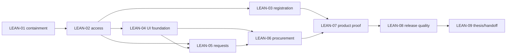

# GTAS VPP — Lean A+ Execution Plan

- Version: `2.0-lean`
- Effective date: `2026-07-15`
- Thesis/release target: `2026-08-15`
- Authority: this file is the execution cutline for the one-month thesis release.
- Reference detail: `04-MASTER-IMPLEMENTATION-PLAN.md` remains the audit and
  traceability annex. An agent reads an original task card only when its current
  package needs that detail; it must not execute the 52 cards as 52 separate goals.
- Decisions: D-001..D-012 in `03-DECISIONS-REQUIRED.md` remain authoritative.

## 1. Outcome and stop rule

Codex executes every **retained package** in this plan in dependency order and
does not pause for approval between packages. It stops only when:

1. LEAN-01..LEAN-09 are `DONE`; or
2. an external/decision blocker truly requires the owner, after independent safe
   work has been exhausted.

`DEFERRED` and `DROPPED` work below is deliberately outside the 2026-08-15
release and does not count as unfinished work. A package cannot be called done
by narrowing its acceptance criteria after implementation.

## 2. Why the original plan is being compressed

The repository audit found 52 detailed cards. Five foundation cards are done,
SEC-001 is active, and 38 unfinished P0/P1 cards remain: 23 size L, 8 size M and
7 size XL. Executing each card as a separate target would repeatedly spend
context on repo audit, planning, build, documentation and hand-off, while making
the Word/demo deadline unsafe.

The lean plan keeps depth in security, access control, core procurement facts,
test evidence and the thesis. It reduces breadth and executes coherent vertical
slices: database/API/UI/test evidence move together after their contract is
stable.

## 3. Current frozen foundation

| Package | Original tasks | Status | Evidence |
|---|---|---|---|
| LEAN-00 — Foundation | BASE-001, SEC-002, ENV-001, QA-001, ARCH-001 | DONE | Dedicated commits and execution records already exist. Do not redo them. |
| LEAN-01 — Incident containment | SEC-001 and required deployment-safety fixes | DONE WITH ACCEPTED RISK | `docs/execution/SEC-001.md`; production recovery run `29428300803`; eight Google-key alerts remain open under the owner's explicit waiver. |

The four user-owned dirty files recorded by BASE-001 remain protected: the
working Word file, `App.razor`, `vpp-login.css` and `vpp-responsive.css`. A
package may touch one only after an explicit overlap decision; otherwise it
must preserve its preflight hash and never stage it.

### Current execution status — 2026-07-16

| Package | Status | Evidence / next action |
|---|---|---|
| LEAN-02 — Trusted access and account cutover | DONE | `docs/execution/LEAN-02.md` |
| LEAN-03 — Registration and recovery | DONE | `docs/execution/LEAN-03.md` |
| LEAN-04 — UI foundation and independent brand | DONE | `docs/execution/LEAN-04.md` |
| LEAN-05 — Request and supplement core | DONE | `docs/execution/LEAN-05.md`; all package gates green |
| LEAN-06 — Procurement and immutable settlement | DONE | `CAT-001`, `PRICE-001/002`, `SET-001`, `SET-002/UI-006` DONE; see execution records |
| LEAN-07 — Product proof | PENDING | Depends on LEAN-06 |
| LEAN-08 — Release candidate quality and recovery | PENDING | Depends on LEAN-03..07 |
| LEAN-09 — Thesis, defense and handoff | PENDING | Final package after LEAN-08 evidence |

## 4. Retained execution packages

| Package | Original cards folded into it | Depends on | Timebox | Exit result |
|---|---|---|---:|---|
| **LEAN-01 — Incident containment** | SEC-001 plus only the deployment-safety fixes needed by it | LEAN-00, owner/provider access | 1–2 d | Every non-waived exposed credential is revoked/rotated; suspect demo accounts are inactive; old credentials fail; paired DB backup is verified; production health is green; current tree/artifacts/log evidence is clean. The eight waived Google alerts stay open and documented. |
| **LEAN-02 — Trusted access and account cutover** | AUTH-001/002/003/004/006; core UI-004; related QA-002 cases | LEAN-01, QA-001, ARCH-001 | 4 d | Explicit action/scope matrix, one active group and primary department, last-admin protection, app-owned hashed credentials, legacy login retired, current-user context and session invalidation pass. If SEC proves all live accounts are disposable demos, skip the generic importer and provision one clean owner through an audited one-time path. |
| **LEAN-03 — Registration and recovery** | AUTH-005, minimal UI-007; activation notification adapter | LEAN-02 | 2 d | Self-register creates zero-privilege `PendingApproval`; unique identity rules, admin map/activate, recovery/admin-reset fallback, rate limits and audit tests pass. |
| **LEAN-04 — UI foundation and independent brand** | UI-001, UI-002; only directly needed ARCH-004 work | ARCH-001, D-009; access contracts from LEAN-02 | 2 d | Typed navigation/error/async states, coherent Radzen-based design system, Vietnamese-first IA, accessibility baseline and responsive shell for six core demo routes. No framework rewrite. |
| **LEAN-05 — Request and supplement core** | PER-001, REQ-001, SUP-001, UI-003/005, existing/capped WOW-001 | LEAN-02, LEAN-04 | 4 d | Vietnam period 05→04, one regular request/user/period, revision/cancel/history, supplement reason/quota/one-pending/approval and concurrency invariants pass end-to-end. Copy-with-diff stays only if the existing flow can be completed within half a day. |
| **LEAN-06 — Procurement and immutable settlement** | CAT-001, PRICE-001/002, SET-001/002, UI-006 | LEAN-02, LEAN-04, LEAN-05 | 6 d | Typed catalog/unit/supplier writes and paging/search for 1,000 items; effective net/VAT price books; company-wide preview; one primary supplier with reasoned exception; immutable price/discount/fee/VAT snapshot; allocation reconciliation, idempotent close and correction revision pass. Implement internally as catalog/price then settlement sub-checkpoints, not one giant commit. |
| **LEAN-07 — Product proof: reports, Excel, inbox and email sandbox** | REPORT-001/002/003, NOTIF-001/002; approved alternative for NOTIF-003 | LEAN-03, LEAN-04, LEAN-05, LEAN-06 | DONE | Role-scoped KPI and dashboard drill-down reconcile with settlement; one polished Excel workbook passes; durable/idempotent inbox and Vietnamese templates work; Mailpit/local sandbox proves email without a real provider blocker. Existing AI insight may remain off; no new AI implementation. |
| **LEAN-08 — Release candidate quality and recovery** | Minimum necessary ARCH-002, PERF-001, OBS-001, QA-002/003, DEP-001/002; only blocking ARCH-003/004 findings | LEAN-03..07 | 3 d | Build/tests, security scans, migration gate, 4–5 core E2E journeys, representative 3-viewport/a11y smoke, targeted scale probes, log scrubbing, paired backup/restore rehearsal and local/server release decision are green. |
| **LEAN-09 — Thesis, defense and handoff** | DOC-001/002/003, REL-001 | Evidence from every package; final work after LEAN-08 | 4–6 d | Source/Word/diagram/traceability agree; anonymized screenshots; fields/links/pages/render checked; clean-state demo rehearsed twice; final DOCX/package/tag handed off. |

Every package receives one concise execution record and rollback note. Keep
small commits inside a package when rollback boundaries differ; do not create a
new goal for every original card.

## 5. Dependency flow

LEAN-04 may proceed locally while LEAN-01 waits on an external provider, but
LEAN-02 and any production deploy remain blocked until containment is green.
LEAN-03 and LEAN-04 may run in parallel after the access contracts stabilize.
DOC-001 evidence capture runs lightly inside every package; Word restructuring
waits for source freeze.

## 6. Explicit release cuts

| Original work | 2026-08-15 decision | Reason / retained substitute |
|---|---|---|
| REPORT-004 PDF | DEFERRED | Excel is the required business export and better thesis evidence for this release. |
| WOW-002 favorites/recent, WOW-003 reorder suggestion, WOW-004 heatmap | DEFERRED | Useful but not worth risking auth/settlement/Word. Copy-with-diff (WOW-001), dashboard and UI polish remain. |
| AI-001 | DEFERRED and feature flag stays off | No core decision should depend on AI; avoids provider/privacy/quota work while leaked Google keys are contained. |
| NOTIF-003 real production provider | ALTERNATIVE: sandbox | Durable inbox and email behavior are proved with Mailpit/local sandbox. Real deliverability is post-thesis. |
| ARCH-002 mass formatting/analyzer cleanup | REDUCED | Format only touched files; keep `git diff --check`, build and a small CI ratchet. |
| ARCH-003 physical retirement of every generic endpoint | DEFERRED except security bypasses | Block/authorize any bypass found in retained flows; broad cleanup is post-release. |
| ARCH-004 broad shell cleanup | FOLDED | Change only what LEAN-02 needs; no separate sweep. |
| PERF-001 full-system load/SLA program | REDUCED | Measure catalog 1,000 items, one report query and settlement preview; record limits and query plans. |
| OBS-001 tracing/ServiceDefaults expansion | REDUCED | Keep structured scrubbed logs, business audit, correlation and health; defer telemetry platform work. |
| QA-002/003 exhaustive matrices | FOLDED/REDUCED | Tests ship with each slice; final gate covers 4–5 core journeys and representative viewports, not every role × route × viewport combination. |
| DEP-002 server release | CONDITIONAL | Local clean-state release and restore rehearsal are mandatory; DigitalOcean deploy occurs only when SEC-001 and server preflight are green. |
| React/Next rewrite, microservices, Kafka/Redis, full PO/inventory/accounting, chatbot/AI mutation | DROPPED | They do not improve the one-month thesis claim enough to justify rewrite and operational risk. |
| Git-history rewrite after revocation | DROPPED by default | Revoke first and retain sanitized incident evidence. Rewrite only if provider/policy still requires it; it is not a substitute for revocation. |

Optional work cannot be reactivated before LEAN-01..09 are green and at least
two full buffer days remain before source freeze. The default is to keep it
deferred, not to consume buffer automatically.

## 7. Calendar and cut gates

| Date (Asia/Ho_Chi_Minh) | Required state | Automatic cut if late |
|---|---|---|
| 15–21/07 | LEAN-01 closed; LEAN-02 started; evidence ledger active | No external mail/AI; production remains frozen if containment is not green. |
| By 24/07 | Trusted account core demonstrable; LEAN-03/04 underway | Recovery uses audited admin fallback; no real mail-provider work. |
| 24/07–04/08 | LEAN-05/06 core invariants green | Cut every optional WOW/AI and non-core cosmetic route. |
| By 07/08 | LEAN-07 and core UI journeys green | Polish only login/dashboard/request/supplement/settlement/report. |
| 08–10/08 | LEAN-08 release gates; **source freeze at end of 10/08** | After freeze, only release-blocking fixes with regression evidence. |
| 10–12/08 | Word/diagram/screenshot/render delta complete | Use local release evidence if server remains externally blocked. |
| 13–15/08 | Two clean demo rehearsals, final package/tag | No new feature. |

## 8. Quota-conscious execution protocol

1. Read this plan, the relevant decision rows and only the source/cards needed
   by the active package. Do not reload the entire audit/master plan each turn.
2. Reuse BASE/QA/architecture inventories and continuation records; do not
   repeat a whole-repository audit unless current evidence contradicts them.
3. Use at most two useful parallel subagents by default. Each gets a bounded,
   non-overlapping deliverable; never assign duplicate full audits.
4. During implementation run targeted tests first. Run full Release build,
   backend/frontend tests, secret scan and diff checks once at package exit and
   again for LEAN-08.
5. Keep one compact execution record per package. Record commands, counts,
   migration/rollback evidence and unresolved risks; do not narrate every edit.
6. No framework/language rewrite, broad formatting sweep or speculative
   abstraction. Refactor only when it removes a verified blocker/risk in the
   retained slice.
7. Capture thesis evidence as short deltas throughout; update the working DOCX
   only after interfaces stabilize, then follow the mandatory render-and-verify
   workflow.
8. Never wait for a “continue” message between retained packages. Ask the owner
   only for credentials, provider login, irreversible production authority or
   an undiscoverable business decision. Continue independent safe work while
   waiting.

## 9. Common acceptance and rollback gate

Every retained package must prove:

- authorization on both UI and direct API paths;
- database migration/upgrade and rollback or forward-correction strategy;
- deterministic tests for its business invariants and failure states;
- no raw secret, verifier, token or real PII in source/log/evidence;
- Release build plus relevant backend/frontend/integration/UI gates;
- responsive/VI/a11y checks for any changed core journey;
- exact staged scope, protected user files preserved, `git diff --check` clean;
- an execution record that another agent can resume without this conversation.

Rollback never restores a compromised credential. Destructive database work
requires verified backup and restore/forward-recovery evidence. Feature cuts
are preferred over weakening security, settlement immutability, test isolation
or thesis/source truthfulness.

## 10. Immediate next action

LEAN-01/SEC-001 is closed with the owner's explicit residual-risk waiver for
eight still-open Google API-key alerts; do not report them as revoked. Continue
the existing persistent Goal with LEAN-02, preserving the contained 12-account
postcondition and the four protected user-owned files. Advance automatically
through LEAN-09 according to this file without creating per-card Goals.
